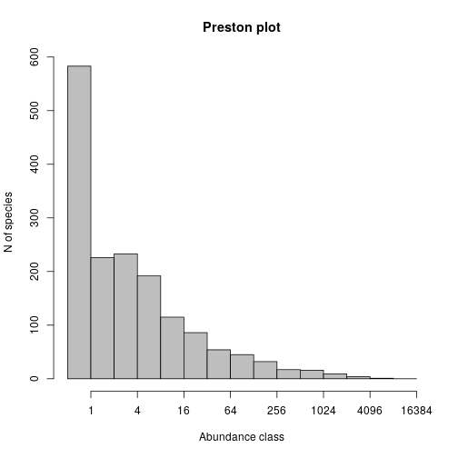
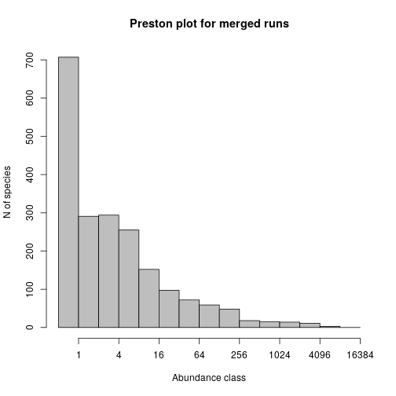
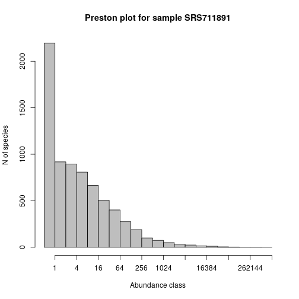
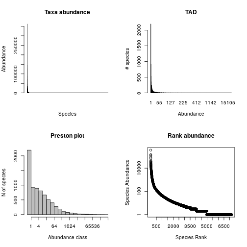
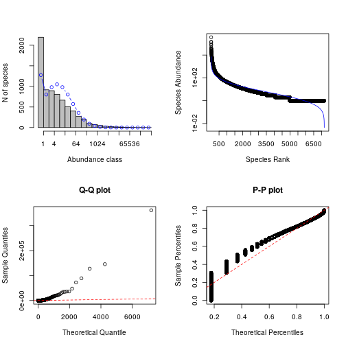

# MGnify data from R

## Introduction and installation

MGnify (https://www.ebi.ac.uk/metagenomics/) is a rich source of a range of metagenomics data, including data on taxa abundance, which often (but not always) comes from 16S profiling.

It is perfectly possible to use the [web portal](https://www.ebi.ac.uk/metagenomics/) to search and browse for data of interest, then download required data in CSV or tab-delimited format. This can then be loaded into R from the local file system. Although this is possible, it quickly becomes slow, cumbersome and error-prone (though the [bulk download facility](https://github.com/ProteinsWebTeam/ebi-metagenomics/wiki/Downloading-results-programmatically) makes it much less so). For many purposes it is better to be able to query the data directly from an R session, and this enables automated data retrieval and analysis workflows. 

I have written a small R package called [ebimetagenomics](http://r-forge.r-project.org/projects/ebimetagenomics/) for querying EBI Metagenomics data using the [MGnify API](https://emg-docs.readthedocs.io/en/latest/api.html). It should be possible to install this directly from [CRAN](https://cran.r-project.org/web/packages/ebimetagenomics/) with `install.packages("ebimetagenomics")`. However, this package is currently undergoing rapid development, so it is probably better to install the latest version directly from [R-Forge](https://r-forge.r-project.org/) with `install.packages("ebimetagenomics", repos="http://r-forge.r-project.org")` and update it regularly. Note that if you are installing from R-Forge, you may need to manually install some dependencies from CRAN (if you installing from CRAN, dependencies should be automatically pulled in).

Once installed, it can be loaded with:


```r
library(ebimetagenomics)
```

Help can be obtained with:


```r
help(package="ebimetagenomics")
```

This will list the functions provided by the package, together with very brief descriptions. Further information about each function can be obtained with, eg.


```r
?getProjectsList
```

Note that there are examples illustrating the use of every function. These can be run with, eg.


```r
example(getProjectsList)
```

```
## 
## gtPrjL> ## No test: 
## gtPrjL> ##D pl = getProjectsList()
## gtPrjL> ##D str(pl)
## gtPrjL> ##D 
## gtPrjL> ##D # Find big projects
## gtPrjL> ##D biggies = pl$accession[pl$samples_count >= 100]
## gtPrjL> ##D ps = getProjectSummary(biggies[3])
## gtPrjL> ##D 
## gtPrjL> ##D # Find some 16S projects
## gtPrjL> ##D pl$accession[agrep("16S",pl$study_name)]
## gtPrjL> ##D 
## gtPrjL> ##D # Look up primary accession using secondary accession
## gtPrjL> ##D pl$accession[pl$secondary_accession=="SRP047083"]
## gtPrjL> ## End(No test)
## gtPrjL> 
## gtPrjL>
```

## A walk-through of the package for querying and downloading taxa abundance data

### Working with the projects list

If you already know the accession ID of the study you are interested in, you can skip this section. The projects list allows high-level exploration of the projects contained in [MGnify](https://www.ebi.ac.uk/metagenomics/). We typically begin by obtaining the latest version of the list:


```r
pl = getProjectsList()
```

The function returns a data frame containing the full list of projects, one row per project. The structure of the frame can be probed with:


```r
str(pl)
```

```
## 'data.frame':	1436 obs. of  18 variables:
##  $ url                : chr  "https://www.ebi.ac.uk/metagenomics/api/v1/studies/MGYS00004729?format=csv" "https://www.ebi.ac.uk/metagenomics/api/v1/studies/MGYS00004728?format=csv" "https://www.ebi.ac.uk/metagenomics/api/v1/studies/MGYS00004726?format=csv" "https://www.ebi.ac.uk/metagenomics/api/v1/studies/MGYS00004725?format=csv" ...
##  $ downloads          : logi  NA NA NA NA NA NA ...
##  $ bioproject         : chr  "PRJEB18650" "" "PRJEB32056" "PRJEB32055" ...
##  $ samples_count      : int  720 369 1 1 1 1 1 1 1 1 ...
##  $ accession          : chr  "MGYS00004729" "MGYS00004728" "MGYS00004726" "MGYS00004725" ...
##  $ samples            : logi  NA NA NA NA NA NA ...
##  $ geocoordinates     : logi  NA NA NA NA NA NA ...
##  $ analyses           : logi  NA NA NA NA NA NA ...
##  $ publications       : logi  NA NA NA NA NA NA ...
##  $ biomes             : chr  "[OrderedDict([('type', 'biomes'), ('id', 'root:Host-associated:Human:Respiratory system:Nasopharyngeal'), ('lin"| __truncated__ "[OrderedDict([('type', 'biomes'), ('id', 'root:Host-associated:Human:Digestive system:Large intestine:Fecal'), "| __truncated__ "[OrderedDict([('type', 'biomes'), ('id', 'root:Engineered:Lab enrichment:Defined media'), ('links', {'self': 'h"| __truncated__ "[OrderedDict([('type', 'biomes'), ('id', 'root:Engineered:Lab enrichment:Defined media'), ('links', {'self': 'h"| __truncated__ ...
##  $ secondary_accession: chr  "ERP020597" "SRP057027" "ERP114682" "ERP114681" ...
##  $ centre_name        : chr  "SC" "UPENNBL" "Veer Narmad South Gujarat University" "Veer Narmad South Gujarat University" ...
##  $ is_public          : chr  "True" "True" "True" "True" ...
##  $ public_release_date: logi  NA NA NA NA NA NA ...
##  $ study_abstract     : chr  "A longitudinal study was undertaken for 21 infants living in the Maela refugee camp on the Thailand-Burma borde"| __truncated__ "Dysbiosis in the human intestines, an alteration in the normal composition of the microbiota, characterizes a w"| __truncated__ "The Winogradsky column is a simple device for culturing a large diversity of microorganisms." "The Winogradsky column is a simple device for culturing a large diversity of microorganisms." ...
##  $ study_name         : chr  "Nasopharyngeal_microbiota_in_Maela_Thailand" "Inflammation, Antibiotics, and Diet as Concurrent Environmental Stressors of the Gut Microbiome in Pediatric Crohn's Disease" "WINOGRADSKY PLASTIC LOWER LEVEL" "WINOGRADSKY PLASTIC UPPER LEVEL" ...
##  $ data_origination   : chr  "SUBMITTED" "HARVESTED" "SUBMITTED" "SUBMITTED" ...
##  $ last_update        : chr  "2019-06-05T15:05:40" "2019-05-14T09:59:32" "2019-05-13T16:45:16" "2019-05-13T16:44:21" ...
```

```r
dim(pl)
```

```
## [1] 1436   18
```

At the time of writing there are nearly three thousand studies, and important fields include `accession` (which corresponds to the `accession` required for the function `getProjectSummary()` in this package), `study_name` and `samples_count`. These can be used to find the ID of a study of interest. For example, a list of *all* study IDs can be obtained with


```r
pl$accession
```

or


```r
rownames(pl)
```

A list of studies containing at least 200 samples can be obtained with:


```r
pl$accession[pl$samples_count >= 200]
```

```
##  [1] "MGYS00004729" "MGYS00004728" "MGYS00004712" "MGYS00004694"
##  [5] "MGYS00003973" "MGYS00003962" "MGYS00003961" "MGYS00003937"
##  [9] "MGYS00003925" "MGYS00003924" "MGYS00003922" "MGYS00003895"
## [13] "MGYS00003871" "MGYS00003868" "MGYS00003858" "MGYS00003853"
## [17] "MGYS00003811" "MGYS00003809" "MGYS00003748" "MGYS00003733"
## [21] "MGYS00003715" "MGYS00003708" "MGYS00003707" "MGYS00003706"
## [25] "MGYS00003705" "MGYS00003687" "MGYS00003677" "MGYS00003673"
## [29] "MGYS00003670" "MGYS00003666" "MGYS00003659" "MGYS00003619"
## [33] "MGYS00003509" "MGYS00003505" "MGYS00003504" "MGYS00003488"
## [37] "MGYS00003481" "MGYS00003476" "MGYS00003469" "MGYS00003468"
## [41] "MGYS00003194" "MGYS00002722" "MGYS00002713" "MGYS00002706"
## [45] "MGYS00002684" "MGYS00002672" "MGYS00002671" "MGYS00002670"
## [49] "MGYS00002586" "MGYS00002554" "MGYS00002550" "MGYS00002534"
## [53] "MGYS00002481"
```

A list of studies with name containing particular text can be obtained with commands like:


```r
pl$accession[grep("16S", pl$study_name)]
```

```
##  [1] "MGYS00004662" "MGYS00004661" "MGYS00004633" "MGYS00004584"
##  [5] "MGYS00004529" "MGYS00004510" "MGYS00004502" "MGYS00004478"
##  [9] "MGYS00004462" "MGYS00004455" "MGYS00004428" "MGYS00004416"
## [13] "MGYS00004377" "MGYS00004332" "MGYS00004331" "MGYS00004320"
## [17] "MGYS00004237" "MGYS00004206" "MGYS00004205" "MGYS00004181"
## [21] "MGYS00004158" "MGYS00004150" "MGYS00004139" "MGYS00004108"
## [25] "MGYS00004044" "MGYS00004024" "MGYS00004015" "MGYS00003998"
## [29] "MGYS00003997" "MGYS00003993" "MGYS00003986" "MGYS00003985"
## [33] "MGYS00003957" "MGYS00003908" "MGYS00003851" "MGYS00003754"
## [37] "MGYS00003724" "MGYS00003722" "MGYS00003716" "MGYS00003170"
## [41] "MGYS00003168" "MGYS00003081" "MGYS00003067" "MGYS00003066"
## [45] "MGYS00002953" "MGYS00002936" "MGYS00002781" "MGYS00002776"
## [49] "MGYS00002725" "MGYS00002669" "MGYS00002665" "MGYS00002605"
## [53] "MGYS00002541" "MGYS00002527" "MGYS00002523" "MGYS00002501"
## [57] "MGYS00002490"
```

```r
pl$accession[grep("sludge", pl$study_name)]
```

```
##  [1] "MGYS00003649" "MGYS00003646" "MGYS00003623" "MGYS00003621"
##  [5] "MGYS00003532" "MGYS00003528" "MGYS00003521" "MGYS00003520"
##  [9] "MGYS00003512" "MGYS00003490" "MGYS00003470" "MGYS00003467"
## [13] "MGYS00003416" "MGYS00003413" "MGYS00003410" "MGYS00003395"
## [17] "MGYS00003380" "MGYS00003379"
```

```r
pl$accession[grep("Tara ", pl$study_name)]
```

```
## character(0)
```

```r
pl$accession[agrep("human gut", pl$study_name)]
```

```
##  [1] "MGYS00003733" "MGYS00003653" "MGYS00003619" "MGYS00003592"
##  [5] "MGYS00003581" "MGYS00003577" "MGYS00003575" "MGYS00003536"
##  [9] "MGYS00003505" "MGYS00003481" "MGYS00003478" "MGYS00003477"
## [13] "MGYS00003476" "MGYS00003469" "MGYS00003367" "MGYS00003346"
## [17] "MGYS00003240" "MGYS00003191" "MGYS00002961" "MGYS00002690"
## [21] "MGYS00002687" "MGYS00002677"
```

More sophisticated searches are also possible:

```r
soil = pl$accession[grep("soil", pl$biomes, ignore.case=TRUE)]
pl$accession[grep("human.*fecal", pl$biomes, ignore.case=TRUE)]
```

```
##  [1] "MGYS00004728" "MGYS00003894" "MGYS00003733" "MGYS00003715"
##  [5] "MGYS00003712" "MGYS00003619" "MGYS00003577" "MGYS00003576"
##  [9] "MGYS00003575" "MGYS00003536" "MGYS00003511" "MGYS00003481"
## [13] "MGYS00003480" "MGYS00003479" "MGYS00003478" "MGYS00003475"
## [17] "MGYS00003469" "MGYS00003468" "MGYS00003441" "MGYS00003367"
## [21] "MGYS00003346" "MGYS00003199" "MGYS00003191" "MGYS00003147"
## [25] "MGYS00003135" "MGYS00002961" "MGYS00002690" "MGYS00002687"
## [29] "MGYS00002685" "MGYS00002677"
```

The information relating to one particular study can be extracted with, eg.


```r
pl[soil[1],]
```

```
##                                                                                    url
## MGYS00004688 https://www.ebi.ac.uk/metagenomics/api/v1/studies/MGYS00004688?format=csv
##              downloads  bioproject samples_count    accession samples
## MGYS00004688        NA PRJNA284836             1 MGYS00004688      NA
##              geocoordinates analyses publications
## MGYS00004688             NA       NA           NA
##                                                                                                                                                                                                                                                              biomes
## MGYS00004688 [OrderedDict([('type', 'biomes'), ('id', 'root:Environmental:Terrestrial:Soil:Uranium contaminated'), ('links', {'self': 'https://www.ebi.ac.uk/metagenomics/api/v1/biomes/root:Environmental:Terrestrial:Soil:Uranium%20contaminated?format=csv'})])]
##              secondary_accession centre_name is_public public_release_date
## MGYS00004688           SRP058675  BioProject      True                  NA
##                                                                                                                                                                                          study_abstract
## MGYS00004688 SJP- Uranium polluted sediment sample collected from Cauvery bank of Kokarayanpettai, Erode District. SJUP- Unpolluted sample collected from agriculture field of Bhavani, Erode District.
##                           study_name data_origination         last_update
## MGYS00004688 SJP and SJUP Metagenome        HARVESTED 2019-04-16T13:10:20
```

### Working with a project summary

Once a study of interest has been identified, a more detailed project summary can be downloaded into a data frame with, eg.


```r
ps = getProjectSummary("SRP047083")
```

This data frame lists all *runs* associated with the project, one row per run. Note that there can be multiple runs per sample. The structure of the frame can be probed with:


```r
str(ps)
```

```
## 'data.frame':	2116 obs. of  22 variables:
##  $ url                 : chr  "https://www.ebi.ac.uk/metagenomics/api/v1/analyses/MGYA00035043?format=csv" "https://www.ebi.ac.uk/metagenomics/api/v1/analyses/MGYA00035044?format=csv" "https://www.ebi.ac.uk/metagenomics/api/v1/analyses/MGYA00035045?format=csv" "https://www.ebi.ac.uk/metagenomics/api/v1/analyses/MGYA00035046?format=csv" ...
##  $ interpro_identifiers: logi  NA NA NA NA NA NA ...
##  $ study               : chr  "https://www.ebi.ac.uk/metagenomics/api/v1/studies/MGYS00000646?format=csv" "https://www.ebi.ac.uk/metagenomics/api/v1/studies/MGYS00000646?format=csv" "https://www.ebi.ac.uk/metagenomics/api/v1/studies/MGYS00000646?format=csv" "https://www.ebi.ac.uk/metagenomics/api/v1/studies/MGYS00000646?format=csv" ...
##  $ taxonomy_ssu        : logi  NA NA NA NA NA NA ...
##  $ go_slim             : logi  NA NA NA NA NA NA ...
##  $ sample              : chr  "https://www.ebi.ac.uk/metagenomics/api/v1/samples/SRS711896?format=csv" "https://www.ebi.ac.uk/metagenomics/api/v1/samples/SRS711896?format=csv" "https://www.ebi.ac.uk/metagenomics/api/v1/samples/SRS711896?format=csv" "https://www.ebi.ac.uk/metagenomics/api/v1/samples/SRS711896?format=csv" ...
##  $ run                 : chr  "https://www.ebi.ac.uk/metagenomics/api/v1/runs/SRR1590371?format=csv" "https://www.ebi.ac.uk/metagenomics/api/v1/runs/SRR1590376?format=csv" "https://www.ebi.ac.uk/metagenomics/api/v1/runs/SRR1590377?format=csv" "https://www.ebi.ac.uk/metagenomics/api/v1/runs/SRR1590374?format=csv" ...
##  $ analysis_status     : chr  "completed" "completed" "completed" "completed" ...
##  $ taxonomy_lsu        : logi  NA NA NA NA NA NA ...
##  $ go_terms            : logi  NA NA NA NA NA NA ...
##  $ accession           : chr  "MGYA00035043" "MGYA00035044" "MGYA00035045" "MGYA00035046" ...
##  $ experiment_type     : chr  "amplicon" "amplicon" "amplicon" "amplicon" ...
##  $ analysis_summary    : chr  "[{'key': 'Submitted nucleotide sequences', 'value': '29024'}, {'key': 'Nucleotide sequences after format-specif"| __truncated__ "[{'key': 'Submitted nucleotide sequences', 'value': '18346'}, {'key': 'Nucleotide sequences after format-specif"| __truncated__ "[{'key': 'Submitted nucleotide sequences', 'value': '15'}, {'key': 'Nucleotide sequences after format-specific "| __truncated__ "[{'key': 'Submitted nucleotide sequences', 'value': '7262'}, {'key': 'Nucleotide sequences after format-specifi"| __truncated__ ...
##  $ taxonomy            : logi  NA NA NA NA NA NA ...
##  $ pipeline_version    : num  2 2 2 2 2 2 2 2 2 2 ...
##  $ assembly            : logi  NA NA NA NA NA NA ...
##  $ downloads           : logi  NA NA NA NA NA NA ...
##  $ complete_time       : chr  "2016-03-30T00:00:00" "2016-03-30T00:00:00" "2016-03-30T00:00:00" "2016-03-30T00:00:00" ...
##  $ instrument_platform : chr  "ILLUMINA" "ILLUMINA" "ILLUMINA" "ILLUMINA" ...
##  $ instrument_model    : chr  "Illumina MiSeq" "Illumina MiSeq" "Illumina MiSeq" "Illumina MiSeq" ...
##  $ run_id              : chr  "SRR1590371" "SRR1590376" "SRR1590377" "SRR1590374" ...
##  $ sample_id           : chr  "SRS711896" "SRS711896" "SRS711896" "SRS711896" ...
##  - attr(*, "project.id")= chr "SRP047083"
```

```r
dim(ps)
```

```
## [1] 2116   22
```

Important fields include `sample_id` and `run_id`. A list of all runs associated with the project can be obtained in several different ways, eg.


```r
ps$run_id
rownames(ps)
projectRuns(ps)
```

If a particular run ID is known and of interest, the information associated with that particular run can be extracted with, eg.


```r
ps["SRR1589726",]
```

```
##                                                                                   url
## SRR1589726 https://www.ebi.ac.uk/metagenomics/api/v1/analyses/MGYA00036503?format=csv
##            interpro_identifiers
## SRR1589726                   NA
##                                                                                study
## SRR1589726 https://www.ebi.ac.uk/metagenomics/api/v1/studies/MGYS00000646?format=csv
##            taxonomy_ssu go_slim
## SRR1589726           NA      NA
##                                                                            sample
## SRR1589726 https://www.ebi.ac.uk/metagenomics/api/v1/samples/SRS711891?format=csv
##                                                                             run
## SRR1589726 https://www.ebi.ac.uk/metagenomics/api/v1/runs/SRR1589726?format=csv
##            analysis_status taxonomy_lsu go_terms    accession
## SRR1589726       completed           NA       NA MGYA00036503
##            experiment_type
## SRR1589726        amplicon
##                                                                                                                                                                                                                                                                                                                                                                                                                                                                                                                                                                                                                                                                                                      analysis_summary
## SRR1589726 [{'key': 'Submitted nucleotide sequences', 'value': '78247'}, {'key': 'Nucleotide sequences after format-specific filtering', 'value': '78247'}, {'key': 'Nucleotide sequences after length filtering', 'value': '76839'}, {'key': 'Nucleotide sequences after undetermined bases filtering', 'value': '76839'}, {'key': 'Nucleotide sequences with predicted CDS', 'value': '1256'}, {'key': 'Nucleotide sequences with InterProScan match', 'value': '989'}, {'key': 'Predicted CDS', 'value': '1261'}, {'key': 'Predicted CDS with InterProScan match', 'value': '990'}, {'key': 'Total InterProScan matches', 'value': '1502'}, {'key': 'Nucleotide sequences with predicted rRNA', 'value': '75518'}]
##            taxonomy pipeline_version assembly downloads
## SRR1589726       NA                2       NA        NA
##                  complete_time instrument_platform instrument_model
## SRR1589726 2016-03-30T00:00:00            ILLUMINA   Illumina MiSeq
##                run_id sample_id
## SRR1589726 SRR1589726 SRS711891
```

A table of the number of runs associated with each sample in the project can be obtained with:


```r
table(ps$sample_id)
```

```
## 
## SRS711891 SRS711892 SRS711893 SRS711894 SRS711895 SRS711896 SRS711897 
##        44       118       113       137       137       109        85 
## SRS711898 SRS711899 SRS711900 SRS711901 SRS711902 SRS711903 SRS711904 
##        89        45       113        42       113       114       115 
## SRS711905 SRS711906 SRS711907 SRS711908 SRS711909 SRS711910 SRS711911 
##        46       110        89        91       113        91       112 
## SRS711912 
##        90
```

Similarly, a list of sample IDs associated with the project can be obtained with:


```r
projectSamples(ps)
```

```
##  [1] "SRS711891" "SRS711892" "SRS711893" "SRS711894" "SRS711895"
##  [6] "SRS711896" "SRS711897" "SRS711898" "SRS711899" "SRS711900"
## [11] "SRS711901" "SRS711902" "SRS711903" "SRS711904" "SRS711905"
## [16] "SRS711906" "SRS711907" "SRS711908" "SRS711909" "SRS711910"
## [21] "SRS711911" "SRS711912"
```

**Note** the *convention used in this package* that functions beginning with `get` involve a query over the *internet* to the EBI servers, and functions which do not begin with `get` do not.

Given a particular sample ID, a list of runs associated with that sample ID can be obtained with, eg.:


```r
runsBySample(ps,"SRS711891")
```

```
##  [1] "SRR1589768" "SRR1589738" "SRR1589739" "SRR1589734" "SRR1589735"
##  [6] "SRR1589736" "SRR1589737" "SRR1589731" "SRR1589732" "SRR1589733"
## [11] "SRR1589727" "SRR1589726" "SRR1589729" "SRR1589728" "SRR1589756"
## [16] "SRR1589757" "SRR1589754" "SRR1589755" "SRR1589752" "SRR1589753"
## [21] "SRR1589750" "SRR1589751" "SRR1589758" "SRR1589759" "SRR1589730"
## [26] "SRR1589745" "SRR1589744" "SRR1589747" "SRR1589746" "SRR1589741"
## [31] "SRR1589740" "SRR1589743" "SRR1589742" "SRR1589749" "SRR1589748"
## [36] "SRR1589769" "SRR1589763" "SRR1589762" "SRR1589767" "SRR1589766"
## [41] "SRR1589765" "SRR1589764" "SRR1589761" "SRR1589760"
```

### Working with taxa abundance data

Currently this package only has functions for querying [OTU](https://en.wikipedia.org/wiki/Operational_taxonomic_unit) data. OTU data associated with a particular run can be downloaded into a data frame with, eg.


```r
run = getRunOtu("SRR1589726")
```

This data frame contains information on all OTUs encountered in the run, one row per OTU. The structure of the frame can be probed with:


```r
str(run)
```

```
## 'data.frame':	1613 obs. of  3 variables:
##  $ OTU  : chr  "556126" "589277" "364926" "708680" ...
##  $ Count: num  5619 3769 3759 2353 2206 ...
##  $ Tax  : chr  "k__Bacteria; p__Bacteroidetes; c__Bacteroidia; o__Bacteroidales; f__Bacteroidaceae; g__Bacteroides; s__" "k__Bacteria; p__Bacteroidetes; c__Bacteroidia; o__Bacteroidales; f__Bacteroidaceae; g__Bacteroides; s__" "k__Bacteria; p__Bacteroidetes; c__Bacteroidia; o__Bacteroidales; f__Bacteroidaceae; g__Bacteroides; s__" "k__Bacteria; p__Firmicutes; c__Clostridia; o__Clostridiales; f__Lachnospiraceae; g__; s__" ...
```

```r
dim(run)
```

```
## [1] 1613    3
```

The data frame contains three variables: `OTU`, corresponding to the OTU ID, `Count`, representing the number of times the OTU was encountered in the run, and `Tax`, a string containing a taxonomic classification associated with the OTU. 

Note that the function `getRunOtu` contains two optional Boolean arguments, `verb` and `plot.preston`, both of which default to `FALSE`. The former simply echos the run ID to the console, and the latter displays a [Preston plot](https://en.wikipedia.org/wiki/Relative_species_abundance) for the OTU data. This can be useful to get a quick visual understanding of the nature of the run. After downloading, a plot can be constructed manually with:


```r
plot(octav(run$Count),main="Preston plot")
```



The function `mergeOtu` can be used to merge together two OTU data frames to produce a new OTU data frame.


```r
run2 = getRunOtu("SRR1589727")
runMerged = mergeOtu(run,run2)
plot(octav(runMerged$Count),main="Preston plot for merged runs")
```



More than two OTU data frames can be merged in this way. See the `?mergeOtu` example for how to merge a list of OTU data frames. It is often desirable to download all of the runs associated with a particular sample and to merge the run OTU data frames together to give an overall OTU data frame for the sample. The function `getSampleOtu` automates this process.

It can be run in its simplest form as `run=getSampleOtu(ps,"SRS711891")` but it too has optional Boolean arguments `verb` and `plot.preston`. Here `verb` defaults to `TRUE`, since it is usually useful to have a progress update, and the `plot.preston` argument is often worth using to "see" the data as it is being downloaded.


```r
run=getSampleOtu(ps,"SRS711891",plot.preston=TRUE)
```


```
## SRR1589768, SRR1589738, SRR1589739, SRR1589734, SRR1589735, SRR1589736, SRR1589737, SRR1589731, SRR1589732, SRR1589733, SRR1589727, SRR1589726, SRR1589729, SRR1589728, SRR1589756, SRR1589757, SRR1589754, SRR1589755, SRR1589752, SRR1589753, SRR1589750, SRR1589751, SRR1589758, SRR1589759, SRR1589730, SRR1589745, SRR1589744, SRR1589747, SRR1589746, SRR1589741, SRR1589740, SRR1589743, SRR1589742, SRR1589749, SRR1589748, SRR1589769, SRR1589763, SRR1589762, SRR1589767, SRR1589766, SRR1589765, SRR1589764, SRR1589761, SRR1589760, END.
```


```r
plot(octav(run$Count),main="Preston plot for sample SRS711891")
```



```r
dim(run)
```

```
## [1] 7168    3
```

The taxa abundance count data now downloaded into the R session can be utilised in the same way as any other species abundance data in R.

Note that the package includes the function `convertOtuTad()` which re-tabulates OTU counts as a taxa abundance distribution (TAD), and `plotOtu()`, which does a selection of 4 plots for a given set of OTU counts.


```r
head(convertOtuTad(run))
```

```
##   abund Freq
## 1     1 2194
## 2     2  918
## 3     3  536
## 4     4  359
## 5     5  249
## 6     6  236
```

```r
plotOtu(run)
```



Commonly required stats associated with OTU counts can be computed with the function `analyseOtu()`.


```r
analyseOtu(run)
```


```
##         S.obs         N.obs Shannon.index  Fisher.alpha       S.chao1 
##  7.168000e+03  1.921997e+06  4.379728e+00  9.402906e+02  9.785760e+03 
##      se.chao1         S.ACE        se.ACE       S.break      se.break 
##  1.502180e+02  9.664716e+03  5.132660e+01  7.171886e+03  4.870321e+00 
##         S.vln         S.pln          N.75          N.90          N.95 
##  1.643350e+04  2.173068e+04  1.257778e+08  1.197866e+09  4.590360e+09 
##          N.99 
##  5.654416e+10
```

As well as computing various different estimates of the total number of taxa in the community that was sampled, it also computes estimates (assuming a Poisson-log-normal TAD) of the number of sequences required in order to observe a given fraction of the total species present. This can be useful for estimating required sequencing effort. 
Several of the fields should be familiar from the `vegan` function `estimateR`. The `breakaway` estimate has also been included. `S.vln` is Preston's veiled log-normal method and `S.pln` is an estimate from a Poisson-log-Normal SAD fit. Under the same assumption of an underlying Poisson-log-Normal species abundance distribution (and using the same fit), `N.75`, `N.90`, `N.95` and `N.99` are estimates of the `N.obs` required in order to obtain 75%, 90%, 95% and 99% species coverage in a future sample.

### Fitting TADs

If we are interested in assessing whether a Poisson-log-Normal assumption is reasonable, we could try fitting some different TADs for comparison.

```r
models = lapply(c("lnorm","poilog","ls","mzsm"), function(m){fitsad(run$Count,m)})
```

```
## Warning in optimize(function(par) fn(par, ...)/con$fnscale, lower =
## lower, : NA/Inf replaced by maximum positive value

## Warning in optimize(function(par) fn(par, ...)/con$fnscale, lower =
## lower, : NA/Inf replaced by maximum positive value
```

```r
models
```

```
## [[1]]
## Maximum likelihood estimation
## Type: continuous  species abundance distribution
## Species: 7168 individuals: 1921997 
## 
## Call:
## mle2(minuslogl = function (meanlog, sdlog) 
## -sum(dlnorm(x, meanlog, sdlog, log = TRUE)), start = list(meanlog = 1.73294524769214, 
##     sdlog = 1.87728425455293), data = list(x = list(361637, 145554, 
##     127613, 89195, 72535, "etc")))
## 
## Coefficients:
##  meanlog    sdlog 
## 1.732945 1.877114 
## 
## Log-likelihood: -27106.8 
## 
## [[2]]
## Maximum likelihood estimation
## Type: discrete  species abundance distribution
## Species: 7168 individuals: 1921997 
## 
## Call:
## mle2(minuslogl = function (mu, sig) 
## -sum(dtrunc("poilog", x = x, coef = list(mu = mu, sig = sig), 
##     trunc = trunc, log = TRUE)), start = list(mu = -2.21224742827161, 
##     sig = 3.53818966221839), data = list(x = list(361637, 145554, 
##     127613, 89195, 72535, "etc")))
## 
## Coefficients:
##        mu       sig 
## -2.212247  3.538190 
## 
## Truncation point: 0 
## 
## Log-likelihood: -25385.76 
## 
## [[3]]
## Maximum likelihood estimation
## Type: discrete  species abundance distribution
## Species: 7168 individuals: 1921997 
## 
## Call:
## mle2(minuslogl = function (N, alpha) 
## -sum(dls(x, N, alpha, log = TRUE)), start = list(alpha = 940.290568940603), 
##     method = "Brent", fixed = list(N = 1921997), data = list(
##         x = list(361637, 145554, 127613, 89195, 72535, "etc")), 
##     lower = 0, upper = 7168L)
## 
## Coefficients:
##            N        alpha 
## 1921997.0000     940.2905 
## 
## Log-likelihood: -27921.4 
## 
## [[4]]
## Maximum likelihood estimation
## Type: discrete  species abundance distribution
## Species: 7168 individuals: 1921997 
## 
## Call:
## mle2(minuslogl = function (J, theta) 
## -sum(dmzsm(x, J = J, theta = theta, log = TRUE)), start = list(
##     theta = 7168L), method = "Brent", fixed = list(J = 1921997), 
##     data = list(x = list(361637, 145554, 127613, 89195, 72535, 
##         "etc")), lower = 0.001, upper = 7168L)
## 
## Coefficients:
##            J        theta 
## 1921997.0000     909.4143 
## 
## Log-likelihood: -27948.36
```

```r
lapply(models, function(x){x@min})
```

```
## [[1]]
## [1] 27106.8
## 
## [[2]]
## [1] 25385.76
## 
## [[3]]
## [1] 27921.4
## 
## [[4]]
## [1] 27948.36
```
Note that `poilog` has (by far) the largest fitted log-likelihood (or equivalently, smallest negative log-likelihood), suggesting a better fit to the data. This isn't a formal test of model adequacy, but suggests that this model is at least better than other commonly used alternatives. This is confirmed by looking at diagnostic plots. For example,

```r
op=par(mfrow=c(2,2))
plot(models[[1]])
```



```r
par(op)
```
shows a poor fit for "lnorm". Repeating for `[[3]]` and `[[4]]` shows even worse fits for "ls" and "mzsm". Repeating for `[[2]]` shows a very good fit, if the plot function doesn't crash, which it sometimes does. This illustrates an important issue: although population ecologists have been thinking about species abundance for decades, they haven't always been thinking about the sample sizes and diversity associated with some metagenomic samples, and so some of the available tools sometimes struggle to scale up to metagenomic data sets.


#### (C) 2016-19 Darren J Wilkinson


