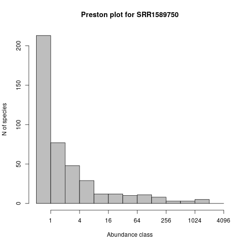

# MGnify data from R

## Introduction and installation

MGnify (https://www.ebi.ac.uk/metagenomics/) is a rich source of a range of metagenomics data, including data on taxa abundance, which often comes from 16S profiling.

It is perfectly possible to use the [web portal](https://www.ebi.ac.uk/metagenomics/) to search and browse for data of interest, then download required data in CSV or tab-delimited format. This can then be loaded into R from the local file system. Although this is possible, it quickly becomes slow, cumbersome and error-prone (though the [bulk download facility](https://github.com/ProteinsWebTeam/ebi-metagenomics/wiki/Downloading-results-programmatically) makes it much less so). For many purposes it is better to be able to query the data directly from an R session, and this enables automated data retrieval and analysis workflows. 

I have written a small R package called [ebimetagenomics](http://r-forge.r-project.org/projects/ebimetagenomics/) for querying EBI Metagenomics data using the [MGnify API](https://emg-docs.readthedocs.io/en/latest/api.html). It should be possible to install this directly from [CRAN](https://cran.r-project.org/web/packages/ebimetagenomics/) with `install.packages("ebimetagenomics")`. However, this package is currently undergoing rapid development, so it is probably better to install the latest version directly from [R-Forge](https://r-forge.r-project.org/) with `install.packages("ebimetagenomics", repos="http://r-forge.r-project.org")` and update it regularly. Note that if you are installing from R-Forge, you may need to manually install some dependencies from CRAN (if you installing from CRAN, dependencies should be automatically pulled in).

Once installed, it can be loaded with:


```r
library(ebimetagenomics)
```

```
## Loading required package: sads
```

```
## Loading required package: bbmle
```

```
## Loading required package: stats4
```

```
## Loading required package: vegan
```

```
## Loading required package: permute
```

```
## Loading required package: lattice
```

```
## This is vegan 2.5-5
```

```
## Loading required package: breakaway
```

```
## Loading required package: methods
```

Help can be obtained with:


```r
help(package="ebimetagenomics")
```

This will list the functions provided by the package, together with very brief descriptions. Further information about each function can be obtained with, eg.


```r
?getProjectsList
```

Note that there are examples illustrating the use of every function. These can be run with, eg.


```r
example(getProjectsList)
```

```
## 
## gtPrjL> ## No test: 
## gtPrjL> ##D pl = getProjectsList()
## gtPrjL> ##D str(pl)
## gtPrjL> ##D 
## gtPrjL> ##D # Find big projects
## gtPrjL> ##D biggies = pl$accession[pl$samples_count >= 100]
## gtPrjL> ##D ps = getProjectSummary(biggies[3])
## gtPrjL> ##D 
## gtPrjL> ##D # Find some 16S projects
## gtPrjL> ##D pl$accession[agrep("16S",pl$study_name)]
## gtPrjL> ##D 
## gtPrjL> ##D # Look up primary accession using secondary accession
## gtPrjL> ##D pl$accession[pl$secondary_accession=="SRP047083"]
## gtPrjL> ## End(No test)
## gtPrjL> 
## gtPrjL>
```

## A walk-through of the package for querying and downloading taxa abundance data

### Working with the projects list

If you already know the `projectID` of the study you are interested in, you can skip this section. The projects list allows high-level exploration of the projects contained in [MGnify](https://www.ebi.ac.uk/metagenomics/). We typically begin by obtaining the latest version of the list:


```r
pl = getProjectsList()
```

The function returns a data frame containing the full list of projects, one row per project. The structure of the frame can be probed with:


```r
str(pl)
```

```
## 'data.frame':	2073 obs. of  18 variables:
##  $ url                : chr  "https://www.ebi.ac.uk/metagenomics/api/v1/studies/MGYS00004729?format=csv" "https://www.ebi.ac.uk/metagenomics/api/v1/studies/MGYS00004728?format=csv" "https://www.ebi.ac.uk/metagenomics/api/v1/studies/MGYS00004726?format=csv" "https://www.ebi.ac.uk/metagenomics/api/v1/studies/MGYS00004725?format=csv" ...
##  $ downloads          : logi  NA NA NA NA NA NA ...
##  $ bioproject         : chr  "PRJEB18650" "" "PRJEB32056" "PRJEB32055" ...
##  $ samples_count      : int  720 369 1 1 1 1 1 1 1 1 ...
##  $ accession          : chr  "MGYS00004729" "MGYS00004728" "MGYS00004726" "MGYS00004725" ...
##  $ samples            : logi  NA NA NA NA NA NA ...
##  $ geocoordinates     : logi  NA NA NA NA NA NA ...
##  $ analyses           : logi  NA NA NA NA NA NA ...
##  $ publications       : logi  NA NA NA NA NA NA ...
##  $ biomes             : chr  "[OrderedDict([('type', 'biomes'), ('id', 'root:Host-associated:Human:Respiratory system:Nasopharyngeal'), ('lin"| __truncated__ "[OrderedDict([('type', 'biomes'), ('id', 'root:Host-associated:Human:Digestive system:Large intestine:Fecal'), "| __truncated__ "[OrderedDict([('type', 'biomes'), ('id', 'root:Engineered:Lab enrichment:Defined media'), ('links', {'self': 'h"| __truncated__ "[OrderedDict([('type', 'biomes'), ('id', 'root:Engineered:Lab enrichment:Defined media'), ('links', {'self': 'h"| __truncated__ ...
##  $ secondary_accession: chr  "ERP020597" "SRP057027" "ERP114682" "ERP114681" ...
##  $ centre_name        : chr  "SC" "UPENNBL" "Veer Narmad South Gujarat University" "Veer Narmad South Gujarat University" ...
##  $ is_public          : chr  "True" "True" "True" "True" ...
##  $ public_release_date: chr  "" "" "" "" ...
##  $ study_abstract     : chr  "A longitudinal study was undertaken for 21 infants living in the Maela refugee camp on the Thailand-Burma borde"| __truncated__ "Dysbiosis in the human intestines, an alteration in the normal composition of the microbiota, characterizes a w"| __truncated__ "The Winogradsky column is a simple device for culturing a large diversity of microorganisms." "The Winogradsky column is a simple device for culturing a large diversity of microorganisms." ...
##  $ study_name         : chr  "Nasopharyngeal_microbiota_in_Maela_Thailand" "Inflammation, Antibiotics, and Diet as Concurrent Environmental Stressors of the Gut Microbiome in Pediatric Crohn's Disease" "WINOGRADSKY PLASTIC LOWER LEVEL" "WINOGRADSKY PLASTIC UPPER LEVEL" ...
##  $ data_origination   : chr  "SUBMITTED" "HARVESTED" "SUBMITTED" "SUBMITTED" ...
##  $ last_update        : chr  "2019-06-05T15:05:40" "2019-05-14T09:59:32" "2019-05-13T16:45:16" "2019-05-13T16:44:21" ...
```

```r
dim(pl)
```

```
## [1] 2073   18
```

At the time of writing there are over 700 projects, and important fields include `accession` (which corresponds to the `accession` required for the function `getProjectSummary()` in this package), `study_name` and `samples_count`. These can be used to find the ID of a study of interest. For example, a list of *all* project IDs can be obtained with


```r
pl$accession
```

```
##    [1] "MGYS00004729" "MGYS00004728" "MGYS00004726" "MGYS00004725"
##    [5] "MGYS00004724" "MGYS00004723" "MGYS00004722" "MGYS00004721"
##    [9] "MGYS00004720" "MGYS00004719" "MGYS00004718" "MGYS00004717"
##   [13] "MGYS00004716" "MGYS00004715" "MGYS00004714" "MGYS00004712"
##   [17] "MGYS00004707" "MGYS00004705" "MGYS00004702" "MGYS00004699"
##   [21] "MGYS00004697" "MGYS00004696" "MGYS00004695" "MGYS00004694"
##   [25] "MGYS00004692" "MGYS00004691" "MGYS00004689" "MGYS00004688"
##   [29] "MGYS00004687" "MGYS00004681" "MGYS00004680" "MGYS00004679"
##   [33] "MGYS00004678" "MGYS00004677" "MGYS00004676" "MGYS00004674"
##   [37] "MGYS00004673" "MGYS00004672" "MGYS00004671" "MGYS00004670"
##   [41] "MGYS00004669" "MGYS00004668" "MGYS00004667" "MGYS00004666"
##   [45] "MGYS00004665" "MGYS00004664" "MGYS00004663" "MGYS00004662"
##   [49] "MGYS00004661" "MGYS00004660" "MGYS00004659" "MGYS00004658"
##   [53] "MGYS00004657" "MGYS00004656" "MGYS00004655" "MGYS00004654"
##   [57] "MGYS00004653" "MGYS00004652" "MGYS00004651" "MGYS00004650"
##   [61] "MGYS00004649" "MGYS00004648" "MGYS00004647" "MGYS00004645"
##   [65] "MGYS00004644" "MGYS00004643" "MGYS00004642" "MGYS00004641"
##   [69] "MGYS00004640" "MGYS00004639" "MGYS00004638" "MGYS00004637"
##   [73] "MGYS00004636" "MGYS00004635" "MGYS00004634" "MGYS00004633"
##   [77] "MGYS00004632" "MGYS00004631" "MGYS00004630" "MGYS00004629"
##   [81] "MGYS00004628" "MGYS00004627" "MGYS00004626" "MGYS00004625"
##   [85] "MGYS00004624" "MGYS00004623" "MGYS00004622" "MGYS00004621"
##   [89] "MGYS00004620" "MGYS00004619" "MGYS00004618" "MGYS00004617"
##   [93] "MGYS00004616" "MGYS00004615" "MGYS00004614" "MGYS00004613"
##   [97] "MGYS00004612" "MGYS00004611" "MGYS00004610" "MGYS00004609"
##  [101] "MGYS00004608" "MGYS00004607" "MGYS00004606" "MGYS00004605"
##  [105] "MGYS00004604" "MGYS00004602" "MGYS00004601" "MGYS00004600"
##  [109] "MGYS00004599" "MGYS00004598" "MGYS00004597" "MGYS00004596"
##  [113] "MGYS00004594" "MGYS00004593" "MGYS00004592" "MGYS00004591"
##  [117] "MGYS00004590" "MGYS00004589" "MGYS00004588" "MGYS00004585"
##  [121] "MGYS00004584" "MGYS00004583" "MGYS00004582" "MGYS00004581"
##  [125] "MGYS00004580" "MGYS00004578" "MGYS00004577" "MGYS00004576"
##  [129] "MGYS00004575" "MGYS00004574" "MGYS00004573" "MGYS00004571"
##  [133] "MGYS00004570" "MGYS00004569" "MGYS00004568" "MGYS00004567"
##  [137] "MGYS00004566" "MGYS00004565" "MGYS00004564" "MGYS00004563"
##  [141] "MGYS00004562" "MGYS00004561" "MGYS00004560" "MGYS00004559"
##  [145] "MGYS00004557" "MGYS00004556" "MGYS00004555" "MGYS00004547"
##  [149] "MGYS00004544" "MGYS00004543" "MGYS00004542" "MGYS00004541"
##  [153] "MGYS00004540" "MGYS00004539" "MGYS00004536" "MGYS00004535"
##  [157] "MGYS00004534" "MGYS00004532" "MGYS00004531" "MGYS00004530"
##  [161] "MGYS00004529" "MGYS00004528" "MGYS00004527" "MGYS00004526"
##  [165] "MGYS00004525" "MGYS00004524" "MGYS00004523" "MGYS00004521"
##  [169] "MGYS00004520" "MGYS00004519" "MGYS00004518" "MGYS00004517"
##  [173] "MGYS00004513" "MGYS00004511" "MGYS00004510" "MGYS00004509"
##  [177] "MGYS00004508" "MGYS00004507" "MGYS00004506" "MGYS00004505"
##  [181] "MGYS00004504" "MGYS00004503" "MGYS00004502" "MGYS00004501"
##  [185] "MGYS00004500" "MGYS00004499" "MGYS00004497" "MGYS00004496"
##  [189] "MGYS00004495" "MGYS00004494" "MGYS00004493" "MGYS00004491"
##  [193] "MGYS00004490" "MGYS00004488" "MGYS00004487" "MGYS00004486"
##  [197] "MGYS00004485" "MGYS00004484" "MGYS00004483" "MGYS00004481"
##  [201] "MGYS00004480" "MGYS00004478" "MGYS00004477" "MGYS00004476"
##  [205] "MGYS00004475" "MGYS00004474" "MGYS00004472" "MGYS00004469"
##  [209] "MGYS00004468" "MGYS00004467" "MGYS00004466" "MGYS00004465"
##  [213] "MGYS00004464" "MGYS00004463" "MGYS00004462" "MGYS00004460"
##  [217] "MGYS00004459" "MGYS00004457" "MGYS00004456" "MGYS00004455"
##  [221] "MGYS00004454" "MGYS00004453" "MGYS00004452" "MGYS00004451"
##  [225] "MGYS00004450" "MGYS00004449" "MGYS00004447" "MGYS00004446"
##  [229] "MGYS00004445" "MGYS00004444" "MGYS00004443" "MGYS00004442"
##  [233] "MGYS00004441" "MGYS00004440" "MGYS00004439" "MGYS00004438"
##  [237] "MGYS00004436" "MGYS00004435" "MGYS00004434" "MGYS00004433"
##  [241] "MGYS00004432" "MGYS00004430" "MGYS00004428" "MGYS00004425"
##  [245] "MGYS00004424" "MGYS00004423" "MGYS00004422" "MGYS00004421"
##  [249] "MGYS00004420" "MGYS00004419" "MGYS00004418" "MGYS00004416"
##  [253] "MGYS00004415" "MGYS00004414" "MGYS00004412" "MGYS00004411"
##  [257] "MGYS00004410" "MGYS00004409" "MGYS00004408" "MGYS00004407"
##  [261] "MGYS00004405" "MGYS00004404" "MGYS00004402" "MGYS00004401"
##  [265] "MGYS00004400" "MGYS00004399" "MGYS00004397" "MGYS00004396"
##  [269] "MGYS00004395" "MGYS00004394" "MGYS00004393" "MGYS00004392"
##  [273] "MGYS00004391" "MGYS00004390" "MGYS00004389" "MGYS00004388"
##  [277] "MGYS00004387" "MGYS00004385" "MGYS00004384" "MGYS00004383"
##  [281] "MGYS00004382" "MGYS00004381" "MGYS00004380" "MGYS00004379"
##  [285] "MGYS00004377" "MGYS00004376" "MGYS00004375" "MGYS00004374"
##  [289] "MGYS00004373" "MGYS00004372" "MGYS00004370" "MGYS00004369"
##  [293] "MGYS00004368" "MGYS00004367" "MGYS00004366" "MGYS00004365"
##  [297] "MGYS00004364" "MGYS00004363" "MGYS00004362" "MGYS00004361"
##  [301] "MGYS00004360" "MGYS00004358" "MGYS00004357" "MGYS00004355"
##  [305] "MGYS00004354" "MGYS00004353" "MGYS00004352" "MGYS00004351"
##  [309] "MGYS00004350" "MGYS00004349" "MGYS00004348" "MGYS00004347"
##  [313] "MGYS00004345" "MGYS00004343" "MGYS00004341" "MGYS00004340"
##  [317] "MGYS00004337" "MGYS00004335" "MGYS00004334" "MGYS00004332"
##  [321] "MGYS00004331" "MGYS00004330" "MGYS00004329" "MGYS00004328"
##  [325] "MGYS00004327" "MGYS00004326" "MGYS00004325" "MGYS00004324"
##  [329] "MGYS00004323" "MGYS00004322" "MGYS00004321" "MGYS00004320"
##  [333] "MGYS00004318" "MGYS00004317" "MGYS00004316" "MGYS00004315"
##  [337] "MGYS00004314" "MGYS00004313" "MGYS00004312" "MGYS00004310"
##  [341] "MGYS00004308" "MGYS00004307" "MGYS00004306" "MGYS00004304"
##  [345] "MGYS00004303" "MGYS00004302" "MGYS00004301" "MGYS00004300"
##  [349] "MGYS00004299" "MGYS00004297" "MGYS00004296" "MGYS00004295"
##  [353] "MGYS00004294" "MGYS00004293" "MGYS00004292" "MGYS00004289"
##  [357] "MGYS00004288" "MGYS00004287" "MGYS00004286" "MGYS00004285"
##  [361] "MGYS00004284" "MGYS00004282" "MGYS00004281" "MGYS00004278"
##  [365] "MGYS00004277" "MGYS00004276" "MGYS00004273" "MGYS00004272"
##  [369] "MGYS00004267" "MGYS00004261" "MGYS00004260" "MGYS00004259"
##  [373] "MGYS00004258" "MGYS00004257" "MGYS00004255" "MGYS00004254"
##  [377] "MGYS00004252" "MGYS00004251" "MGYS00004250" "MGYS00004249"
##  [381] "MGYS00004247" "MGYS00004246" "MGYS00004244" "MGYS00004242"
##  [385] "MGYS00004241" "MGYS00004240" "MGYS00004239" "MGYS00004238"
##  [389] "MGYS00004237" "MGYS00004236" "MGYS00004235" "MGYS00004234"
##  [393] "MGYS00004233" "MGYS00004232" "MGYS00004230" "MGYS00004229"
##  [397] "MGYS00004228" "MGYS00004227" "MGYS00004226" "MGYS00004225"
##  [401] "MGYS00004224" "MGYS00004223" "MGYS00004222" "MGYS00004221"
##  [405] "MGYS00004220" "MGYS00004218" "MGYS00004217" "MGYS00004216"
##  [409] "MGYS00004215" "MGYS00004214" "MGYS00004213" "MGYS00004212"
##  [413] "MGYS00004211" "MGYS00004210" "MGYS00004209" "MGYS00004208"
##  [417] "MGYS00004207" "MGYS00004206" "MGYS00004205" "MGYS00004203"
##  [421] "MGYS00004202" "MGYS00004201" "MGYS00004200" "MGYS00004199"
##  [425] "MGYS00004197" "MGYS00004196" "MGYS00004195" "MGYS00004194"
##  [429] "MGYS00004193" "MGYS00004192" "MGYS00004191" "MGYS00004190"
##  [433] "MGYS00004189" "MGYS00004187" "MGYS00004186" "MGYS00004185"
##  [437] "MGYS00004183" "MGYS00004182" "MGYS00004181" "MGYS00004180"
##  [441] "MGYS00004179" "MGYS00004178" "MGYS00004177" "MGYS00004176"
##  [445] "MGYS00004175" "MGYS00004174" "MGYS00004173" "MGYS00004171"
##  [449] "MGYS00004170" "MGYS00004169" "MGYS00004168" "MGYS00004167"
##  [453] "MGYS00004165" "MGYS00004164" "MGYS00004163" "MGYS00004162"
##  [457] "MGYS00004161" "MGYS00004160" "MGYS00004159" "MGYS00004158"
##  [461] "MGYS00004156" "MGYS00004155" "MGYS00004154" "MGYS00004153"
##  [465] "MGYS00004152" "MGYS00004151" "MGYS00004150" "MGYS00004149"
##  [469] "MGYS00004148" "MGYS00004146" "MGYS00004144" "MGYS00004143"
##  [473] "MGYS00004141" "MGYS00004140" "MGYS00004139" "MGYS00004138"
##  [477] "MGYS00004137" "MGYS00004136" "MGYS00004135" "MGYS00004134"
##  [481] "MGYS00004133" "MGYS00004132" "MGYS00004131" "MGYS00004130"
##  [485] "MGYS00004129" "MGYS00004128" "MGYS00004127" "MGYS00004126"
##  [489] "MGYS00004125" "MGYS00004123" "MGYS00004122" "MGYS00004121"
##  [493] "MGYS00004120" "MGYS00004119" "MGYS00004117" "MGYS00004116"
##  [497] "MGYS00004115" "MGYS00004113" "MGYS00004112" "MGYS00004110"
##  [501] "MGYS00004108" "MGYS00004107" "MGYS00004105" "MGYS00004104"
##  [505] "MGYS00004103" "MGYS00004102" "MGYS00004101" "MGYS00004100"
##  [509] "MGYS00004099" "MGYS00004098" "MGYS00004096" "MGYS00004095"
##  [513] "MGYS00004094" "MGYS00004093" "MGYS00004091" "MGYS00004090"
##  [517] "MGYS00004088" "MGYS00004087" "MGYS00004086" "MGYS00004084"
##  [521] "MGYS00004083" "MGYS00004082" "MGYS00004081" "MGYS00004080"
##  [525] "MGYS00004079" "MGYS00004078" "MGYS00004077" "MGYS00004076"
##  [529] "MGYS00004075" "MGYS00004074" "MGYS00004073" "MGYS00004071"
##  [533] "MGYS00004070" "MGYS00004069" "MGYS00004068" "MGYS00004067"
##  [537] "MGYS00004066" "MGYS00004065" "MGYS00004064" "MGYS00004061"
##  [541] "MGYS00004060" "MGYS00004059" "MGYS00004058" "MGYS00004057"
##  [545] "MGYS00004056" "MGYS00004055" "MGYS00004053" "MGYS00004052"
##  [549] "MGYS00004051" "MGYS00004050" "MGYS00004049" "MGYS00004048"
##  [553] "MGYS00004047" "MGYS00004046" "MGYS00004045" "MGYS00004044"
##  [557] "MGYS00004043" "MGYS00004042" "MGYS00004041" "MGYS00004040"
##  [561] "MGYS00004038" "MGYS00004037" "MGYS00004036" "MGYS00004035"
##  [565] "MGYS00004032" "MGYS00004031" "MGYS00004030" "MGYS00004029"
##  [569] "MGYS00004028" "MGYS00004025" "MGYS00004024" "MGYS00004023"
##  [573] "MGYS00004022" "MGYS00004021" "MGYS00004020" "MGYS00004019"
##  [577] "MGYS00004018" "MGYS00004017" "MGYS00004016" "MGYS00004015"
##  [581] "MGYS00004014" "MGYS00004013" "MGYS00004012" "MGYS00004011"
##  [585] "MGYS00004010" "MGYS00004009" "MGYS00004006" "MGYS00004005"
##  [589] "MGYS00004004" "MGYS00004002" "MGYS00003999" "MGYS00003998"
##  [593] "MGYS00003997" "MGYS00003996" "MGYS00003995" "MGYS00003994"
##  [597] "MGYS00003993" "MGYS00003990" "MGYS00003989" "MGYS00003988"
##  [601] "MGYS00003986" "MGYS00003985" "MGYS00003984" "MGYS00003978"
##  [605] "MGYS00003977" "MGYS00003973" "MGYS00003963" "MGYS00003962"
##  [609] "MGYS00003961" "MGYS00003957" "MGYS00003954" "MGYS00003952"
##  [613] "MGYS00003951" "MGYS00003950" "MGYS00003946" "MGYS00003937"
##  [617] "MGYS00003932" "MGYS00003925" "MGYS00003924" "MGYS00003923"
##  [621] "MGYS00003922" "MGYS00003921" "MGYS00003920" "MGYS00003919"
##  [625] "MGYS00003918" "MGYS00003917" "MGYS00003916" "MGYS00003915"
##  [629] "MGYS00003914" "MGYS00003913" "MGYS00003912" "MGYS00003911"
##  [633] "MGYS00003909" "MGYS00003908" "MGYS00003906" "MGYS00003895"
##  [637] "MGYS00003894" "MGYS00003893" "MGYS00003892" "MGYS00003871"
##  [641] "MGYS00003870" "MGYS00003869" "MGYS00003868" "MGYS00003867"
##  [645] "MGYS00003866" "MGYS00003865" "MGYS00003864" "MGYS00003863"
##  [649] "MGYS00003862" "MGYS00003861" "MGYS00003860" "MGYS00003859"
##  [653] "MGYS00003858" "MGYS00003857" "MGYS00003856" "MGYS00003855"
##  [657] "MGYS00003854" "MGYS00003853" "MGYS00003852" "MGYS00003851"
##  [661] "MGYS00003814" "MGYS00003813" "MGYS00003812" "MGYS00003811"
##  [665] "MGYS00003810" "MGYS00003809" "MGYS00003808" "MGYS00003807"
##  [669] "MGYS00003806" "MGYS00003800" "MGYS00003798" "MGYS00003793"
##  [673] "MGYS00003786" "MGYS00003785" "MGYS00003783" "MGYS00003780"
##  [677] "MGYS00003773" "MGYS00003772" "MGYS00003769" "MGYS00003765"
##  [681] "MGYS00003759" "MGYS00003754" "MGYS00003750" "MGYS00003748"
##  [685] "MGYS00003736" "MGYS00003735" "MGYS00003734" "MGYS00003733"
##  [689] "MGYS00003732" "MGYS00003731" "MGYS00003729" "MGYS00003727"
##  [693] "MGYS00003724" "MGYS00003723" "MGYS00003722" "MGYS00003721"
##  [697] "MGYS00003720" "MGYS00003719" "MGYS00003718" "MGYS00003717"
##  [701] "MGYS00003716" "MGYS00003715" "MGYS00003712" "MGYS00003708"
##  [705] "MGYS00003707" "MGYS00003706" "MGYS00003705" "MGYS00003702"
##  [709] "MGYS00003699" "MGYS00003698" "MGYS00003691" "MGYS00003688"
##  [713] "MGYS00003687" "MGYS00003684" "MGYS00003681" "MGYS00003677"
##  [717] "MGYS00003675" "MGYS00003674" "MGYS00003673" "MGYS00003670"
##  [721] "MGYS00003666" "MGYS00003659" "MGYS00003658" "MGYS00003656"
##  [725] "MGYS00003655" "MGYS00003654" "MGYS00003653" "MGYS00003652"
##  [729] "MGYS00003651" "MGYS00003650" "MGYS00003649" "MGYS00003648"
##  [733] "MGYS00003647" "MGYS00003646" "MGYS00003645" "MGYS00003644"
##  [737] "MGYS00003643" "MGYS00003642" "MGYS00003641" "MGYS00003640"
##  [741] "MGYS00003639" "MGYS00003638" "MGYS00003637" "MGYS00003636"
##  [745] "MGYS00003635" "MGYS00003634" "MGYS00003633" "MGYS00003632"
##  [749] "MGYS00003631" "MGYS00003630" "MGYS00003629" "MGYS00003628"
##  [753] "MGYS00003627" "MGYS00003626" "MGYS00003625" "MGYS00003624"
##  [757] "MGYS00003623" "MGYS00003622" "MGYS00003621" "MGYS00003620"
##  [761] "MGYS00003619" "MGYS00003618" "MGYS00003617" "MGYS00003616"
##  [765] "MGYS00003615" "MGYS00003614" "MGYS00003613" "MGYS00003612"
##  [769] "MGYS00003611" "MGYS00003609" "MGYS00003607" "MGYS00003605"
##  [773] "MGYS00003604" "MGYS00003603" "MGYS00003602" "MGYS00003601"
##  [777] "MGYS00003600" "MGYS00003599" "MGYS00003598" "MGYS00003597"
##  [781] "MGYS00003596" "MGYS00003595" "MGYS00003594" "MGYS00003592"
##  [785] "MGYS00003591" "MGYS00003590" "MGYS00003589" "MGYS00003588"
##  [789] "MGYS00003587" "MGYS00003586" "MGYS00003585" "MGYS00003584"
##  [793] "MGYS00003583" "MGYS00003582" "MGYS00003581" "MGYS00003580"
##  [797] "MGYS00003579" "MGYS00003578" "MGYS00003577" "MGYS00003576"
##  [801] "MGYS00003575" "MGYS00003574" "MGYS00003573" "MGYS00003572"
##  [805] "MGYS00003571" "MGYS00003570" "MGYS00003569" "MGYS00003568"
##  [809] "MGYS00003567" "MGYS00003566" "MGYS00003565" "MGYS00003564"
##  [813] "MGYS00003563" "MGYS00003562" "MGYS00003561" "MGYS00003560"
##  [817] "MGYS00003559" "MGYS00003558" "MGYS00003557" "MGYS00003556"
##  [821] "MGYS00003555" "MGYS00003554" "MGYS00003553" "MGYS00003552"
##  [825] "MGYS00003551" "MGYS00003550" "MGYS00003549" "MGYS00003548"
##  [829] "MGYS00003547" "MGYS00003546" "MGYS00003545" "MGYS00003544"
##  [833] "MGYS00003543" "MGYS00003542" "MGYS00003541" "MGYS00003540"
##  [837] "MGYS00003539" "MGYS00003538" "MGYS00003537" "MGYS00003536"
##  [841] "MGYS00003535" "MGYS00003534" "MGYS00003533" "MGYS00003532"
##  [845] "MGYS00003531" "MGYS00003530" "MGYS00003529" "MGYS00003528"
##  [849] "MGYS00003527" "MGYS00003526" "MGYS00003525" "MGYS00003524"
##  [853] "MGYS00003523" "MGYS00003522" "MGYS00003521" "MGYS00003520"
##  [857] "MGYS00003519" "MGYS00003518" "MGYS00003517" "MGYS00003516"
##  [861] "MGYS00003514" "MGYS00003513" "MGYS00003512" "MGYS00003511"
##  [865] "MGYS00003510" "MGYS00003509" "MGYS00003508" "MGYS00003505"
##  [869] "MGYS00003504" "MGYS00003503" "MGYS00003502" "MGYS00003501"
##  [873] "MGYS00003499" "MGYS00003498" "MGYS00003497" "MGYS00003496"
##  [877] "MGYS00003495" "MGYS00003494" "MGYS00003493" "MGYS00003492"
##  [881] "MGYS00003491" "MGYS00003490" "MGYS00003489" "MGYS00003488"
##  [885] "MGYS00003487" "MGYS00003486" "MGYS00003481" "MGYS00003480"
##  [889] "MGYS00003479" "MGYS00003478" "MGYS00003477" "MGYS00003476"
##  [893] "MGYS00003475" "MGYS00003472" "MGYS00003470" "MGYS00003469"
##  [897] "MGYS00003468" "MGYS00003467" "MGYS00003466" "MGYS00003465"
##  [901] "MGYS00003464" "MGYS00003463" "MGYS00003462" "MGYS00003461"
##  [905] "MGYS00003441" "MGYS00003440" "MGYS00003439" "MGYS00003433"
##  [909] "MGYS00003432" "MGYS00003431" "MGYS00003416" "MGYS00003415"
##  [913] "MGYS00003414" "MGYS00003413" "MGYS00003412" "MGYS00003411"
##  [917] "MGYS00003410" "MGYS00003409" "MGYS00003408" "MGYS00003407"
##  [921] "MGYS00003406" "MGYS00003405" "MGYS00003404" "MGYS00003403"
##  [925] "MGYS00003402" "MGYS00003401" "MGYS00003400" "MGYS00003399"
##  [929] "MGYS00003398" "MGYS00003397" "MGYS00003396" "MGYS00003395"
##  [933] "MGYS00003394" "MGYS00003393" "MGYS00003392" "MGYS00003391"
##  [937] "MGYS00003390" "MGYS00003389" "MGYS00003388" "MGYS00003387"
##  [941] "MGYS00003386" "MGYS00003385" "MGYS00003384" "MGYS00003383"
##  [945] "MGYS00003382" "MGYS00003381" "MGYS00003380" "MGYS00003379"
##  [949] "MGYS00003378" "MGYS00003376" "MGYS00003375" "MGYS00003374"
##  [953] "MGYS00003373" "MGYS00003372" "MGYS00003371" "MGYS00003370"
##  [957] "MGYS00003369" "MGYS00003368" "MGYS00003367" "MGYS00003366"
##  [961] "MGYS00003365" "MGYS00003364" "MGYS00003363" "MGYS00003362"
##  [965] "MGYS00003361" "MGYS00003360" "MGYS00003359" "MGYS00003358"
##  [969] "MGYS00003357" "MGYS00003356" "MGYS00003355" "MGYS00003354"
##  [973] "MGYS00003353" "MGYS00003352" "MGYS00003351" "MGYS00003350"
##  [977] "MGYS00003349" "MGYS00003348" "MGYS00003347" "MGYS00003346"
##  [981] "MGYS00003345" "MGYS00003344" "MGYS00003343" "MGYS00003342"
##  [985] "MGYS00003341" "MGYS00003340" "MGYS00003339" "MGYS00003338"
##  [989] "MGYS00003337" "MGYS00003336" "MGYS00003335" "MGYS00003334"
##  [993] "MGYS00003333" "MGYS00003332" "MGYS00003331" "MGYS00003330"
##  [997] "MGYS00003329" "MGYS00003328" "MGYS00003327" "MGYS00003326"
## [1001] "MGYS00003325" "MGYS00003324" "MGYS00003323" "MGYS00003322"
## [1005] "MGYS00003321" "MGYS00003320" "MGYS00003319" "MGYS00003318"
## [1009] "MGYS00003317" "MGYS00003316" "MGYS00003315" "MGYS00003314"
## [1013] "MGYS00003313" "MGYS00003312" "MGYS00003311" "MGYS00003310"
## [1017] "MGYS00003309" "MGYS00003308" "MGYS00003307" "MGYS00003306"
## [1021] "MGYS00003305" "MGYS00003304" "MGYS00003303" "MGYS00003302"
## [1025] "MGYS00003301" "MGYS00003300" "MGYS00003299" "MGYS00003298"
## [1029] "MGYS00003297" "MGYS00003296" "MGYS00003295" "MGYS00003294"
## [1033] "MGYS00003293" "MGYS00003292" "MGYS00003291" "MGYS00003290"
## [1037] "MGYS00003289" "MGYS00003288" "MGYS00003287" "MGYS00003286"
## [1041] "MGYS00003285" "MGYS00003284" "MGYS00003283" "MGYS00003282"
## [1045] "MGYS00003281" "MGYS00003280" "MGYS00003279" "MGYS00003278"
## [1049] "MGYS00003277" "MGYS00003276" "MGYS00003275" "MGYS00003274"
## [1053] "MGYS00003273" "MGYS00003272" "MGYS00003271" "MGYS00003270"
## [1057] "MGYS00003269" "MGYS00003268" "MGYS00003267" "MGYS00003266"
## [1061] "MGYS00003265" "MGYS00003264" "MGYS00003263" "MGYS00003262"
## [1065] "MGYS00003261" "MGYS00003260" "MGYS00003259" "MGYS00003258"
## [1069] "MGYS00003257" "MGYS00003256" "MGYS00003255" "MGYS00003254"
## [1073] "MGYS00003253" "MGYS00003252" "MGYS00003251" "MGYS00003250"
## [1077] "MGYS00003249" "MGYS00003248" "MGYS00003247" "MGYS00003246"
## [1081] "MGYS00003245" "MGYS00003244" "MGYS00003243" "MGYS00003242"
## [1085] "MGYS00003241" "MGYS00003240" "MGYS00003239" "MGYS00003238"
## [1089] "MGYS00003237" "MGYS00003236" "MGYS00003235" "MGYS00003234"
## [1093] "MGYS00003233" "MGYS00003232" "MGYS00003231" "MGYS00003230"
## [1097] "MGYS00003229" "MGYS00003228" "MGYS00003227" "MGYS00003226"
## [1101] "MGYS00003225" "MGYS00003224" "MGYS00003223" "MGYS00003222"
## [1105] "MGYS00003221" "MGYS00003220" "MGYS00003219" "MGYS00003218"
## [1109] "MGYS00003217" "MGYS00003216" "MGYS00003215" "MGYS00003214"
## [1113] "MGYS00003213" "MGYS00003212" "MGYS00003211" "MGYS00003210"
## [1117] "MGYS00003209" "MGYS00003208" "MGYS00003207" "MGYS00003206"
## [1121] "MGYS00003205" "MGYS00003204" "MGYS00003203" "MGYS00003202"
## [1125] "MGYS00003201" "MGYS00003199" "MGYS00003198" "MGYS00003196"
## [1129] "MGYS00003194" "MGYS00003192" "MGYS00003191" "MGYS00003181"
## [1133] "MGYS00003180" "MGYS00003179" "MGYS00003175" "MGYS00003174"
## [1137] "MGYS00003173" "MGYS00003172" "MGYS00003171" "MGYS00003170"
## [1141] "MGYS00003169" "MGYS00003168" "MGYS00003167" "MGYS00003166"
## [1145] "MGYS00003165" "MGYS00003164" "MGYS00003147" "MGYS00003141"
## [1149] "MGYS00003135" "MGYS00003133" "MGYS00003132" "MGYS00003131"
## [1153] "MGYS00003130" "MGYS00003129" "MGYS00003128" "MGYS00003127"
## [1157] "MGYS00003126" "MGYS00003125" "MGYS00003124" "MGYS00003123"
## [1161] "MGYS00003122" "MGYS00003121" "MGYS00003120" "MGYS00003119"
## [1165] "MGYS00003118" "MGYS00003117" "MGYS00003116" "MGYS00003115"
## [1169] "MGYS00003091" "MGYS00003090" "MGYS00003089" "MGYS00003088"
## [1173] "MGYS00003087" "MGYS00003086" "MGYS00003085" "MGYS00003084"
## [1177] "MGYS00003083" "MGYS00003082" "MGYS00003081" "MGYS00003080"
## [1181] "MGYS00003079" "MGYS00003078" "MGYS00003077" "MGYS00003076"
## [1185] "MGYS00003075" "MGYS00003074" "MGYS00003073" "MGYS00003072"
## [1189] "MGYS00003071" "MGYS00003070" "MGYS00003069" "MGYS00003068"
## [1193] "MGYS00003067" "MGYS00003066" "MGYS00003025" "MGYS00003019"
## [1197] "MGYS00003018" "MGYS00003017" "MGYS00003016" "MGYS00003015"
## [1201] "MGYS00003014" "MGYS00003013" "MGYS00003012" "MGYS00003011"
## [1205] "MGYS00003010" "MGYS00003009" "MGYS00003008" "MGYS00003007"
## [1209] "MGYS00003006" "MGYS00003005" "MGYS00003004" "MGYS00003003"
## [1213] "MGYS00003002" "MGYS00003001" "MGYS00003000" "MGYS00002999"
## [1217] "MGYS00002998" "MGYS00002997" "MGYS00002996" "MGYS00002961"
## [1221] "MGYS00002960" "MGYS00002959" "MGYS00002958" "MGYS00002957"
## [1225] "MGYS00002956" "MGYS00002955" "MGYS00002954" "MGYS00002953"
## [1229] "MGYS00002952" "MGYS00002951" "MGYS00002950" "MGYS00002949"
## [1233] "MGYS00002948" "MGYS00002947" "MGYS00002946" "MGYS00002945"
## [1237] "MGYS00002944" "MGYS00002943" "MGYS00002942" "MGYS00002940"
## [1241] "MGYS00002939" "MGYS00002938" "MGYS00002937" "MGYS00002936"
## [1245] "MGYS00002905" "MGYS00002904" "MGYS00002902" "MGYS00002897"
## [1249] "MGYS00002896" "MGYS00002895" "MGYS00002894" "MGYS00002893"
## [1253] "MGYS00002892" "MGYS00002891" "MGYS00002890" "MGYS00002889"
## [1257] "MGYS00002888" "MGYS00002887" "MGYS00002886" "MGYS00002885"
## [1261] "MGYS00002884" "MGYS00002883" "MGYS00002882" "MGYS00002849"
## [1265] "MGYS00002848" "MGYS00002845" "MGYS00002844" "MGYS00002843"
## [1269] "MGYS00002842" "MGYS00002841" "MGYS00002840" "MGYS00002839"
## [1273] "MGYS00002838" "MGYS00002837" "MGYS00002822" "MGYS00002821"
## [1277] "MGYS00002820" "MGYS00002819" "MGYS00002818" "MGYS00002817"
## [1281] "MGYS00002816" "MGYS00002815" "MGYS00002814" "MGYS00002813"
## [1285] "MGYS00002812" "MGYS00002811" "MGYS00002810" "MGYS00002809"
## [1289] "MGYS00002808" "MGYS00002807" "MGYS00002788" "MGYS00002786"
## [1293] "MGYS00002785" "MGYS00002784" "MGYS00002783" "MGYS00002782"
## [1297] "MGYS00002781" "MGYS00002780" "MGYS00002779" "MGYS00002778"
## [1301] "MGYS00002777" "MGYS00002776" "MGYS00002775" "MGYS00002774"
## [1305] "MGYS00002773" "MGYS00002772" "MGYS00002771" "MGYS00002770"
## [1309] "MGYS00002769" "MGYS00002768" "MGYS00002767" "MGYS00002766"
## [1313] "MGYS00002765" "MGYS00002764" "MGYS00002763" "MGYS00002762"
## [1317] "MGYS00002761" "MGYS00002736" "MGYS00002735" "MGYS00002734"
## [1321] "MGYS00002725" "MGYS00002724" "MGYS00002723" "MGYS00002722"
## [1325] "MGYS00002714" "MGYS00002713" "MGYS00002710" "MGYS00002707"
## [1329] "MGYS00002706" "MGYS00002703" "MGYS00002702" "MGYS00002701"
## [1333] "MGYS00002698" "MGYS00002691" "MGYS00002690" "MGYS00002689"
## [1337] "MGYS00002688" "MGYS00002687" "MGYS00002686" "MGYS00002685"
## [1341] "MGYS00002684" "MGYS00002680" "MGYS00002679" "MGYS00002678"
## [1345] "MGYS00002677" "MGYS00002676" "MGYS00002675" "MGYS00002674"
## [1349] "MGYS00002673" "MGYS00002672" "MGYS00002671" "MGYS00002670"
## [1353] "MGYS00002669" "MGYS00002668" "MGYS00002666" "MGYS00002665"
## [1357] "MGYS00002664" "MGYS00002663" "MGYS00002661" "MGYS00002660"
## [1361] "MGYS00002659" "MGYS00002657" "MGYS00002656" "MGYS00002655"
## [1365] "MGYS00002654" "MGYS00002653" "MGYS00002652" "MGYS00002651"
## [1369] "MGYS00002650" "MGYS00002649" "MGYS00002648" "MGYS00002647"
## [1373] "MGYS00002646" "MGYS00002645" "MGYS00002644" "MGYS00002643"
## [1377] "MGYS00002608" "MGYS00002607" "MGYS00002606" "MGYS00002605"
## [1381] "MGYS00002604" "MGYS00002603" "MGYS00002593" "MGYS00002592"
## [1385] "MGYS00002591" "MGYS00002590" "MGYS00002589" "MGYS00002588"
## [1389] "MGYS00002587" "MGYS00002586" "MGYS00002585" "MGYS00002584"
## [1393] "MGYS00002583" "MGYS00002582" "MGYS00002572" "MGYS00002571"
## [1397] "MGYS00002567" "MGYS00002566" "MGYS00002565" "MGYS00002564"
## [1401] "MGYS00002563" "MGYS00002562" "MGYS00002554" "MGYS00002552"
## [1405] "MGYS00002550" "MGYS00002547" "MGYS00002546" "MGYS00002545"
## [1409] "MGYS00002544" "MGYS00002543" "MGYS00002542" "MGYS00002541"
## [1413] "MGYS00002534" "MGYS00002531" "MGYS00002529" "MGYS00002528"
## [1417] "MGYS00002527" "MGYS00002523" "MGYS00002522" "MGYS00002521"
## [1421] "MGYS00002520" "MGYS00002519" "MGYS00002518" "MGYS00002511"
## [1425] "MGYS00002510" "MGYS00002502" "MGYS00002501" "MGYS00002500"
## [1429] "MGYS00002498" "MGYS00002496" "MGYS00002494" "MGYS00002492"
## [1433] "MGYS00002490" "MGYS00002488" "MGYS00002486" "MGYS00002481"
## [1437] "MGYS00002480" "MGYS00002478" "MGYS00002477" "MGYS00002476"
## [1441] "MGYS00002475" "MGYS00002474" "MGYS00002473" "MGYS00002462"
## [1445] "MGYS00002452" "MGYS00002451" "MGYS00002449" "MGYS00002448"
## [1449] "MGYS00002447" "MGYS00002446" "MGYS00002444" "MGYS00002443"
## [1453] "MGYS00002441" "MGYS00002439" "MGYS00002438" "MGYS00002437"
## [1457] "MGYS00002436" "MGYS00002431" "MGYS00002430" "MGYS00002425"
## [1461] "MGYS00002421" "MGYS00002420" "MGYS00002419" "MGYS00002418"
## [1465] "MGYS00002417" "MGYS00002415" "MGYS00002413" "MGYS00002411"
## [1469] "MGYS00002407" "MGYS00002406" "MGYS00002405" "MGYS00002404"
## [1473] "MGYS00002401" "MGYS00002400" "MGYS00002399" "MGYS00002398"
## [1477] "MGYS00002396" "MGYS00002395" "MGYS00002394" "MGYS00002393"
## [1481] "MGYS00002392" "MGYS00002391" "MGYS00002390" "MGYS00002389"
## [1485] "MGYS00002388" "MGYS00002386" "MGYS00002385" "MGYS00002384"
## [1489] "MGYS00002383" "MGYS00002381" "MGYS00002376" "MGYS00002375"
## [1493] "MGYS00002374" "MGYS00002373" "MGYS00002372" "MGYS00002371"
## [1497] "MGYS00002370" "MGYS00002369" "MGYS00002368" "MGYS00002367"
## [1501] "MGYS00002366" "MGYS00002365" "MGYS00002364" "MGYS00002363"
## [1505] "MGYS00002362" "MGYS00002361" "MGYS00002360" "MGYS00002359"
## [1509] "MGYS00002358" "MGYS00002357" "MGYS00002356" "MGYS00002355"
## [1513] "MGYS00002354" "MGYS00002353" "MGYS00002352" "MGYS00002351"
## [1517] "MGYS00002350" "MGYS00002349" "MGYS00002348" "MGYS00002347"
## [1521] "MGYS00002342" "MGYS00002341" "MGYS00002339" "MGYS00002338"
## [1525] "MGYS00002337" "MGYS00002336" "MGYS00002335" "MGYS00002334"
## [1529] "MGYS00002333" "MGYS00002332" "MGYS00002331" "MGYS00002330"
## [1533] "MGYS00002329" "MGYS00002328" "MGYS00002327" "MGYS00002326"
## [1537] "MGYS00002325" "MGYS00002324" "MGYS00002323" "MGYS00002322"
## [1541] "MGYS00002321" "MGYS00002320" "MGYS00002319" "MGYS00002318"
## [1545] "MGYS00002317" "MGYS00002316" "MGYS00002315" "MGYS00002314"
## [1549] "MGYS00002313" "MGYS00002312" "MGYS00002311" "MGYS00002310"
## [1553] "MGYS00002309" "MGYS00002308" "MGYS00002307" "MGYS00002306"
## [1557] "MGYS00002305" "MGYS00002304" "MGYS00002303" "MGYS00002302"
## [1561] "MGYS00002301" "MGYS00002299" "MGYS00002297" "MGYS00002296"
## [1565] "MGYS00002294" "MGYS00002293" "MGYS00002286" "MGYS00002285"
## [1569] "MGYS00002284" "MGYS00002283" "MGYS00002282" "MGYS00002279"
## [1573] "MGYS00002278" "MGYS00002277" "MGYS00002276" "MGYS00002275"
## [1577] "MGYS00002274" "MGYS00002273" "MGYS00002272" "MGYS00002271"
## [1581] "MGYS00002270" "MGYS00002269" "MGYS00002268" "MGYS00002267"
## [1585] "MGYS00002266" "MGYS00002265" "MGYS00002264" "MGYS00002263"
## [1589] "MGYS00002262" "MGYS00002261" "MGYS00002260" "MGYS00002259"
## [1593] "MGYS00002258" "MGYS00002257" "MGYS00002256" "MGYS00002255"
## [1597] "MGYS00002253" "MGYS00002249" "MGYS00002248" "MGYS00002246"
## [1601] "MGYS00002245" "MGYS00002243" "MGYS00002242" "MGYS00002241"
## [1605] "MGYS00002240" "MGYS00002239" "MGYS00002238" "MGYS00002237"
## [1609] "MGYS00002236" "MGYS00002235" "MGYS00002234" "MGYS00002233"
## [1613] "MGYS00002232" "MGYS00002231" "MGYS00002230" "MGYS00002229"
## [1617] "MGYS00002228" "MGYS00002227" "MGYS00002226" "MGYS00002225"
## [1621] "MGYS00002224" "MGYS00002222" "MGYS00002221" "MGYS00002220"
## [1625] "MGYS00002219" "MGYS00002218" "MGYS00002217" "MGYS00002216"
## [1629] "MGYS00002215" "MGYS00002214" "MGYS00002213" "MGYS00002212"
## [1633] "MGYS00002211" "MGYS00002210" "MGYS00002209" "MGYS00002207"
## [1637] "MGYS00002199" "MGYS00002193" "MGYS00002192" "MGYS00002190"
## [1641] "MGYS00002189" "MGYS00002188" "MGYS00002187" "MGYS00002186"
## [1645] "MGYS00002185" "MGYS00002184" "MGYS00002183" "MGYS00002182"
## [1649] "MGYS00002180" "MGYS00002179" "MGYS00002178" "MGYS00002177"
## [1653] "MGYS00002176" "MGYS00002174" "MGYS00002173" "MGYS00002172"
## [1657] "MGYS00002171" "MGYS00002170" "MGYS00002165" "MGYS00002162"
## [1661] "MGYS00002159" "MGYS00002157" "MGYS00002154" "MGYS00002150"
## [1665] "MGYS00002149" "MGYS00002148" "MGYS00002147" "MGYS00002146"
## [1669] "MGYS00002143" "MGYS00002139" "MGYS00002138" "MGYS00002137"
## [1673] "MGYS00002134" "MGYS00002122" "MGYS00002121" "MGYS00002119"
## [1677] "MGYS00002118" "MGYS00002117" "MGYS00002115" "MGYS00002114"
## [1681] "MGYS00002113" "MGYS00002112" "MGYS00002111" "MGYS00002108"
## [1685] "MGYS00002105" "MGYS00002104" "MGYS00002103" "MGYS00002102"
## [1689] "MGYS00002100" "MGYS00002099" "MGYS00002098" "MGYS00002097"
## [1693] "MGYS00002092" "MGYS00002091" "MGYS00002090" "MGYS00002089"
## [1697] "MGYS00002088" "MGYS00002087" "MGYS00002085" "MGYS00002084"
## [1701] "MGYS00002083" "MGYS00002081" "MGYS00002080" "MGYS00002079"
## [1705] "MGYS00002078" "MGYS00002077" "MGYS00002076" "MGYS00002075"
## [1709] "MGYS00002074" "MGYS00002073" "MGYS00002072" "MGYS00002071"
## [1713] "MGYS00002070" "MGYS00002069" "MGYS00002068" "MGYS00002067"
## [1717] "MGYS00002066" "MGYS00002065" "MGYS00002064" "MGYS00002063"
## [1721] "MGYS00002062" "MGYS00002061" "MGYS00002060" "MGYS00002059"
## [1725] "MGYS00002058" "MGYS00002057" "MGYS00002056" "MGYS00002055"
## [1729] "MGYS00002054" "MGYS00002053" "MGYS00002052" "MGYS00002051"
## [1733] "MGYS00002050" "MGYS00002049" "MGYS00002048" "MGYS00002047"
## [1737] "MGYS00002046" "MGYS00002045" "MGYS00002044" "MGYS00002043"
## [1741] "MGYS00002042" "MGYS00002041" "MGYS00002040" "MGYS00002039"
## [1745] "MGYS00002038" "MGYS00002037" "MGYS00002036" "MGYS00002035"
## [1749] "MGYS00002034" "MGYS00002033" "MGYS00002032" "MGYS00002031"
## [1753] "MGYS00002030" "MGYS00002029" "MGYS00002028" "MGYS00002027"
## [1757] "MGYS00002026" "MGYS00002025" "MGYS00002024" "MGYS00002021"
## [1761] "MGYS00002020" "MGYS00002019" "MGYS00002018" "MGYS00002017"
## [1765] "MGYS00002015" "MGYS00002014" "MGYS00002013" "MGYS00002012"
## [1769] "MGYS00002011" "MGYS00002010" "MGYS00002009" "MGYS00002008"
## [1773] "MGYS00002007" "MGYS00002006" "MGYS00002005" "MGYS00002003"
## [1777] "MGYS00002002" "MGYS00002000" "MGYS00001998" "MGYS00001997"
## [1781] "MGYS00001996" "MGYS00001993" "MGYS00001992" "MGYS00001991"
## [1785] "MGYS00001990" "MGYS00001988" "MGYS00001987" "MGYS00001986"
## [1789] "MGYS00001985" "MGYS00001984" "MGYS00001983" "MGYS00001982"
## [1793] "MGYS00001981" "MGYS00001980" "MGYS00001977" "MGYS00001976"
## [1797] "MGYS00001972" "MGYS00001970" "MGYS00001963" "MGYS00001962"
## [1801] "MGYS00001961" "MGYS00001960" "MGYS00001958" "MGYS00001957"
## [1805] "MGYS00001956" "MGYS00001953" "MGYS00001952" "MGYS00001951"
## [1809] "MGYS00001949" "MGYS00001948" "MGYS00001946" "MGYS00001945"
## [1813] "MGYS00001943" "MGYS00001941" "MGYS00001939" "MGYS00001935"
## [1817] "MGYS00001933" "MGYS00001932" "MGYS00001928" "MGYS00001926"
## [1821] "MGYS00001922" "MGYS00001918" "MGYS00001916" "MGYS00001912"
## [1825] "MGYS00001911" "MGYS00001910" "MGYS00001906" "MGYS00001903"
## [1829] "MGYS00001902" "MGYS00001901" "MGYS00001897" "MGYS00001896"
## [1833] "MGYS00001895" "MGYS00001894" "MGYS00001893" "MGYS00001892"
## [1837] "MGYS00001889" "MGYS00001887" "MGYS00001886" "MGYS00001885"
## [1841] "MGYS00001884" "MGYS00001880" "MGYS00001879" "MGYS00001878"
## [1845] "MGYS00001877" "MGYS00001876" "MGYS00001869" "MGYS00001868"
## [1849] "MGYS00001864" "MGYS00001863" "MGYS00001861" "MGYS00001860"
## [1853] "MGYS00001859" "MGYS00001858" "MGYS00001857" "MGYS00001856"
## [1857] "MGYS00001855" "MGYS00001854" "MGYS00001853" "MGYS00001852"
## [1861] "MGYS00001851" "MGYS00001850" "MGYS00001849" "MGYS00001848"
## [1865] "MGYS00001847" "MGYS00001846" "MGYS00001844" "MGYS00001843"
## [1869] "MGYS00001842" "MGYS00001841" "MGYS00001840" "MGYS00001839"
## [1873] "MGYS00001838" "MGYS00001837" "MGYS00001836" "MGYS00001835"
## [1877] "MGYS00001834" "MGYS00001833" "MGYS00001832" "MGYS00001831"
## [1881] "MGYS00001830" "MGYS00001829" "MGYS00001828" "MGYS00001827"
## [1885] "MGYS00001826" "MGYS00001825" "MGYS00001824" "MGYS00001823"
## [1889] "MGYS00001822" "MGYS00001821" "MGYS00001820" "MGYS00001819"
## [1893] "MGYS00001818" "MGYS00001816" "MGYS00001815" "MGYS00001814"
## [1897] "MGYS00001813" "MGYS00001812" "MGYS00001811" "MGYS00001810"
## [1901] "MGYS00001809" "MGYS00001808" "MGYS00001807" "MGYS00001806"
## [1905] "MGYS00001805" "MGYS00001804" "MGYS00001803" "MGYS00001802"
## [1909] "MGYS00001801" "MGYS00001800" "MGYS00001799" "MGYS00001798"
## [1913] "MGYS00001797" "MGYS00001796" "MGYS00001795" "MGYS00001794"
## [1917] "MGYS00001793" "MGYS00001792" "MGYS00001791" "MGYS00001790"
## [1921] "MGYS00001789" "MGYS00001787" "MGYS00001786" "MGYS00001785"
## [1925] "MGYS00001784" "MGYS00001782" "MGYS00001781" "MGYS00001780"
## [1929] "MGYS00001779" "MGYS00001778" "MGYS00001776" "MGYS00001775"
## [1933] "MGYS00001774" "MGYS00001773" "MGYS00001772" "MGYS00001769"
## [1937] "MGYS00001768" "MGYS00001767" "MGYS00001766" "MGYS00001765"
## [1941] "MGYS00001764" "MGYS00001763" "MGYS00001762" "MGYS00001761"
## [1945] "MGYS00001760" "MGYS00001758" "MGYS00001757" "MGYS00001756"
## [1949] "MGYS00001755" "MGYS00001754" "MGYS00001753" "MGYS00001752"
## [1953] "MGYS00001751" "MGYS00001750" "MGYS00001749" "MGYS00001748"
## [1957] "MGYS00001747" "MGYS00001746" "MGYS00001745" "MGYS00001743"
## [1961] "MGYS00001742" "MGYS00001741" "MGYS00001736" "MGYS00001733"
## [1965] "MGYS00001732" "MGYS00001731" "MGYS00001730" "MGYS00001729"
## [1969] "MGYS00001728" "MGYS00001727" "MGYS00001726" "MGYS00001725"
## [1973] "MGYS00001724" "MGYS00001723" "MGYS00001722" "MGYS00001721"
## [1977] "MGYS00001720" "MGYS00001719" "MGYS00001718" "MGYS00001717"
## [1981] "MGYS00001716" "MGYS00001715" "MGYS00001714" "MGYS00001713"
## [1985] "MGYS00001712" "MGYS00001706" "MGYS00001705" "MGYS00001704"
## [1989] "MGYS00001703" "MGYS00001702" "MGYS00001701" "MGYS00001698"
## [1993] "MGYS00001697" "MGYS00001696" "MGYS00001695" "MGYS00001694"
## [1997] "MGYS00001693" "MGYS00001692" "MGYS00001691" "MGYS00001690"
## [2001] "MGYS00001689" "MGYS00001688" "MGYS00001687" "MGYS00001686"
## [2005] "MGYS00001685" "MGYS00001682" "MGYS00001679" "MGYS00001677"
## [2009] "MGYS00001676" "MGYS00001675" "MGYS00001674" "MGYS00001673"
## [2013] "MGYS00001671" "MGYS00001670" "MGYS00001669" "MGYS00001668"
## [2017] "MGYS00001667" "MGYS00001666" "MGYS00001665" "MGYS00001664"
## [2021] "MGYS00001663" "MGYS00001660" "MGYS00001659" "MGYS00001658"
## [2025] "MGYS00001657" "MGYS00001656" "MGYS00001655" "MGYS00001654"
## [2029] "MGYS00001653" "MGYS00001652" "MGYS00001651" "MGYS00001650"
## [2033] "MGYS00001649" "MGYS00001648" "MGYS00001647" "MGYS00001646"
## [2037] "MGYS00001645" "MGYS00001643" "MGYS00001642" "MGYS00001641"
## [2041] "MGYS00001640" "MGYS00001639" "MGYS00001637" "MGYS00001636"
## [2045] "MGYS00001635" "MGYS00001634" "MGYS00001633" "MGYS00001632"
## [2049] "MGYS00001631" "MGYS00001628" "MGYS00001627" "MGYS00001626"
## [2053] "MGYS00001625" "MGYS00001623" "MGYS00001622" "MGYS00001621"
## [2057] "MGYS00001620" "MGYS00001619" "MGYS00001603" "MGYS00001605"
## [2061] "MGYS00001606" "MGYS00001607" "MGYS00001608" "MGYS00001609"
## [2065] "MGYS00001610" "MGYS00001611" "MGYS00001612" "MGYS00001602"
## [2069] "MGYS00001601" "MGYS00001600" "MGYS00001599" "MGYS00001598"
## [2073] "MGYS00001597"
```

or


```r
rownames(pl)
```

```
##    [1] "MGYS00004729" "MGYS00004728" "MGYS00004726" "MGYS00004725"
##    [5] "MGYS00004724" "MGYS00004723" "MGYS00004722" "MGYS00004721"
##    [9] "MGYS00004720" "MGYS00004719" "MGYS00004718" "MGYS00004717"
##   [13] "MGYS00004716" "MGYS00004715" "MGYS00004714" "MGYS00004712"
##   [17] "MGYS00004707" "MGYS00004705" "MGYS00004702" "MGYS00004699"
##   [21] "MGYS00004697" "MGYS00004696" "MGYS00004695" "MGYS00004694"
##   [25] "MGYS00004692" "MGYS00004691" "MGYS00004689" "MGYS00004688"
##   [29] "MGYS00004687" "MGYS00004681" "MGYS00004680" "MGYS00004679"
##   [33] "MGYS00004678" "MGYS00004677" "MGYS00004676" "MGYS00004674"
##   [37] "MGYS00004673" "MGYS00004672" "MGYS00004671" "MGYS00004670"
##   [41] "MGYS00004669" "MGYS00004668" "MGYS00004667" "MGYS00004666"
##   [45] "MGYS00004665" "MGYS00004664" "MGYS00004663" "MGYS00004662"
##   [49] "MGYS00004661" "MGYS00004660" "MGYS00004659" "MGYS00004658"
##   [53] "MGYS00004657" "MGYS00004656" "MGYS00004655" "MGYS00004654"
##   [57] "MGYS00004653" "MGYS00004652" "MGYS00004651" "MGYS00004650"
##   [61] "MGYS00004649" "MGYS00004648" "MGYS00004647" "MGYS00004645"
##   [65] "MGYS00004644" "MGYS00004643" "MGYS00004642" "MGYS00004641"
##   [69] "MGYS00004640" "MGYS00004639" "MGYS00004638" "MGYS00004637"
##   [73] "MGYS00004636" "MGYS00004635" "MGYS00004634" "MGYS00004633"
##   [77] "MGYS00004632" "MGYS00004631" "MGYS00004630" "MGYS00004629"
##   [81] "MGYS00004628" "MGYS00004627" "MGYS00004626" "MGYS00004625"
##   [85] "MGYS00004624" "MGYS00004623" "MGYS00004622" "MGYS00004621"
##   [89] "MGYS00004620" "MGYS00004619" "MGYS00004618" "MGYS00004617"
##   [93] "MGYS00004616" "MGYS00004615" "MGYS00004614" "MGYS00004613"
##   [97] "MGYS00004612" "MGYS00004611" "MGYS00004610" "MGYS00004609"
##  [101] "MGYS00004608" "MGYS00004607" "MGYS00004606" "MGYS00004605"
##  [105] "MGYS00004604" "MGYS00004602" "MGYS00004601" "MGYS00004600"
##  [109] "MGYS00004599" "MGYS00004598" "MGYS00004597" "MGYS00004596"
##  [113] "MGYS00004594" "MGYS00004593" "MGYS00004592" "MGYS00004591"
##  [117] "MGYS00004590" "MGYS00004589" "MGYS00004588" "MGYS00004585"
##  [121] "MGYS00004584" "MGYS00004583" "MGYS00004582" "MGYS00004581"
##  [125] "MGYS00004580" "MGYS00004578" "MGYS00004577" "MGYS00004576"
##  [129] "MGYS00004575" "MGYS00004574" "MGYS00004573" "MGYS00004571"
##  [133] "MGYS00004570" "MGYS00004569" "MGYS00004568" "MGYS00004567"
##  [137] "MGYS00004566" "MGYS00004565" "MGYS00004564" "MGYS00004563"
##  [141] "MGYS00004562" "MGYS00004561" "MGYS00004560" "MGYS00004559"
##  [145] "MGYS00004557" "MGYS00004556" "MGYS00004555" "MGYS00004547"
##  [149] "MGYS00004544" "MGYS00004543" "MGYS00004542" "MGYS00004541"
##  [153] "MGYS00004540" "MGYS00004539" "MGYS00004536" "MGYS00004535"
##  [157] "MGYS00004534" "MGYS00004532" "MGYS00004531" "MGYS00004530"
##  [161] "MGYS00004529" "MGYS00004528" "MGYS00004527" "MGYS00004526"
##  [165] "MGYS00004525" "MGYS00004524" "MGYS00004523" "MGYS00004521"
##  [169] "MGYS00004520" "MGYS00004519" "MGYS00004518" "MGYS00004517"
##  [173] "MGYS00004513" "MGYS00004511" "MGYS00004510" "MGYS00004509"
##  [177] "MGYS00004508" "MGYS00004507" "MGYS00004506" "MGYS00004505"
##  [181] "MGYS00004504" "MGYS00004503" "MGYS00004502" "MGYS00004501"
##  [185] "MGYS00004500" "MGYS00004499" "MGYS00004497" "MGYS00004496"
##  [189] "MGYS00004495" "MGYS00004494" "MGYS00004493" "MGYS00004491"
##  [193] "MGYS00004490" "MGYS00004488" "MGYS00004487" "MGYS00004486"
##  [197] "MGYS00004485" "MGYS00004484" "MGYS00004483" "MGYS00004481"
##  [201] "MGYS00004480" "MGYS00004478" "MGYS00004477" "MGYS00004476"
##  [205] "MGYS00004475" "MGYS00004474" "MGYS00004472" "MGYS00004469"
##  [209] "MGYS00004468" "MGYS00004467" "MGYS00004466" "MGYS00004465"
##  [213] "MGYS00004464" "MGYS00004463" "MGYS00004462" "MGYS00004460"
##  [217] "MGYS00004459" "MGYS00004457" "MGYS00004456" "MGYS00004455"
##  [221] "MGYS00004454" "MGYS00004453" "MGYS00004452" "MGYS00004451"
##  [225] "MGYS00004450" "MGYS00004449" "MGYS00004447" "MGYS00004446"
##  [229] "MGYS00004445" "MGYS00004444" "MGYS00004443" "MGYS00004442"
##  [233] "MGYS00004441" "MGYS00004440" "MGYS00004439" "MGYS00004438"
##  [237] "MGYS00004436" "MGYS00004435" "MGYS00004434" "MGYS00004433"
##  [241] "MGYS00004432" "MGYS00004430" "MGYS00004428" "MGYS00004425"
##  [245] "MGYS00004424" "MGYS00004423" "MGYS00004422" "MGYS00004421"
##  [249] "MGYS00004420" "MGYS00004419" "MGYS00004418" "MGYS00004416"
##  [253] "MGYS00004415" "MGYS00004414" "MGYS00004412" "MGYS00004411"
##  [257] "MGYS00004410" "MGYS00004409" "MGYS00004408" "MGYS00004407"
##  [261] "MGYS00004405" "MGYS00004404" "MGYS00004402" "MGYS00004401"
##  [265] "MGYS00004400" "MGYS00004399" "MGYS00004397" "MGYS00004396"
##  [269] "MGYS00004395" "MGYS00004394" "MGYS00004393" "MGYS00004392"
##  [273] "MGYS00004391" "MGYS00004390" "MGYS00004389" "MGYS00004388"
##  [277] "MGYS00004387" "MGYS00004385" "MGYS00004384" "MGYS00004383"
##  [281] "MGYS00004382" "MGYS00004381" "MGYS00004380" "MGYS00004379"
##  [285] "MGYS00004377" "MGYS00004376" "MGYS00004375" "MGYS00004374"
##  [289] "MGYS00004373" "MGYS00004372" "MGYS00004370" "MGYS00004369"
##  [293] "MGYS00004368" "MGYS00004367" "MGYS00004366" "MGYS00004365"
##  [297] "MGYS00004364" "MGYS00004363" "MGYS00004362" "MGYS00004361"
##  [301] "MGYS00004360" "MGYS00004358" "MGYS00004357" "MGYS00004355"
##  [305] "MGYS00004354" "MGYS00004353" "MGYS00004352" "MGYS00004351"
##  [309] "MGYS00004350" "MGYS00004349" "MGYS00004348" "MGYS00004347"
##  [313] "MGYS00004345" "MGYS00004343" "MGYS00004341" "MGYS00004340"
##  [317] "MGYS00004337" "MGYS00004335" "MGYS00004334" "MGYS00004332"
##  [321] "MGYS00004331" "MGYS00004330" "MGYS00004329" "MGYS00004328"
##  [325] "MGYS00004327" "MGYS00004326" "MGYS00004325" "MGYS00004324"
##  [329] "MGYS00004323" "MGYS00004322" "MGYS00004321" "MGYS00004320"
##  [333] "MGYS00004318" "MGYS00004317" "MGYS00004316" "MGYS00004315"
##  [337] "MGYS00004314" "MGYS00004313" "MGYS00004312" "MGYS00004310"
##  [341] "MGYS00004308" "MGYS00004307" "MGYS00004306" "MGYS00004304"
##  [345] "MGYS00004303" "MGYS00004302" "MGYS00004301" "MGYS00004300"
##  [349] "MGYS00004299" "MGYS00004297" "MGYS00004296" "MGYS00004295"
##  [353] "MGYS00004294" "MGYS00004293" "MGYS00004292" "MGYS00004289"
##  [357] "MGYS00004288" "MGYS00004287" "MGYS00004286" "MGYS00004285"
##  [361] "MGYS00004284" "MGYS00004282" "MGYS00004281" "MGYS00004278"
##  [365] "MGYS00004277" "MGYS00004276" "MGYS00004273" "MGYS00004272"
##  [369] "MGYS00004267" "MGYS00004261" "MGYS00004260" "MGYS00004259"
##  [373] "MGYS00004258" "MGYS00004257" "MGYS00004255" "MGYS00004254"
##  [377] "MGYS00004252" "MGYS00004251" "MGYS00004250" "MGYS00004249"
##  [381] "MGYS00004247" "MGYS00004246" "MGYS00004244" "MGYS00004242"
##  [385] "MGYS00004241" "MGYS00004240" "MGYS00004239" "MGYS00004238"
##  [389] "MGYS00004237" "MGYS00004236" "MGYS00004235" "MGYS00004234"
##  [393] "MGYS00004233" "MGYS00004232" "MGYS00004230" "MGYS00004229"
##  [397] "MGYS00004228" "MGYS00004227" "MGYS00004226" "MGYS00004225"
##  [401] "MGYS00004224" "MGYS00004223" "MGYS00004222" "MGYS00004221"
##  [405] "MGYS00004220" "MGYS00004218" "MGYS00004217" "MGYS00004216"
##  [409] "MGYS00004215" "MGYS00004214" "MGYS00004213" "MGYS00004212"
##  [413] "MGYS00004211" "MGYS00004210" "MGYS00004209" "MGYS00004208"
##  [417] "MGYS00004207" "MGYS00004206" "MGYS00004205" "MGYS00004203"
##  [421] "MGYS00004202" "MGYS00004201" "MGYS00004200" "MGYS00004199"
##  [425] "MGYS00004197" "MGYS00004196" "MGYS00004195" "MGYS00004194"
##  [429] "MGYS00004193" "MGYS00004192" "MGYS00004191" "MGYS00004190"
##  [433] "MGYS00004189" "MGYS00004187" "MGYS00004186" "MGYS00004185"
##  [437] "MGYS00004183" "MGYS00004182" "MGYS00004181" "MGYS00004180"
##  [441] "MGYS00004179" "MGYS00004178" "MGYS00004177" "MGYS00004176"
##  [445] "MGYS00004175" "MGYS00004174" "MGYS00004173" "MGYS00004171"
##  [449] "MGYS00004170" "MGYS00004169" "MGYS00004168" "MGYS00004167"
##  [453] "MGYS00004165" "MGYS00004164" "MGYS00004163" "MGYS00004162"
##  [457] "MGYS00004161" "MGYS00004160" "MGYS00004159" "MGYS00004158"
##  [461] "MGYS00004156" "MGYS00004155" "MGYS00004154" "MGYS00004153"
##  [465] "MGYS00004152" "MGYS00004151" "MGYS00004150" "MGYS00004149"
##  [469] "MGYS00004148" "MGYS00004146" "MGYS00004144" "MGYS00004143"
##  [473] "MGYS00004141" "MGYS00004140" "MGYS00004139" "MGYS00004138"
##  [477] "MGYS00004137" "MGYS00004136" "MGYS00004135" "MGYS00004134"
##  [481] "MGYS00004133" "MGYS00004132" "MGYS00004131" "MGYS00004130"
##  [485] "MGYS00004129" "MGYS00004128" "MGYS00004127" "MGYS00004126"
##  [489] "MGYS00004125" "MGYS00004123" "MGYS00004122" "MGYS00004121"
##  [493] "MGYS00004120" "MGYS00004119" "MGYS00004117" "MGYS00004116"
##  [497] "MGYS00004115" "MGYS00004113" "MGYS00004112" "MGYS00004110"
##  [501] "MGYS00004108" "MGYS00004107" "MGYS00004105" "MGYS00004104"
##  [505] "MGYS00004103" "MGYS00004102" "MGYS00004101" "MGYS00004100"
##  [509] "MGYS00004099" "MGYS00004098" "MGYS00004096" "MGYS00004095"
##  [513] "MGYS00004094" "MGYS00004093" "MGYS00004091" "MGYS00004090"
##  [517] "MGYS00004088" "MGYS00004087" "MGYS00004086" "MGYS00004084"
##  [521] "MGYS00004083" "MGYS00004082" "MGYS00004081" "MGYS00004080"
##  [525] "MGYS00004079" "MGYS00004078" "MGYS00004077" "MGYS00004076"
##  [529] "MGYS00004075" "MGYS00004074" "MGYS00004073" "MGYS00004071"
##  [533] "MGYS00004070" "MGYS00004069" "MGYS00004068" "MGYS00004067"
##  [537] "MGYS00004066" "MGYS00004065" "MGYS00004064" "MGYS00004061"
##  [541] "MGYS00004060" "MGYS00004059" "MGYS00004058" "MGYS00004057"
##  [545] "MGYS00004056" "MGYS00004055" "MGYS00004053" "MGYS00004052"
##  [549] "MGYS00004051" "MGYS00004050" "MGYS00004049" "MGYS00004048"
##  [553] "MGYS00004047" "MGYS00004046" "MGYS00004045" "MGYS00004044"
##  [557] "MGYS00004043" "MGYS00004042" "MGYS00004041" "MGYS00004040"
##  [561] "MGYS00004038" "MGYS00004037" "MGYS00004036" "MGYS00004035"
##  [565] "MGYS00004032" "MGYS00004031" "MGYS00004030" "MGYS00004029"
##  [569] "MGYS00004028" "MGYS00004025" "MGYS00004024" "MGYS00004023"
##  [573] "MGYS00004022" "MGYS00004021" "MGYS00004020" "MGYS00004019"
##  [577] "MGYS00004018" "MGYS00004017" "MGYS00004016" "MGYS00004015"
##  [581] "MGYS00004014" "MGYS00004013" "MGYS00004012" "MGYS00004011"
##  [585] "MGYS00004010" "MGYS00004009" "MGYS00004006" "MGYS00004005"
##  [589] "MGYS00004004" "MGYS00004002" "MGYS00003999" "MGYS00003998"
##  [593] "MGYS00003997" "MGYS00003996" "MGYS00003995" "MGYS00003994"
##  [597] "MGYS00003993" "MGYS00003990" "MGYS00003989" "MGYS00003988"
##  [601] "MGYS00003986" "MGYS00003985" "MGYS00003984" "MGYS00003978"
##  [605] "MGYS00003977" "MGYS00003973" "MGYS00003963" "MGYS00003962"
##  [609] "MGYS00003961" "MGYS00003957" "MGYS00003954" "MGYS00003952"
##  [613] "MGYS00003951" "MGYS00003950" "MGYS00003946" "MGYS00003937"
##  [617] "MGYS00003932" "MGYS00003925" "MGYS00003924" "MGYS00003923"
##  [621] "MGYS00003922" "MGYS00003921" "MGYS00003920" "MGYS00003919"
##  [625] "MGYS00003918" "MGYS00003917" "MGYS00003916" "MGYS00003915"
##  [629] "MGYS00003914" "MGYS00003913" "MGYS00003912" "MGYS00003911"
##  [633] "MGYS00003909" "MGYS00003908" "MGYS00003906" "MGYS00003895"
##  [637] "MGYS00003894" "MGYS00003893" "MGYS00003892" "MGYS00003871"
##  [641] "MGYS00003870" "MGYS00003869" "MGYS00003868" "MGYS00003867"
##  [645] "MGYS00003866" "MGYS00003865" "MGYS00003864" "MGYS00003863"
##  [649] "MGYS00003862" "MGYS00003861" "MGYS00003860" "MGYS00003859"
##  [653] "MGYS00003858" "MGYS00003857" "MGYS00003856" "MGYS00003855"
##  [657] "MGYS00003854" "MGYS00003853" "MGYS00003852" "MGYS00003851"
##  [661] "MGYS00003814" "MGYS00003813" "MGYS00003812" "MGYS00003811"
##  [665] "MGYS00003810" "MGYS00003809" "MGYS00003808" "MGYS00003807"
##  [669] "MGYS00003806" "MGYS00003800" "MGYS00003798" "MGYS00003793"
##  [673] "MGYS00003786" "MGYS00003785" "MGYS00003783" "MGYS00003780"
##  [677] "MGYS00003773" "MGYS00003772" "MGYS00003769" "MGYS00003765"
##  [681] "MGYS00003759" "MGYS00003754" "MGYS00003750" "MGYS00003748"
##  [685] "MGYS00003736" "MGYS00003735" "MGYS00003734" "MGYS00003733"
##  [689] "MGYS00003732" "MGYS00003731" "MGYS00003729" "MGYS00003727"
##  [693] "MGYS00003724" "MGYS00003723" "MGYS00003722" "MGYS00003721"
##  [697] "MGYS00003720" "MGYS00003719" "MGYS00003718" "MGYS00003717"
##  [701] "MGYS00003716" "MGYS00003715" "MGYS00003712" "MGYS00003708"
##  [705] "MGYS00003707" "MGYS00003706" "MGYS00003705" "MGYS00003702"
##  [709] "MGYS00003699" "MGYS00003698" "MGYS00003691" "MGYS00003688"
##  [713] "MGYS00003687" "MGYS00003684" "MGYS00003681" "MGYS00003677"
##  [717] "MGYS00003675" "MGYS00003674" "MGYS00003673" "MGYS00003670"
##  [721] "MGYS00003666" "MGYS00003659" "MGYS00003658" "MGYS00003656"
##  [725] "MGYS00003655" "MGYS00003654" "MGYS00003653" "MGYS00003652"
##  [729] "MGYS00003651" "MGYS00003650" "MGYS00003649" "MGYS00003648"
##  [733] "MGYS00003647" "MGYS00003646" "MGYS00003645" "MGYS00003644"
##  [737] "MGYS00003643" "MGYS00003642" "MGYS00003641" "MGYS00003640"
##  [741] "MGYS00003639" "MGYS00003638" "MGYS00003637" "MGYS00003636"
##  [745] "MGYS00003635" "MGYS00003634" "MGYS00003633" "MGYS00003632"
##  [749] "MGYS00003631" "MGYS00003630" "MGYS00003629" "MGYS00003628"
##  [753] "MGYS00003627" "MGYS00003626" "MGYS00003625" "MGYS00003624"
##  [757] "MGYS00003623" "MGYS00003622" "MGYS00003621" "MGYS00003620"
##  [761] "MGYS00003619" "MGYS00003618" "MGYS00003617" "MGYS00003616"
##  [765] "MGYS00003615" "MGYS00003614" "MGYS00003613" "MGYS00003612"
##  [769] "MGYS00003611" "MGYS00003609" "MGYS00003607" "MGYS00003605"
##  [773] "MGYS00003604" "MGYS00003603" "MGYS00003602" "MGYS00003601"
##  [777] "MGYS00003600" "MGYS00003599" "MGYS00003598" "MGYS00003597"
##  [781] "MGYS00003596" "MGYS00003595" "MGYS00003594" "MGYS00003592"
##  [785] "MGYS00003591" "MGYS00003590" "MGYS00003589" "MGYS00003588"
##  [789] "MGYS00003587" "MGYS00003586" "MGYS00003585" "MGYS00003584"
##  [793] "MGYS00003583" "MGYS00003582" "MGYS00003581" "MGYS00003580"
##  [797] "MGYS00003579" "MGYS00003578" "MGYS00003577" "MGYS00003576"
##  [801] "MGYS00003575" "MGYS00003574" "MGYS00003573" "MGYS00003572"
##  [805] "MGYS00003571" "MGYS00003570" "MGYS00003569" "MGYS00003568"
##  [809] "MGYS00003567" "MGYS00003566" "MGYS00003565" "MGYS00003564"
##  [813] "MGYS00003563" "MGYS00003562" "MGYS00003561" "MGYS00003560"
##  [817] "MGYS00003559" "MGYS00003558" "MGYS00003557" "MGYS00003556"
##  [821] "MGYS00003555" "MGYS00003554" "MGYS00003553" "MGYS00003552"
##  [825] "MGYS00003551" "MGYS00003550" "MGYS00003549" "MGYS00003548"
##  [829] "MGYS00003547" "MGYS00003546" "MGYS00003545" "MGYS00003544"
##  [833] "MGYS00003543" "MGYS00003542" "MGYS00003541" "MGYS00003540"
##  [837] "MGYS00003539" "MGYS00003538" "MGYS00003537" "MGYS00003536"
##  [841] "MGYS00003535" "MGYS00003534" "MGYS00003533" "MGYS00003532"
##  [845] "MGYS00003531" "MGYS00003530" "MGYS00003529" "MGYS00003528"
##  [849] "MGYS00003527" "MGYS00003526" "MGYS00003525" "MGYS00003524"
##  [853] "MGYS00003523" "MGYS00003522" "MGYS00003521" "MGYS00003520"
##  [857] "MGYS00003519" "MGYS00003518" "MGYS00003517" "MGYS00003516"
##  [861] "MGYS00003514" "MGYS00003513" "MGYS00003512" "MGYS00003511"
##  [865] "MGYS00003510" "MGYS00003509" "MGYS00003508" "MGYS00003505"
##  [869] "MGYS00003504" "MGYS00003503" "MGYS00003502" "MGYS00003501"
##  [873] "MGYS00003499" "MGYS00003498" "MGYS00003497" "MGYS00003496"
##  [877] "MGYS00003495" "MGYS00003494" "MGYS00003493" "MGYS00003492"
##  [881] "MGYS00003491" "MGYS00003490" "MGYS00003489" "MGYS00003488"
##  [885] "MGYS00003487" "MGYS00003486" "MGYS00003481" "MGYS00003480"
##  [889] "MGYS00003479" "MGYS00003478" "MGYS00003477" "MGYS00003476"
##  [893] "MGYS00003475" "MGYS00003472" "MGYS00003470" "MGYS00003469"
##  [897] "MGYS00003468" "MGYS00003467" "MGYS00003466" "MGYS00003465"
##  [901] "MGYS00003464" "MGYS00003463" "MGYS00003462" "MGYS00003461"
##  [905] "MGYS00003441" "MGYS00003440" "MGYS00003439" "MGYS00003433"
##  [909] "MGYS00003432" "MGYS00003431" "MGYS00003416" "MGYS00003415"
##  [913] "MGYS00003414" "MGYS00003413" "MGYS00003412" "MGYS00003411"
##  [917] "MGYS00003410" "MGYS00003409" "MGYS00003408" "MGYS00003407"
##  [921] "MGYS00003406" "MGYS00003405" "MGYS00003404" "MGYS00003403"
##  [925] "MGYS00003402" "MGYS00003401" "MGYS00003400" "MGYS00003399"
##  [929] "MGYS00003398" "MGYS00003397" "MGYS00003396" "MGYS00003395"
##  [933] "MGYS00003394" "MGYS00003393" "MGYS00003392" "MGYS00003391"
##  [937] "MGYS00003390" "MGYS00003389" "MGYS00003388" "MGYS00003387"
##  [941] "MGYS00003386" "MGYS00003385" "MGYS00003384" "MGYS00003383"
##  [945] "MGYS00003382" "MGYS00003381" "MGYS00003380" "MGYS00003379"
##  [949] "MGYS00003378" "MGYS00003376" "MGYS00003375" "MGYS00003374"
##  [953] "MGYS00003373" "MGYS00003372" "MGYS00003371" "MGYS00003370"
##  [957] "MGYS00003369" "MGYS00003368" "MGYS00003367" "MGYS00003366"
##  [961] "MGYS00003365" "MGYS00003364" "MGYS00003363" "MGYS00003362"
##  [965] "MGYS00003361" "MGYS00003360" "MGYS00003359" "MGYS00003358"
##  [969] "MGYS00003357" "MGYS00003356" "MGYS00003355" "MGYS00003354"
##  [973] "MGYS00003353" "MGYS00003352" "MGYS00003351" "MGYS00003350"
##  [977] "MGYS00003349" "MGYS00003348" "MGYS00003347" "MGYS00003346"
##  [981] "MGYS00003345" "MGYS00003344" "MGYS00003343" "MGYS00003342"
##  [985] "MGYS00003341" "MGYS00003340" "MGYS00003339" "MGYS00003338"
##  [989] "MGYS00003337" "MGYS00003336" "MGYS00003335" "MGYS00003334"
##  [993] "MGYS00003333" "MGYS00003332" "MGYS00003331" "MGYS00003330"
##  [997] "MGYS00003329" "MGYS00003328" "MGYS00003327" "MGYS00003326"
## [1001] "MGYS00003325" "MGYS00003324" "MGYS00003323" "MGYS00003322"
## [1005] "MGYS00003321" "MGYS00003320" "MGYS00003319" "MGYS00003318"
## [1009] "MGYS00003317" "MGYS00003316" "MGYS00003315" "MGYS00003314"
## [1013] "MGYS00003313" "MGYS00003312" "MGYS00003311" "MGYS00003310"
## [1017] "MGYS00003309" "MGYS00003308" "MGYS00003307" "MGYS00003306"
## [1021] "MGYS00003305" "MGYS00003304" "MGYS00003303" "MGYS00003302"
## [1025] "MGYS00003301" "MGYS00003300" "MGYS00003299" "MGYS00003298"
## [1029] "MGYS00003297" "MGYS00003296" "MGYS00003295" "MGYS00003294"
## [1033] "MGYS00003293" "MGYS00003292" "MGYS00003291" "MGYS00003290"
## [1037] "MGYS00003289" "MGYS00003288" "MGYS00003287" "MGYS00003286"
## [1041] "MGYS00003285" "MGYS00003284" "MGYS00003283" "MGYS00003282"
## [1045] "MGYS00003281" "MGYS00003280" "MGYS00003279" "MGYS00003278"
## [1049] "MGYS00003277" "MGYS00003276" "MGYS00003275" "MGYS00003274"
## [1053] "MGYS00003273" "MGYS00003272" "MGYS00003271" "MGYS00003270"
## [1057] "MGYS00003269" "MGYS00003268" "MGYS00003267" "MGYS00003266"
## [1061] "MGYS00003265" "MGYS00003264" "MGYS00003263" "MGYS00003262"
## [1065] "MGYS00003261" "MGYS00003260" "MGYS00003259" "MGYS00003258"
## [1069] "MGYS00003257" "MGYS00003256" "MGYS00003255" "MGYS00003254"
## [1073] "MGYS00003253" "MGYS00003252" "MGYS00003251" "MGYS00003250"
## [1077] "MGYS00003249" "MGYS00003248" "MGYS00003247" "MGYS00003246"
## [1081] "MGYS00003245" "MGYS00003244" "MGYS00003243" "MGYS00003242"
## [1085] "MGYS00003241" "MGYS00003240" "MGYS00003239" "MGYS00003238"
## [1089] "MGYS00003237" "MGYS00003236" "MGYS00003235" "MGYS00003234"
## [1093] "MGYS00003233" "MGYS00003232" "MGYS00003231" "MGYS00003230"
## [1097] "MGYS00003229" "MGYS00003228" "MGYS00003227" "MGYS00003226"
## [1101] "MGYS00003225" "MGYS00003224" "MGYS00003223" "MGYS00003222"
## [1105] "MGYS00003221" "MGYS00003220" "MGYS00003219" "MGYS00003218"
## [1109] "MGYS00003217" "MGYS00003216" "MGYS00003215" "MGYS00003214"
## [1113] "MGYS00003213" "MGYS00003212" "MGYS00003211" "MGYS00003210"
## [1117] "MGYS00003209" "MGYS00003208" "MGYS00003207" "MGYS00003206"
## [1121] "MGYS00003205" "MGYS00003204" "MGYS00003203" "MGYS00003202"
## [1125] "MGYS00003201" "MGYS00003199" "MGYS00003198" "MGYS00003196"
## [1129] "MGYS00003194" "MGYS00003192" "MGYS00003191" "MGYS00003181"
## [1133] "MGYS00003180" "MGYS00003179" "MGYS00003175" "MGYS00003174"
## [1137] "MGYS00003173" "MGYS00003172" "MGYS00003171" "MGYS00003170"
## [1141] "MGYS00003169" "MGYS00003168" "MGYS00003167" "MGYS00003166"
## [1145] "MGYS00003165" "MGYS00003164" "MGYS00003147" "MGYS00003141"
## [1149] "MGYS00003135" "MGYS00003133" "MGYS00003132" "MGYS00003131"
## [1153] "MGYS00003130" "MGYS00003129" "MGYS00003128" "MGYS00003127"
## [1157] "MGYS00003126" "MGYS00003125" "MGYS00003124" "MGYS00003123"
## [1161] "MGYS00003122" "MGYS00003121" "MGYS00003120" "MGYS00003119"
## [1165] "MGYS00003118" "MGYS00003117" "MGYS00003116" "MGYS00003115"
## [1169] "MGYS00003091" "MGYS00003090" "MGYS00003089" "MGYS00003088"
## [1173] "MGYS00003087" "MGYS00003086" "MGYS00003085" "MGYS00003084"
## [1177] "MGYS00003083" "MGYS00003082" "MGYS00003081" "MGYS00003080"
## [1181] "MGYS00003079" "MGYS00003078" "MGYS00003077" "MGYS00003076"
## [1185] "MGYS00003075" "MGYS00003074" "MGYS00003073" "MGYS00003072"
## [1189] "MGYS00003071" "MGYS00003070" "MGYS00003069" "MGYS00003068"
## [1193] "MGYS00003067" "MGYS00003066" "MGYS00003025" "MGYS00003019"
## [1197] "MGYS00003018" "MGYS00003017" "MGYS00003016" "MGYS00003015"
## [1201] "MGYS00003014" "MGYS00003013" "MGYS00003012" "MGYS00003011"
## [1205] "MGYS00003010" "MGYS00003009" "MGYS00003008" "MGYS00003007"
## [1209] "MGYS00003006" "MGYS00003005" "MGYS00003004" "MGYS00003003"
## [1213] "MGYS00003002" "MGYS00003001" "MGYS00003000" "MGYS00002999"
## [1217] "MGYS00002998" "MGYS00002997" "MGYS00002996" "MGYS00002961"
## [1221] "MGYS00002960" "MGYS00002959" "MGYS00002958" "MGYS00002957"
## [1225] "MGYS00002956" "MGYS00002955" "MGYS00002954" "MGYS00002953"
## [1229] "MGYS00002952" "MGYS00002951" "MGYS00002950" "MGYS00002949"
## [1233] "MGYS00002948" "MGYS00002947" "MGYS00002946" "MGYS00002945"
## [1237] "MGYS00002944" "MGYS00002943" "MGYS00002942" "MGYS00002940"
## [1241] "MGYS00002939" "MGYS00002938" "MGYS00002937" "MGYS00002936"
## [1245] "MGYS00002905" "MGYS00002904" "MGYS00002902" "MGYS00002897"
## [1249] "MGYS00002896" "MGYS00002895" "MGYS00002894" "MGYS00002893"
## [1253] "MGYS00002892" "MGYS00002891" "MGYS00002890" "MGYS00002889"
## [1257] "MGYS00002888" "MGYS00002887" "MGYS00002886" "MGYS00002885"
## [1261] "MGYS00002884" "MGYS00002883" "MGYS00002882" "MGYS00002849"
## [1265] "MGYS00002848" "MGYS00002845" "MGYS00002844" "MGYS00002843"
## [1269] "MGYS00002842" "MGYS00002841" "MGYS00002840" "MGYS00002839"
## [1273] "MGYS00002838" "MGYS00002837" "MGYS00002822" "MGYS00002821"
## [1277] "MGYS00002820" "MGYS00002819" "MGYS00002818" "MGYS00002817"
## [1281] "MGYS00002816" "MGYS00002815" "MGYS00002814" "MGYS00002813"
## [1285] "MGYS00002812" "MGYS00002811" "MGYS00002810" "MGYS00002809"
## [1289] "MGYS00002808" "MGYS00002807" "MGYS00002788" "MGYS00002786"
## [1293] "MGYS00002785" "MGYS00002784" "MGYS00002783" "MGYS00002782"
## [1297] "MGYS00002781" "MGYS00002780" "MGYS00002779" "MGYS00002778"
## [1301] "MGYS00002777" "MGYS00002776" "MGYS00002775" "MGYS00002774"
## [1305] "MGYS00002773" "MGYS00002772" "MGYS00002771" "MGYS00002770"
## [1309] "MGYS00002769" "MGYS00002768" "MGYS00002767" "MGYS00002766"
## [1313] "MGYS00002765" "MGYS00002764" "MGYS00002763" "MGYS00002762"
## [1317] "MGYS00002761" "MGYS00002736" "MGYS00002735" "MGYS00002734"
## [1321] "MGYS00002725" "MGYS00002724" "MGYS00002723" "MGYS00002722"
## [1325] "MGYS00002714" "MGYS00002713" "MGYS00002710" "MGYS00002707"
## [1329] "MGYS00002706" "MGYS00002703" "MGYS00002702" "MGYS00002701"
## [1333] "MGYS00002698" "MGYS00002691" "MGYS00002690" "MGYS00002689"
## [1337] "MGYS00002688" "MGYS00002687" "MGYS00002686" "MGYS00002685"
## [1341] "MGYS00002684" "MGYS00002680" "MGYS00002679" "MGYS00002678"
## [1345] "MGYS00002677" "MGYS00002676" "MGYS00002675" "MGYS00002674"
## [1349] "MGYS00002673" "MGYS00002672" "MGYS00002671" "MGYS00002670"
## [1353] "MGYS00002669" "MGYS00002668" "MGYS00002666" "MGYS00002665"
## [1357] "MGYS00002664" "MGYS00002663" "MGYS00002661" "MGYS00002660"
## [1361] "MGYS00002659" "MGYS00002657" "MGYS00002656" "MGYS00002655"
## [1365] "MGYS00002654" "MGYS00002653" "MGYS00002652" "MGYS00002651"
## [1369] "MGYS00002650" "MGYS00002649" "MGYS00002648" "MGYS00002647"
## [1373] "MGYS00002646" "MGYS00002645" "MGYS00002644" "MGYS00002643"
## [1377] "MGYS00002608" "MGYS00002607" "MGYS00002606" "MGYS00002605"
## [1381] "MGYS00002604" "MGYS00002603" "MGYS00002593" "MGYS00002592"
## [1385] "MGYS00002591" "MGYS00002590" "MGYS00002589" "MGYS00002588"
## [1389] "MGYS00002587" "MGYS00002586" "MGYS00002585" "MGYS00002584"
## [1393] "MGYS00002583" "MGYS00002582" "MGYS00002572" "MGYS00002571"
## [1397] "MGYS00002567" "MGYS00002566" "MGYS00002565" "MGYS00002564"
## [1401] "MGYS00002563" "MGYS00002562" "MGYS00002554" "MGYS00002552"
## [1405] "MGYS00002550" "MGYS00002547" "MGYS00002546" "MGYS00002545"
## [1409] "MGYS00002544" "MGYS00002543" "MGYS00002542" "MGYS00002541"
## [1413] "MGYS00002534" "MGYS00002531" "MGYS00002529" "MGYS00002528"
## [1417] "MGYS00002527" "MGYS00002523" "MGYS00002522" "MGYS00002521"
## [1421] "MGYS00002520" "MGYS00002519" "MGYS00002518" "MGYS00002511"
## [1425] "MGYS00002510" "MGYS00002502" "MGYS00002501" "MGYS00002500"
## [1429] "MGYS00002498" "MGYS00002496" "MGYS00002494" "MGYS00002492"
## [1433] "MGYS00002490" "MGYS00002488" "MGYS00002486" "MGYS00002481"
## [1437] "MGYS00002480" "MGYS00002478" "MGYS00002477" "MGYS00002476"
## [1441] "MGYS00002475" "MGYS00002474" "MGYS00002473" "MGYS00002462"
## [1445] "MGYS00002452" "MGYS00002451" "MGYS00002449" "MGYS00002448"
## [1449] "MGYS00002447" "MGYS00002446" "MGYS00002444" "MGYS00002443"
## [1453] "MGYS00002441" "MGYS00002439" "MGYS00002438" "MGYS00002437"
## [1457] "MGYS00002436" "MGYS00002431" "MGYS00002430" "MGYS00002425"
## [1461] "MGYS00002421" "MGYS00002420" "MGYS00002419" "MGYS00002418"
## [1465] "MGYS00002417" "MGYS00002415" "MGYS00002413" "MGYS00002411"
## [1469] "MGYS00002407" "MGYS00002406" "MGYS00002405" "MGYS00002404"
## [1473] "MGYS00002401" "MGYS00002400" "MGYS00002399" "MGYS00002398"
## [1477] "MGYS00002396" "MGYS00002395" "MGYS00002394" "MGYS00002393"
## [1481] "MGYS00002392" "MGYS00002391" "MGYS00002390" "MGYS00002389"
## [1485] "MGYS00002388" "MGYS00002386" "MGYS00002385" "MGYS00002384"
## [1489] "MGYS00002383" "MGYS00002381" "MGYS00002376" "MGYS00002375"
## [1493] "MGYS00002374" "MGYS00002373" "MGYS00002372" "MGYS00002371"
## [1497] "MGYS00002370" "MGYS00002369" "MGYS00002368" "MGYS00002367"
## [1501] "MGYS00002366" "MGYS00002365" "MGYS00002364" "MGYS00002363"
## [1505] "MGYS00002362" "MGYS00002361" "MGYS00002360" "MGYS00002359"
## [1509] "MGYS00002358" "MGYS00002357" "MGYS00002356" "MGYS00002355"
## [1513] "MGYS00002354" "MGYS00002353" "MGYS00002352" "MGYS00002351"
## [1517] "MGYS00002350" "MGYS00002349" "MGYS00002348" "MGYS00002347"
## [1521] "MGYS00002342" "MGYS00002341" "MGYS00002339" "MGYS00002338"
## [1525] "MGYS00002337" "MGYS00002336" "MGYS00002335" "MGYS00002334"
## [1529] "MGYS00002333" "MGYS00002332" "MGYS00002331" "MGYS00002330"
## [1533] "MGYS00002329" "MGYS00002328" "MGYS00002327" "MGYS00002326"
## [1537] "MGYS00002325" "MGYS00002324" "MGYS00002323" "MGYS00002322"
## [1541] "MGYS00002321" "MGYS00002320" "MGYS00002319" "MGYS00002318"
## [1545] "MGYS00002317" "MGYS00002316" "MGYS00002315" "MGYS00002314"
## [1549] "MGYS00002313" "MGYS00002312" "MGYS00002311" "MGYS00002310"
## [1553] "MGYS00002309" "MGYS00002308" "MGYS00002307" "MGYS00002306"
## [1557] "MGYS00002305" "MGYS00002304" "MGYS00002303" "MGYS00002302"
## [1561] "MGYS00002301" "MGYS00002299" "MGYS00002297" "MGYS00002296"
## [1565] "MGYS00002294" "MGYS00002293" "MGYS00002286" "MGYS00002285"
## [1569] "MGYS00002284" "MGYS00002283" "MGYS00002282" "MGYS00002279"
## [1573] "MGYS00002278" "MGYS00002277" "MGYS00002276" "MGYS00002275"
## [1577] "MGYS00002274" "MGYS00002273" "MGYS00002272" "MGYS00002271"
## [1581] "MGYS00002270" "MGYS00002269" "MGYS00002268" "MGYS00002267"
## [1585] "MGYS00002266" "MGYS00002265" "MGYS00002264" "MGYS00002263"
## [1589] "MGYS00002262" "MGYS00002261" "MGYS00002260" "MGYS00002259"
## [1593] "MGYS00002258" "MGYS00002257" "MGYS00002256" "MGYS00002255"
## [1597] "MGYS00002253" "MGYS00002249" "MGYS00002248" "MGYS00002246"
## [1601] "MGYS00002245" "MGYS00002243" "MGYS00002242" "MGYS00002241"
## [1605] "MGYS00002240" "MGYS00002239" "MGYS00002238" "MGYS00002237"
## [1609] "MGYS00002236" "MGYS00002235" "MGYS00002234" "MGYS00002233"
## [1613] "MGYS00002232" "MGYS00002231" "MGYS00002230" "MGYS00002229"
## [1617] "MGYS00002228" "MGYS00002227" "MGYS00002226" "MGYS00002225"
## [1621] "MGYS00002224" "MGYS00002222" "MGYS00002221" "MGYS00002220"
## [1625] "MGYS00002219" "MGYS00002218" "MGYS00002217" "MGYS00002216"
## [1629] "MGYS00002215" "MGYS00002214" "MGYS00002213" "MGYS00002212"
## [1633] "MGYS00002211" "MGYS00002210" "MGYS00002209" "MGYS00002207"
## [1637] "MGYS00002199" "MGYS00002193" "MGYS00002192" "MGYS00002190"
## [1641] "MGYS00002189" "MGYS00002188" "MGYS00002187" "MGYS00002186"
## [1645] "MGYS00002185" "MGYS00002184" "MGYS00002183" "MGYS00002182"
## [1649] "MGYS00002180" "MGYS00002179" "MGYS00002178" "MGYS00002177"
## [1653] "MGYS00002176" "MGYS00002174" "MGYS00002173" "MGYS00002172"
## [1657] "MGYS00002171" "MGYS00002170" "MGYS00002165" "MGYS00002162"
## [1661] "MGYS00002159" "MGYS00002157" "MGYS00002154" "MGYS00002150"
## [1665] "MGYS00002149" "MGYS00002148" "MGYS00002147" "MGYS00002146"
## [1669] "MGYS00002143" "MGYS00002139" "MGYS00002138" "MGYS00002137"
## [1673] "MGYS00002134" "MGYS00002122" "MGYS00002121" "MGYS00002119"
## [1677] "MGYS00002118" "MGYS00002117" "MGYS00002115" "MGYS00002114"
## [1681] "MGYS00002113" "MGYS00002112" "MGYS00002111" "MGYS00002108"
## [1685] "MGYS00002105" "MGYS00002104" "MGYS00002103" "MGYS00002102"
## [1689] "MGYS00002100" "MGYS00002099" "MGYS00002098" "MGYS00002097"
## [1693] "MGYS00002092" "MGYS00002091" "MGYS00002090" "MGYS00002089"
## [1697] "MGYS00002088" "MGYS00002087" "MGYS00002085" "MGYS00002084"
## [1701] "MGYS00002083" "MGYS00002081" "MGYS00002080" "MGYS00002079"
## [1705] "MGYS00002078" "MGYS00002077" "MGYS00002076" "MGYS00002075"
## [1709] "MGYS00002074" "MGYS00002073" "MGYS00002072" "MGYS00002071"
## [1713] "MGYS00002070" "MGYS00002069" "MGYS00002068" "MGYS00002067"
## [1717] "MGYS00002066" "MGYS00002065" "MGYS00002064" "MGYS00002063"
## [1721] "MGYS00002062" "MGYS00002061" "MGYS00002060" "MGYS00002059"
## [1725] "MGYS00002058" "MGYS00002057" "MGYS00002056" "MGYS00002055"
## [1729] "MGYS00002054" "MGYS00002053" "MGYS00002052" "MGYS00002051"
## [1733] "MGYS00002050" "MGYS00002049" "MGYS00002048" "MGYS00002047"
## [1737] "MGYS00002046" "MGYS00002045" "MGYS00002044" "MGYS00002043"
## [1741] "MGYS00002042" "MGYS00002041" "MGYS00002040" "MGYS00002039"
## [1745] "MGYS00002038" "MGYS00002037" "MGYS00002036" "MGYS00002035"
## [1749] "MGYS00002034" "MGYS00002033" "MGYS00002032" "MGYS00002031"
## [1753] "MGYS00002030" "MGYS00002029" "MGYS00002028" "MGYS00002027"
## [1757] "MGYS00002026" "MGYS00002025" "MGYS00002024" "MGYS00002021"
## [1761] "MGYS00002020" "MGYS00002019" "MGYS00002018" "MGYS00002017"
## [1765] "MGYS00002015" "MGYS00002014" "MGYS00002013" "MGYS00002012"
## [1769] "MGYS00002011" "MGYS00002010" "MGYS00002009" "MGYS00002008"
## [1773] "MGYS00002007" "MGYS00002006" "MGYS00002005" "MGYS00002003"
## [1777] "MGYS00002002" "MGYS00002000" "MGYS00001998" "MGYS00001997"
## [1781] "MGYS00001996" "MGYS00001993" "MGYS00001992" "MGYS00001991"
## [1785] "MGYS00001990" "MGYS00001988" "MGYS00001987" "MGYS00001986"
## [1789] "MGYS00001985" "MGYS00001984" "MGYS00001983" "MGYS00001982"
## [1793] "MGYS00001981" "MGYS00001980" "MGYS00001977" "MGYS00001976"
## [1797] "MGYS00001972" "MGYS00001970" "MGYS00001963" "MGYS00001962"
## [1801] "MGYS00001961" "MGYS00001960" "MGYS00001958" "MGYS00001957"
## [1805] "MGYS00001956" "MGYS00001953" "MGYS00001952" "MGYS00001951"
## [1809] "MGYS00001949" "MGYS00001948" "MGYS00001946" "MGYS00001945"
## [1813] "MGYS00001943" "MGYS00001941" "MGYS00001939" "MGYS00001935"
## [1817] "MGYS00001933" "MGYS00001932" "MGYS00001928" "MGYS00001926"
## [1821] "MGYS00001922" "MGYS00001918" "MGYS00001916" "MGYS00001912"
## [1825] "MGYS00001911" "MGYS00001910" "MGYS00001906" "MGYS00001903"
## [1829] "MGYS00001902" "MGYS00001901" "MGYS00001897" "MGYS00001896"
## [1833] "MGYS00001895" "MGYS00001894" "MGYS00001893" "MGYS00001892"
## [1837] "MGYS00001889" "MGYS00001887" "MGYS00001886" "MGYS00001885"
## [1841] "MGYS00001884" "MGYS00001880" "MGYS00001879" "MGYS00001878"
## [1845] "MGYS00001877" "MGYS00001876" "MGYS00001869" "MGYS00001868"
## [1849] "MGYS00001864" "MGYS00001863" "MGYS00001861" "MGYS00001860"
## [1853] "MGYS00001859" "MGYS00001858" "MGYS00001857" "MGYS00001856"
## [1857] "MGYS00001855" "MGYS00001854" "MGYS00001853" "MGYS00001852"
## [1861] "MGYS00001851" "MGYS00001850" "MGYS00001849" "MGYS00001848"
## [1865] "MGYS00001847" "MGYS00001846" "MGYS00001844" "MGYS00001843"
## [1869] "MGYS00001842" "MGYS00001841" "MGYS00001840" "MGYS00001839"
## [1873] "MGYS00001838" "MGYS00001837" "MGYS00001836" "MGYS00001835"
## [1877] "MGYS00001834" "MGYS00001833" "MGYS00001832" "MGYS00001831"
## [1881] "MGYS00001830" "MGYS00001829" "MGYS00001828" "MGYS00001827"
## [1885] "MGYS00001826" "MGYS00001825" "MGYS00001824" "MGYS00001823"
## [1889] "MGYS00001822" "MGYS00001821" "MGYS00001820" "MGYS00001819"
## [1893] "MGYS00001818" "MGYS00001816" "MGYS00001815" "MGYS00001814"
## [1897] "MGYS00001813" "MGYS00001812" "MGYS00001811" "MGYS00001810"
## [1901] "MGYS00001809" "MGYS00001808" "MGYS00001807" "MGYS00001806"
## [1905] "MGYS00001805" "MGYS00001804" "MGYS00001803" "MGYS00001802"
## [1909] "MGYS00001801" "MGYS00001800" "MGYS00001799" "MGYS00001798"
## [1913] "MGYS00001797" "MGYS00001796" "MGYS00001795" "MGYS00001794"
## [1917] "MGYS00001793" "MGYS00001792" "MGYS00001791" "MGYS00001790"
## [1921] "MGYS00001789" "MGYS00001787" "MGYS00001786" "MGYS00001785"
## [1925] "MGYS00001784" "MGYS00001782" "MGYS00001781" "MGYS00001780"
## [1929] "MGYS00001779" "MGYS00001778" "MGYS00001776" "MGYS00001775"
## [1933] "MGYS00001774" "MGYS00001773" "MGYS00001772" "MGYS00001769"
## [1937] "MGYS00001768" "MGYS00001767" "MGYS00001766" "MGYS00001765"
## [1941] "MGYS00001764" "MGYS00001763" "MGYS00001762" "MGYS00001761"
## [1945] "MGYS00001760" "MGYS00001758" "MGYS00001757" "MGYS00001756"
## [1949] "MGYS00001755" "MGYS00001754" "MGYS00001753" "MGYS00001752"
## [1953] "MGYS00001751" "MGYS00001750" "MGYS00001749" "MGYS00001748"
## [1957] "MGYS00001747" "MGYS00001746" "MGYS00001745" "MGYS00001743"
## [1961] "MGYS00001742" "MGYS00001741" "MGYS00001736" "MGYS00001733"
## [1965] "MGYS00001732" "MGYS00001731" "MGYS00001730" "MGYS00001729"
## [1969] "MGYS00001728" "MGYS00001727" "MGYS00001726" "MGYS00001725"
## [1973] "MGYS00001724" "MGYS00001723" "MGYS00001722" "MGYS00001721"
## [1977] "MGYS00001720" "MGYS00001719" "MGYS00001718" "MGYS00001717"
## [1981] "MGYS00001716" "MGYS00001715" "MGYS00001714" "MGYS00001713"
## [1985] "MGYS00001712" "MGYS00001706" "MGYS00001705" "MGYS00001704"
## [1989] "MGYS00001703" "MGYS00001702" "MGYS00001701" "MGYS00001698"
## [1993] "MGYS00001697" "MGYS00001696" "MGYS00001695" "MGYS00001694"
## [1997] "MGYS00001693" "MGYS00001692" "MGYS00001691" "MGYS00001690"
## [2001] "MGYS00001689" "MGYS00001688" "MGYS00001687" "MGYS00001686"
## [2005] "MGYS00001685" "MGYS00001682" "MGYS00001679" "MGYS00001677"
## [2009] "MGYS00001676" "MGYS00001675" "MGYS00001674" "MGYS00001673"
## [2013] "MGYS00001671" "MGYS00001670" "MGYS00001669" "MGYS00001668"
## [2017] "MGYS00001667" "MGYS00001666" "MGYS00001665" "MGYS00001664"
## [2021] "MGYS00001663" "MGYS00001660" "MGYS00001659" "MGYS00001658"
## [2025] "MGYS00001657" "MGYS00001656" "MGYS00001655" "MGYS00001654"
## [2029] "MGYS00001653" "MGYS00001652" "MGYS00001651" "MGYS00001650"
## [2033] "MGYS00001649" "MGYS00001648" "MGYS00001647" "MGYS00001646"
## [2037] "MGYS00001645" "MGYS00001643" "MGYS00001642" "MGYS00001641"
## [2041] "MGYS00001640" "MGYS00001639" "MGYS00001637" "MGYS00001636"
## [2045] "MGYS00001635" "MGYS00001634" "MGYS00001633" "MGYS00001632"
## [2049] "MGYS00001631" "MGYS00001628" "MGYS00001627" "MGYS00001626"
## [2053] "MGYS00001625" "MGYS00001623" "MGYS00001622" "MGYS00001621"
## [2057] "MGYS00001620" "MGYS00001619" "MGYS00001603" "MGYS00001605"
## [2061] "MGYS00001606" "MGYS00001607" "MGYS00001608" "MGYS00001609"
## [2065] "MGYS00001610" "MGYS00001611" "MGYS00001612" "MGYS00001602"
## [2069] "MGYS00001601" "MGYS00001600" "MGYS00001599" "MGYS00001598"
## [2073] "MGYS00001597"
```

A list of studies containing at least 100 samples can be obtained with:


```r
pl$accession[pl$samples_count >= 100]
```

```
##   [1] "MGYS00004729" "MGYS00004728" "MGYS00004712" "MGYS00004695"
##   [5] "MGYS00004694" "MGYS00004664" "MGYS00004660" "MGYS00004651"
##   [9] "MGYS00004629" "MGYS00004557" "MGYS00004525" "MGYS00004485"
##  [13] "MGYS00004467" "MGYS00004393" "MGYS00004246" "MGYS00003977"
##  [17] "MGYS00003973" "MGYS00003962" "MGYS00003961" "MGYS00003957"
##  [21] "MGYS00003952" "MGYS00003950" "MGYS00003937" "MGYS00003925"
##  [25] "MGYS00003924" "MGYS00003922" "MGYS00003915" "MGYS00003913"
##  [29] "MGYS00003895" "MGYS00003871" "MGYS00003868" "MGYS00003860"
##  [33] "MGYS00003858" "MGYS00003853" "MGYS00003811" "MGYS00003809"
##  [37] "MGYS00003800" "MGYS00003798" "MGYS00003750" "MGYS00003748"
##  [41] "MGYS00003733" "MGYS00003732" "MGYS00003717" "MGYS00003715"
##  [45] "MGYS00003708" "MGYS00003707" "MGYS00003706" "MGYS00003705"
##  [49] "MGYS00003698" "MGYS00003687" "MGYS00003684" "MGYS00003681"
##  [53] "MGYS00003677" "MGYS00003673" "MGYS00003670" "MGYS00003666"
##  [57] "MGYS00003659" "MGYS00003653" "MGYS00003619" "MGYS00003509"
##  [61] "MGYS00003505" "MGYS00003504" "MGYS00003503" "MGYS00003502"
##  [65] "MGYS00003488" "MGYS00003481" "MGYS00003478" "MGYS00003477"
##  [69] "MGYS00003476" "MGYS00003469" "MGYS00003468" "MGYS00003441"
##  [73] "MGYS00003194" "MGYS00003181" "MGYS00003164" "MGYS00002961"
##  [77] "MGYS00002725" "MGYS00002724" "MGYS00002722" "MGYS00002713"
##  [81] "MGYS00002710" "MGYS00002706" "MGYS00002684" "MGYS00002672"
##  [85] "MGYS00002671" "MGYS00002670" "MGYS00002669" "MGYS00002668"
##  [89] "MGYS00002666" "MGYS00002665" "MGYS00002663" "MGYS00002660"
##  [93] "MGYS00002659" "MGYS00002657" "MGYS00002656" "MGYS00002655"
##  [97] "MGYS00002654" "MGYS00002653" "MGYS00002651" "MGYS00002649"
## [101] "MGYS00002648" "MGYS00002647" "MGYS00002646" "MGYS00002645"
## [105] "MGYS00002608" "MGYS00002606" "MGYS00002586" "MGYS00002554"
## [109] "MGYS00002550" "MGYS00002534" "MGYS00002528" "MGYS00002498"
## [113] "MGYS00002481" "MGYS00002444" "MGYS00002443" "MGYS00002439"
## [117] "MGYS00002437" "MGYS00002430" "MGYS00002425" "MGYS00002420"
## [121] "MGYS00002417" "MGYS00002415" "MGYS00002413" "MGYS00002405"
## [125] "MGYS00002404" "MGYS00002401" "MGYS00002400" "MGYS00002396"
## [129] "MGYS00002393" "MGYS00002392" "MGYS00002368" "MGYS00002364"
## [133] "MGYS00002363" "MGYS00002361" "MGYS00002360" "MGYS00002357"
## [137] "MGYS00002355" "MGYS00002349" "MGYS00002342" "MGYS00002338"
## [141] "MGYS00002301" "MGYS00002294" "MGYS00002279" "MGYS00002275"
## [145] "MGYS00002269" "MGYS00002267" "MGYS00002256" "MGYS00002243"
## [149] "MGYS00002242" "MGYS00002238" "MGYS00002234" "MGYS00002233"
## [153] "MGYS00002229" "MGYS00002224" "MGYS00002222" "MGYS00002216"
## [157] "MGYS00002211" "MGYS00002207" "MGYS00002190" "MGYS00002187"
## [161] "MGYS00002184" "MGYS00002178" "MGYS00002174" "MGYS00002173"
## [165] "MGYS00002154" "MGYS00002081" "MGYS00002079" "MGYS00002074"
## [169] "MGYS00002072" "MGYS00002065" "MGYS00002019" "MGYS00002017"
## [173] "MGYS00002008" "MGYS00001998" "MGYS00001988" "MGYS00001982"
## [177] "MGYS00001980" "MGYS00001977" "MGYS00001928" "MGYS00001910"
## [181] "MGYS00001889" "MGYS00001886" "MGYS00001884" "MGYS00001864"
## [185] "MGYS00001859" "MGYS00001837" "MGYS00001835" "MGYS00001818"
## [189] "MGYS00001816" "MGYS00001809" "MGYS00001805" "MGYS00001803"
## [193] "MGYS00001799" "MGYS00001787" "MGYS00001778" "MGYS00001767"
## [197] "MGYS00001750" "MGYS00001749" "MGYS00001748" "MGYS00001745"
## [201] "MGYS00001742" "MGYS00001732" "MGYS00001721" "MGYS00001705"
## [205] "MGYS00001704" "MGYS00001703" "MGYS00001701" "MGYS00001679"
## [209] "MGYS00001675" "MGYS00001669" "MGYS00001650" "MGYS00001645"
## [213] "MGYS00001636" "MGYS00001607"
```

A list of studies with name containing particular text can be obtained with commands like:


```r
pl$accession[grep("16S",pl$study_name)]
```

```
##   [1] "MGYS00004662" "MGYS00004661" "MGYS00004633" "MGYS00004584"
##   [5] "MGYS00004529" "MGYS00004510" "MGYS00004502" "MGYS00004478"
##   [9] "MGYS00004462" "MGYS00004455" "MGYS00004428" "MGYS00004416"
##  [13] "MGYS00004377" "MGYS00004332" "MGYS00004331" "MGYS00004320"
##  [17] "MGYS00004237" "MGYS00004206" "MGYS00004205" "MGYS00004181"
##  [21] "MGYS00004158" "MGYS00004150" "MGYS00004139" "MGYS00004108"
##  [25] "MGYS00004044" "MGYS00004024" "MGYS00004015" "MGYS00003998"
##  [29] "MGYS00003997" "MGYS00003993" "MGYS00003986" "MGYS00003985"
##  [33] "MGYS00003957" "MGYS00003908" "MGYS00003851" "MGYS00003754"
##  [37] "MGYS00003724" "MGYS00003722" "MGYS00003716" "MGYS00003170"
##  [41] "MGYS00003168" "MGYS00003081" "MGYS00003067" "MGYS00003066"
##  [45] "MGYS00002953" "MGYS00002936" "MGYS00002781" "MGYS00002776"
##  [49] "MGYS00002725" "MGYS00002669" "MGYS00002665" "MGYS00002605"
##  [53] "MGYS00002541" "MGYS00002527" "MGYS00002523" "MGYS00002501"
##  [57] "MGYS00002490" "MGYS00002452" "MGYS00002451" "MGYS00002444"
##  [61] "MGYS00002441" "MGYS00002404" "MGYS00002400" "MGYS00002396"
##  [65] "MGYS00002371" "MGYS00002356" "MGYS00002282" "MGYS00002253"
##  [69] "MGYS00002243" "MGYS00002242" "MGYS00002240" "MGYS00002235"
##  [73] "MGYS00002234" "MGYS00002209" "MGYS00002193" "MGYS00002146"
##  [77] "MGYS00002074" "MGYS00002064" "MGYS00002018" "MGYS00001996"
##  [81] "MGYS00001972" "MGYS00001960" "MGYS00001901" "MGYS00001893"
##  [85] "MGYS00001878" "MGYS00001855" "MGYS00001854" "MGYS00001850"
##  [89] "MGYS00001826" "MGYS00001780" "MGYS00001757" "MGYS00001755"
##  [93] "MGYS00001750" "MGYS00001731" "MGYS00001729" "MGYS00001724"
##  [97] "MGYS00001719" "MGYS00001717" "MGYS00001682" "MGYS00001675"
## [101] "MGYS00001626" "MGYS00001620"
```

```r
pl$accession[grep("sludge",pl$study_name)]
```

```
##  [1] "MGYS00003649" "MGYS00003646" "MGYS00003623" "MGYS00003621"
##  [5] "MGYS00003532" "MGYS00003528" "MGYS00003521" "MGYS00003520"
##  [9] "MGYS00003512" "MGYS00003490" "MGYS00003470" "MGYS00003467"
## [13] "MGYS00003416" "MGYS00003413" "MGYS00003410" "MGYS00003395"
## [17] "MGYS00003380" "MGYS00003379" "MGYS00002319" "MGYS00002316"
## [21] "MGYS00002311" "MGYS00002310" "MGYS00002058" "MGYS00001910"
## [25] "MGYS00001835" "MGYS00001823" "MGYS00001806" "MGYS00001764"
## [29] "MGYS00001670" "MGYS00001668"
```

```r
pl$accession[grep("Tara",pl$study_name)]
```

```
## [1] "MGYS00002883" "MGYS00002392" "MGYS00002008" "MGYS00001918"
## [5] "MGYS00001811" "MGYS00001789"
```

```r
pl$accession[agrep("human gut",pl$study_name)]
```

```
##  [1] "MGYS00003733" "MGYS00003653" "MGYS00003619" "MGYS00003592"
##  [5] "MGYS00003581" "MGYS00003577" "MGYS00003575" "MGYS00003536"
##  [9] "MGYS00003505" "MGYS00003481" "MGYS00003478" "MGYS00003477"
## [13] "MGYS00003476" "MGYS00003469" "MGYS00003367" "MGYS00003346"
## [17] "MGYS00003240" "MGYS00003191" "MGYS00002961" "MGYS00002690"
## [21] "MGYS00002687" "MGYS00002677" "MGYS00002436" "MGYS00002419"
## [25] "MGYS00002417" "MGYS00002411" "MGYS00002334" "MGYS00002301"
## [29] "MGYS00002061" "MGYS00002060" "MGYS00002057" "MGYS00002056"
## [33] "MGYS00002052" "MGYS00002050" "MGYS00002045" "MGYS00002027"
## [37] "MGYS00002021" "MGYS00002020" "MGYS00002014" "MGYS00002007"
## [41] "MGYS00001987" "MGYS00001986" "MGYS00001985" "MGYS00001983"
## [45] "MGYS00001981" "MGYS00001748" "MGYS00001647"
```

The information relating to one particular study can be extracted with, eg.


```r
pl$accession[pl$secondary_accession=="ERP001736"]
```

```
## character(0)
```

```r
pl["MGYS00000410",]
```

```
##     url downloads bioproject samples_count accession samples
## NA <NA>        NA       <NA>            NA      <NA>      NA
##    geocoordinates analyses publications biomes secondary_accession
## NA             NA       NA           NA   <NA>                <NA>
##    centre_name is_public public_release_date study_abstract study_name
## NA        <NA>      <NA>                <NA>           <NA>       <NA>
##    data_origination last_update
## NA             <NA>        <NA>
```

### Working with a project summary

Once a study of interest has been identified, a more detailed project summary can be downloaded into a data frame with, eg.


```r
ps = getProjectSummary("SRP047083")
```

This data frame lists all *runs* associated with the project, one row per run. Note that there can be multiple runs per sample. The structure of the frame can be probed with:


```r
str(ps)
```

```
## 'data.frame':	2116 obs. of  22 variables:
##  $ url                 : chr  "https://www.ebi.ac.uk/metagenomics/api/v1/analyses/MGYA00035043?format=csv" "https://www.ebi.ac.uk/metagenomics/api/v1/analyses/MGYA00035044?format=csv" "https://www.ebi.ac.uk/metagenomics/api/v1/analyses/MGYA00035045?format=csv" "https://www.ebi.ac.uk/metagenomics/api/v1/analyses/MGYA00035046?format=csv" ...
##  $ experiment_type     : chr  "amplicon" "amplicon" "amplicon" "amplicon" ...
##  $ assembly            : logi  NA NA NA NA NA NA ...
##  $ study               : chr  "https://www.ebi.ac.uk/metagenomics/api/v1/studies/MGYS00000646?format=csv" "https://www.ebi.ac.uk/metagenomics/api/v1/studies/MGYS00000646?format=csv" "https://www.ebi.ac.uk/metagenomics/api/v1/studies/MGYS00000646?format=csv" "https://www.ebi.ac.uk/metagenomics/api/v1/studies/MGYS00000646?format=csv" ...
##  $ interpro_identifiers: logi  NA NA NA NA NA NA ...
##  $ pipeline_version    : num  2 2 2 2 2 2 2 2 2 2 ...
##  $ taxonomy_ssu        : logi  NA NA NA NA NA NA ...
##  $ go_slim             : logi  NA NA NA NA NA NA ...
##  $ run                 : chr  "https://www.ebi.ac.uk/metagenomics/api/v1/runs/SRR1590371?format=csv" "https://www.ebi.ac.uk/metagenomics/api/v1/runs/SRR1590376?format=csv" "https://www.ebi.ac.uk/metagenomics/api/v1/runs/SRR1590377?format=csv" "https://www.ebi.ac.uk/metagenomics/api/v1/runs/SRR1590374?format=csv" ...
##  $ analysis_status     : chr  "completed" "completed" "completed" "completed" ...
##  $ taxonomy            : logi  NA NA NA NA NA NA ...
##  $ downloads           : logi  NA NA NA NA NA NA ...
##  $ taxonomy_lsu        : logi  NA NA NA NA NA NA ...
##  $ analysis_summary    : chr  "[{'key': 'Submitted nucleotide sequences', 'value': '29024'}, {'key': 'Nucleotide sequences after format-specif"| __truncated__ "[{'key': 'Submitted nucleotide sequences', 'value': '18346'}, {'key': 'Nucleotide sequences after format-specif"| __truncated__ "[{'key': 'Submitted nucleotide sequences', 'value': '15'}, {'key': 'Nucleotide sequences after format-specific "| __truncated__ "[{'key': 'Submitted nucleotide sequences', 'value': '7262'}, {'key': 'Nucleotide sequences after format-specifi"| __truncated__ ...
##  $ go_terms            : logi  NA NA NA NA NA NA ...
##  $ sample              : chr  "https://www.ebi.ac.uk/metagenomics/api/v1/samples/SRS711896?format=csv" "https://www.ebi.ac.uk/metagenomics/api/v1/samples/SRS711896?format=csv" "https://www.ebi.ac.uk/metagenomics/api/v1/samples/SRS711896?format=csv" "https://www.ebi.ac.uk/metagenomics/api/v1/samples/SRS711896?format=csv" ...
##  $ accession           : chr  "MGYA00035043" "MGYA00035044" "MGYA00035045" "MGYA00035046" ...
##  $ complete_time       : chr  "2016-03-30T00:00:00" "2016-03-30T00:00:00" "2016-03-30T00:00:00" "2016-03-30T00:00:00" ...
##  $ instrument_platform : chr  "ILLUMINA" "ILLUMINA" "ILLUMINA" "ILLUMINA" ...
##  $ instrument_model    : chr  "Illumina MiSeq" "Illumina MiSeq" "Illumina MiSeq" "Illumina MiSeq" ...
##  $ run_id              : chr  "SRR1590371" "SRR1590376" "SRR1590377" "SRR1590374" ...
##  $ sample_id           : chr  "SRS711896" "SRS711896" "SRS711896" "SRS711896" ...
##  - attr(*, "project.id")= chr "SRP047083"
```

```r
dim(ps)
```

```
## [1] 2116   22
```

Important fields include `sample_id` and `run_id`. A list of all runs associated with the project can be obtained in several different ways, eg.


```r
ps$run_id
```

```
##    [1] "SRR1590371" "SRR1590376" "SRR1590377" "SRR1590374" "SRR1590375"
##    [6] "SRR1591663" "SRR1591662" "SRR1591661" "SRR1591660" "SRR1591667"
##   [11] "SRR1591666" "SRR1591665" "SRR1591664" "SRR1591669" "SRR1591668"
##   [16] "SRR1590040" "SRR1590041" "SRR1590042" "SRR1590043" "SRR1590044"
##   [21] "SRR1590045" "SRR1590046" "SRR1590047" "SRR1590048" "SRR1590049"
##   [26] "SRR1591270" "SRR1591271" "SRR1591272" "SRR1591273" "SRR1591274"
##   [31] "SRR1591275" "SRR1591276" "SRR1591277" "SRR1591278" "SRR1591279"
##   [36] "SRR1591472" "SRR1591473" "SRR1591470" "SRR1591471" "SRR1591476"
##   [41] "SRR1591477" "SRR1591474" "SRR1591475" "SRR1591478" "SRR1591479"
##   [46] "SRR1590196" "SRR1590197" "SRR1590194" "SRR1590195" "SRR1590192"
##   [51] "SRR1590193" "SRR1590190" "SRR1590191" "SRR1590198" "SRR1590199"
##   [56] "SRR1591586" "SRR1591587" "SRR1591584" "SRR1591585" "SRR1591582"
##   [61] "SRR1591583" "SRR1591580" "SRR1591581" "SRR1591588" "SRR1591589"
##   [66] "SRR1590228" "SRR1590229" "SRR1590220" "SRR1590221" "SRR1590222"
##   [71] "SRR1590223" "SRR1590224" "SRR1590225" "SRR1590226" "SRR1590227"
##   [76] "SRR1591058" "SRR1591059" "SRR1591050" "SRR1591051" "SRR1591052"
##   [81] "SRR1591053" "SRR1591054" "SRR1591055" "SRR1591056" "SRR1591057"
##   [86] "SRR1591298" "SRR1591299" "SRR1591292" "SRR1591293" "SRR1591290"
##   [91] "SRR1591291" "SRR1591296" "SRR1591297" "SRR1591294" "SRR1591295"
##   [96] "SRR1589972" "SRR1589973" "SRR1589970" "SRR1589971" "SRR1589976"
##  [101] "SRR1589977" "SRR1589974" "SRR1589975" "SRR1589978" "SRR1589979"
##  [106] "SRR1590538" "SRR1590539" "SRR1590534" "SRR1590535" "SRR1590536"
##  [111] "SRR1590537" "SRR1590530" "SRR1590531" "SRR1590532" "SRR1590533"
##  [116] "SRR1591128" "SRR1591129" "SRR1591124" "SRR1591125" "SRR1591126"
##  [121] "SRR1591127" "SRR1591120" "SRR1591121" "SRR1591122" "SRR1591123"
##  [126] "SRR1589886" "SRR1589887" "SRR1590459" "SRR1590458" "SRR1589882"
##  [131] "SRR1589883" "SRR1589880" "SRR1589881" "SRR1590453" "SRR1590452"
##  [136] "SRR1590451" "SRR1590450" "SRR1590457" "SRR1590456" "SRR1590455"
##  [141] "SRR1590454" "SRR1589792" "SRR1589793" "SRR1589790" "SRR1589791"
##  [146] "SRR1589796" "SRR1589797" "SRR1589794" "SRR1589795" "SRR1589798"
##  [151] "SRR1589799" "SRR1590989" "SRR1590988" "SRR1590985" "SRR1590984"
##  [156] "SRR1590987" "SRR1590986" "SRR1590981" "SRR1590980" "SRR1590983"
##  [161] "SRR1590982" "SRR1590345" "SRR1591616" "SRR1591617" "SRR1591614"
##  [166] "SRR1591615" "SRR1591612" "SRR1591613" "SRR1591610" "SRR1591611"
##  [171] "SRR1591618" "SRR1591619" "SRR1591728" "SRR1591729" "SRR1591722"
##  [176] "SRR1591723" "SRR1591720" "SRR1591721" "SRR1591726" "SRR1591727"
##  [181] "SRR1591724" "SRR1591725" "SRR1590057" "SRR1590056" "SRR1590055"
##  [186] "SRR1590054" "SRR1590053" "SRR1590052" "SRR1590051" "SRR1590050"
##  [191] "SRR1590059" "SRR1590058" "SRR1591267" "SRR1591266" "SRR1591265"
##  [196] "SRR1591264" "SRR1591263" "SRR1591262" "SRR1591261" "SRR1591260"
##  [201] "SRR1591269" "SRR1591268" "SRR1591461" "SRR1591460" "SRR1591463"
##  [206] "SRR1591462" "SRR1591465" "SRR1591464" "SRR1591467" "SRR1591466"
##  [211] "SRR1591469" "SRR1591468" "SRR1590185" "SRR1590184" "SRR1590187"
##  [216] "SRR1590186" "SRR1590181" "SRR1590180" "SRR1590183" "SRR1590182"
##  [221] "SRR1590189" "SRR1590188" "SRR1591595" "SRR1591594" "SRR1591597"
##  [226] "SRR1591596" "SRR1591591" "SRR1591590" "SRR1591593" "SRR1591592"
##  [231] "SRR1591599" "SRR1591598" "SRR1590239" "SRR1590238" "SRR1590237"
##  [236] "SRR1590236" "SRR1590235" "SRR1590234" "SRR1590233" "SRR1590232"
##  [241] "SRR1590231" "SRR1590230" "SRR1591049" "SRR1591048" "SRR1591047"
##  [246] "SRR1591046" "SRR1591045" "SRR1591044" "SRR1591043" "SRR1591042"
##  [251] "SRR1591041" "SRR1591040" "SRR1591289" "SRR1591288" "SRR1591281"
##  [256] "SRR1591280" "SRR1591283" "SRR1591282" "SRR1591285" "SRR1591284"
##  [261] "SRR1591287" "SRR1591286" "SRR1589961" "SRR1589960" "SRR1589963"
##  [266] "SRR1589962" "SRR1589965" "SRR1589964" "SRR1589967" "SRR1589966"
##  [271] "SRR1589969" "SRR1589968" "SRR1590523" "SRR1590522" "SRR1590521"
##  [276] "SRR1590520" "SRR1590527" "SRR1590526" "SRR1590525" "SRR1590524"
##  [281] "SRR1590529" "SRR1590528" "SRR1591133" "SRR1591132" "SRR1591131"
##  [286] "SRR1591130" "SRR1591137" "SRR1591136" "SRR1591135" "SRR1591134"
##  [291] "SRR1591139" "SRR1591138" "SRR1589895" "SRR1589894" "SRR1589897"
##  [296] "SRR1589896" "SRR1589891" "SRR1589890" "SRR1590428" "SRR1590429"
##  [301] "SRR1590426" "SRR1590427" "SRR1590424" "SRR1590425" "SRR1590422"
##  [306] "SRR1590423" "SRR1590420" "SRR1590421" "SRR1589781" "SRR1589780"
##  [311] "SRR1589783" "SRR1589782" "SRR1589785" "SRR1589784" "SRR1589787"
##  [316] "SRR1589786" "SRR1589789" "SRR1589788" "SRR1590732" "SRR1590733"
##  [321] "SRR1590730" "SRR1590731" "SRR1590736" "SRR1590737" "SRR1590734"
##  [326] "SRR1590735" "SRR1590738" "SRR1590739" "SRR1589768" "SRR1590884"
##  [331] "SRR1590885" "SRR1590886" "SRR1590887" "SRR1590880" "SRR1590881"
##  [336] "SRR1590882" "SRR1590883" "SRR1590888" "SRR1590889" "SRR1591605"
##  [341] "SRR1591604" "SRR1591607" "SRR1591606" "SRR1591601" "SRR1591600"
##  [346] "SRR1591603" "SRR1591602" "SRR1591609" "SRR1591608" "SRR1590958"
##  [351] "SRR1590959" "SRR1590952" "SRR1590953" "SRR1590950" "SRR1590951"
##  [356] "SRR1590956" "SRR1590957" "SRR1590954" "SRR1590955" "SRR1591739"
##  [361] "SRR1591738" "SRR1591731" "SRR1591730" "SRR1591733" "SRR1591732"
##  [366] "SRR1591735" "SRR1591734" "SRR1591737" "SRR1591736" "SRR1591454"
##  [371] "SRR1591455" "SRR1591456" "SRR1591457" "SRR1591450" "SRR1591451"
##  [376] "SRR1591452" "SRR1591453" "SRR1591458" "SRR1591459" "SRR1590088"
##  [381] "SRR1590089" "SRR1590084" "SRR1590085" "SRR1590086" "SRR1590087"
##  [386] "SRR1590080" "SRR1590081" "SRR1590082" "SRR1590083" "SRR1589954"
##  [391] "SRR1589955" "SRR1589956" "SRR1589957" "SRR1589950" "SRR1589951"
##  [396] "SRR1589952" "SRR1589953" "SRR1589958" "SRR1589959" "SRR1590556"
##  [401] "SRR1590557" "SRR1590554" "SRR1590555" "SRR1590552" "SRR1590553"
##  [406] "SRR1590550" "SRR1590551" "SRR1590558" "SRR1590559" "SRR1591146"
##  [411] "SRR1591147" "SRR1591144" "SRR1591145" "SRR1591142" "SRR1591143"
##  [416] "SRR1591140" "SRR1591141" "SRR1591148" "SRR1591149" "SRR1590439"
##  [421] "SRR1590438" "SRR1590435" "SRR1590434" "SRR1590437" "SRR1590436"
##  [426] "SRR1590431" "SRR1590430" "SRR1590433" "SRR1590432" "SRR1590721"
##  [431] "SRR1590720" "SRR1590723" "SRR1590722" "SRR1590725" "SRR1590724"
##  [436] "SRR1590727" "SRR1590726" "SRR1590729" "SRR1590728" "SRR1590899"
##  [441] "SRR1590898" "SRR1590893" "SRR1590892" "SRR1590891" "SRR1590890"
##  [446] "SRR1590897" "SRR1590896" "SRR1590895" "SRR1590894" "SRR1591638"
##  [451] "SRR1591639" "SRR1591630" "SRR1591631" "SRR1591632" "SRR1591633"
##  [456] "SRR1591634" "SRR1591635" "SRR1591636" "SRR1591637" "SRR1589770"
##  [461] "SRR1590949" "SRR1590948" "SRR1590941" "SRR1590940" "SRR1590943"
##  [466] "SRR1590942" "SRR1590945" "SRR1590944" "SRR1590947" "SRR1590946"
##  [471] "SRR1591708" "SRR1591709" "SRR1591704" "SRR1591705" "SRR1591706"
##  [476] "SRR1591707" "SRR1591700" "SRR1591701" "SRR1591702" "SRR1591703"
##  [481] "SRR1591449" "SRR1591448" "SRR1591443" "SRR1591442" "SRR1591441"
##  [486] "SRR1591440" "SRR1591447" "SRR1591446" "SRR1591445" "SRR1591444"
##  [491] "SRR1590093" "SRR1590092" "SRR1590091" "SRR1590090" "SRR1590097"
##  [496] "SRR1590096" "SRR1590095" "SRR1590094" "SRR1590099" "SRR1590098"
##  [501] "SRR1590343" "SRR1590342" "SRR1590341" "SRR1590340" "SRR1590347"
##  [506] "SRR1590346" "SRR1590545" "SRR1590544" "SRR1590547" "SRR1590546"
##  [511] "SRR1590541" "SRR1590540" "SRR1590543" "SRR1590542" "SRR1590344"
##  [516] "SRR1590549" "SRR1590548" "SRR1591155" "SRR1591154" "SRR1591157"
##  [521] "SRR1591156" "SRR1591151" "SRR1591150" "SRR1591153" "SRR1591152"
##  [526] "SRR1591159" "SRR1591158" "SRR1590400" "SRR1590401" "SRR1590402"
##  [531] "SRR1590403" "SRR1590404" "SRR1590405" "SRR1590406" "SRR1590407"
##  [536] "SRR1590408" "SRR1590409" "SRR1589949" "SRR1589948" "SRR1589943"
##  [541] "SRR1589942" "SRR1589941" "SRR1589940" "SRR1589947" "SRR1589946"
##  [546] "SRR1589945" "SRR1589944" "SRR1591841" "SRR1591840" "SRR1590714"
##  [551] "SRR1590715" "SRR1590716" "SRR1590717" "SRR1590710" "SRR1590711"
##  [556] "SRR1590712" "SRR1590713" "SRR1590718" "SRR1590719" "SRR1591629"
##  [561] "SRR1591628" "SRR1591627" "SRR1591626" "SRR1591625" "SRR1591624"
##  [566] "SRR1591623" "SRR1591622" "SRR1591621" "SRR1591620" "SRR1590978"
##  [571] "SRR1590979" "SRR1590974" "SRR1590975" "SRR1590976" "SRR1590977"
##  [576] "SRR1590970" "SRR1590971" "SRR1590972" "SRR1590973" "SRR1591713"
##  [581] "SRR1591712" "SRR1591711" "SRR1591710" "SRR1591717" "SRR1591716"
##  [586] "SRR1591715" "SRR1591714" "SRR1591719" "SRR1591718" "SRR1591438"
##  [591] "SRR1591439" "SRR1591436" "SRR1591437" "SRR1591434" "SRR1591435"
##  [596] "SRR1591432" "SRR1591433" "SRR1591430" "SRR1591431" "SRR1590141"
##  [601] "SRR1590140" "SRR1590143" "SRR1590142" "SRR1590145" "SRR1590144"
##  [606] "SRR1590390" "SRR1590391" "SRR1590392" "SRR1590393" "SRR1590394"
##  [611] "SRR1590395" "SRR1590396" "SRR1590397" "SRR1590398" "SRR1590399"
##  [616] "SRR1590146" "SRR1591380" "SRR1591381" "SRR1591382" "SRR1591383"
##  [621] "SRR1591384" "SRR1591385" "SRR1591386" "SRR1591387" "SRR1591388"
##  [626] "SRR1591389" "SRR1590158" "SRR1590159" "SRR1591542" "SRR1591543"
##  [631] "SRR1591540" "SRR1591541" "SRR1591546" "SRR1591547" "SRR1591544"
##  [636] "SRR1591545" "SRR1591548" "SRR1591549" "SRR1591094" "SRR1591095"
##  [641] "SRR1591096" "SRR1591097" "SRR1591090" "SRR1591091" "SRR1591092"
##  [646] "SRR1591093" "SRR1591098" "SRR1591099" "SRR1590578" "SRR1590579"
##  [651] "SRR1590570" "SRR1590571" "SRR1590572" "SRR1590573" "SRR1590574"
##  [656] "SRR1590575" "SRR1590576" "SRR1590577" "SRR1591168" "SRR1591169"
##  [661] "SRR1590378" "SRR1590379" "SRR1591160" "SRR1591161" "SRR1591162"
##  [666] "SRR1591163" "SRR1591164" "SRR1591165" "SRR1591166" "SRR1591167"
##  [671] "SRR1591368" "SRR1591369" "SRR1591362" "SRR1591363" "SRR1591360"
##  [676] "SRR1591361" "SRR1591366" "SRR1591367" "SRR1591364" "SRR1591365"
##  [681] "SRR1589842" "SRR1589843" "SRR1589840" "SRR1589841" "SRR1589846"
##  [686] "SRR1589847" "SRR1589844" "SRR1589845" "SRR1589848" "SRR1589849"
##  [691] "SRR1590417" "SRR1590416" "SRR1590415" "SRR1590414" "SRR1590413"
##  [696] "SRR1590412" "SRR1590411" "SRR1590410" "SRR1590419" "SRR1590418"
##  [701] "SRR1589884" "SRR1589885" "SRR1589938" "SRR1589939" "SRR1589936"
##  [706] "SRR1589937" "SRR1589934" "SRR1589935" "SRR1589932" "SRR1589933"
##  [711] "SRR1589930" "SRR1589931" "SRR1590709" "SRR1590708" "SRR1590703"
##  [716] "SRR1590702" "SRR1590701" "SRR1590700" "SRR1590707" "SRR1590706"
##  [721] "SRR1590705" "SRR1590704" "SRR1589888" "SRR1589889" "SRR1590963"
##  [726] "SRR1590962" "SRR1590961" "SRR1590960" "SRR1590967" "SRR1590966"
##  [731] "SRR1590965" "SRR1590964" "SRR1590969" "SRR1590968" "SRR1591766"
##  [736] "SRR1591767" "SRR1591764" "SRR1591765" "SRR1591762" "SRR1591763"
##  [741] "SRR1591760" "SRR1591761" "SRR1591768" "SRR1591769" "SRR1591429"
##  [746] "SRR1591428" "SRR1591425" "SRR1591424" "SRR1591427" "SRR1591426"
##  [751] "SRR1591421" "SRR1591420" "SRR1591423" "SRR1591422" "SRR1590387"
##  [756] "SRR1590386" "SRR1590385" "SRR1590384" "SRR1590383" "SRR1590382"
##  [761] "SRR1590381" "SRR1590380" "SRR1590389" "SRR1590388" "SRR1591397"
##  [766] "SRR1591396" "SRR1591395" "SRR1591394" "SRR1591393" "SRR1591392"
##  [771] "SRR1591391" "SRR1591390" "SRR1590149" "SRR1590148" "SRR1591399"
##  [776] "SRR1591398" "SRR1591551" "SRR1591550" "SRR1591553" "SRR1591552"
##  [781] "SRR1591555" "SRR1591554" "SRR1591557" "SRR1591556" "SRR1591559"
##  [786] "SRR1591558" "SRR1591089" "SRR1591088" "SRR1591083" "SRR1591082"
##  [791] "SRR1591081" "SRR1591080" "SRR1591087" "SRR1591086" "SRR1591085"
##  [796] "SRR1591084" "SRR1590569" "SRR1590568" "SRR1590567" "SRR1590566"
##  [801] "SRR1590565" "SRR1590564" "SRR1590563" "SRR1590562" "SRR1590561"
##  [806] "SRR1590560" "SRR1590369" "SRR1590368" "SRR1591179" "SRR1591178"
##  [811] "SRR1591177" "SRR1591176" "SRR1591175" "SRR1591174" "SRR1591173"
##  [816] "SRR1591172" "SRR1591171" "SRR1591170" "SRR1591379" "SRR1591378"
##  [821] "SRR1591371" "SRR1591370" "SRR1591373" "SRR1591372" "SRR1591375"
##  [826] "SRR1591374" "SRR1591377" "SRR1591376" "SRR1589851" "SRR1589850"
##  [831] "SRR1589853" "SRR1589852" "SRR1589855" "SRR1589854" "SRR1589857"
##  [836] "SRR1589856" "SRR1589859" "SRR1589858" "SRR1589929" "SRR1589928"
##  [841] "SRR1589925" "SRR1589924" "SRR1589927" "SRR1589926" "SRR1589921"
##  [846] "SRR1589920" "SRR1589923" "SRR1589922" "SRR1590778" "SRR1590779"
##  [851] "SRR1590776" "SRR1590777" "SRR1590774" "SRR1590775" "SRR1590772"
##  [856] "SRR1590773" "SRR1590770" "SRR1590771" "SRR1590361" "SRR1590360"
##  [861] "SRR1590363" "SRR1590362" "SRR1590365" "SRR1590364" "SRR1590367"
##  [866] "SRR1590366" "SRR1590602" "SRR1590603" "SRR1590600" "SRR1590601"
##  [871] "SRR1590606" "SRR1590607" "SRR1590604" "SRR1590605" "SRR1590608"
##  [876] "SRR1590609" "SRR1590916" "SRR1590917" "SRR1590914" "SRR1590915"
##  [881] "SRR1590912" "SRR1590913" "SRR1590910" "SRR1590911" "SRR1590918"
##  [886] "SRR1590919" "SRR1591775" "SRR1591774" "SRR1591777" "SRR1591776"
##  [891] "SRR1591771" "SRR1591770" "SRR1591773" "SRR1591772" "SRR1591779"
##  [896] "SRR1591778" "SRR1590828" "SRR1590829" "SRR1590822" "SRR1590823"
##  [901] "SRR1590820" "SRR1590821" "SRR1590826" "SRR1590827" "SRR1590824"
##  [906] "SRR1590825" "SRR1591410" "SRR1591411" "SRR1591412" "SRR1591413"
##  [911] "SRR1591414" "SRR1591415" "SRR1591416" "SRR1591417" "SRR1591418"
##  [916] "SRR1591419" "SRR1590174" "SRR1590175" "SRR1590176" "SRR1590177"
##  [921] "SRR1590170" "SRR1590171" "SRR1590172" "SRR1590173" "SRR1590178"
##  [926] "SRR1590179" "SRR1591564" "SRR1591565" "SRR1591566" "SRR1591567"
##  [931] "SRR1591560" "SRR1591561" "SRR1591562" "SRR1591563" "SRR1591568"
##  [936] "SRR1591569" "SRR1590288" "SRR1590289" "SRR1590286" "SRR1590287"
##  [941] "SRR1590284" "SRR1590285" "SRR1590282" "SRR1590283" "SRR1590280"
##  [946] "SRR1590281" "SRR1590592" "SRR1590593" "SRR1590590" "SRR1590591"
##  [951] "SRR1590596" "SRR1590597" "SRR1590594" "SRR1590595" "SRR1590598"
##  [956] "SRR1590599" "SRR1591182" "SRR1591183" "SRR1591180" "SRR1591181"
##  [961] "SRR1591186" "SRR1591187" "SRR1591184" "SRR1591185" "SRR1590354"
##  [966] "SRR1590355" "SRR1591188" "SRR1591189" "SRR1590350" "SRR1590351"
##  [971] "SRR1590352" "SRR1590353" "SRR1591348" "SRR1591349" "SRR1591344"
##  [976] "SRR1591345" "SRR1591346" "SRR1591347" "SRR1591340" "SRR1591341"
##  [981] "SRR1591342" "SRR1591343" "SRR1589864" "SRR1589865" "SRR1589866"
##  [986] "SRR1589867" "SRR1589860" "SRR1589861" "SRR1589862" "SRR1589863"
##  [991] "SRR1589868" "SRR1589869" "SRR1589910" "SRR1589911" "SRR1589912"
##  [996] "SRR1589913" "SRR1589914" "SRR1589915" "SRR1589916" "SRR1589917"
## [1001] "SRR1589918" "SRR1589919" "SRR1590769" "SRR1590768" "SRR1590765"
## [1006] "SRR1590764" "SRR1590767" "SRR1590766" "SRR1590761" "SRR1590760"
## [1011] "SRR1590763" "SRR1590762" "SRR1590611" "SRR1590610" "SRR1590613"
## [1016] "SRR1590612" "SRR1590615" "SRR1590614" "SRR1590617" "SRR1590616"
## [1021] "SRR1590619" "SRR1590618" "SRR1590905" "SRR1590904" "SRR1590907"
## [1026] "SRR1590906" "SRR1590901" "SRR1590900" "SRR1590903" "SRR1590902"
## [1031] "SRR1590909" "SRR1590908" "SRR1589778" "SRR1589779" "SRR1591748"
## [1036] "SRR1591749" "SRR1591740" "SRR1591741" "SRR1591742" "SRR1591743"
## [1041] "SRR1591744" "SRR1591745" "SRR1591746" "SRR1591747" "SRR1590839"
## [1046] "SRR1590838" "SRR1589771" "SRR1590831" "SRR1590830" "SRR1590833"
## [1051] "SRR1590832" "SRR1590835" "SRR1590834" "SRR1590837" "SRR1590836"
## [1056] "SRR1591407" "SRR1591406" "SRR1591405" "SRR1591404" "SRR1591403"
## [1061] "SRR1591402" "SRR1591401" "SRR1591400" "SRR1591409" "SRR1591408"
## [1066] "SRR1590169" "SRR1590168" "SRR1590163" "SRR1590162" "SRR1590161"
## [1071] "SRR1590160" "SRR1590167" "SRR1590166" "SRR1590165" "SRR1590164"
## [1076] "SRR1591579" "SRR1591578" "SRR1591573" "SRR1591572" "SRR1591571"
## [1081] "SRR1591570" "SRR1591577" "SRR1591576" "SRR1591575" "SRR1591574"
## [1086] "SRR1590299" "SRR1590298" "SRR1590295" "SRR1590294" "SRR1590297"
## [1091] "SRR1590296" "SRR1590291" "SRR1590290" "SRR1590293" "SRR1590292"
## [1096] "SRR1590581" "SRR1590580" "SRR1590583" "SRR1590582" "SRR1590585"
## [1101] "SRR1590584" "SRR1590587" "SRR1590586" "SRR1590589" "SRR1590588"
## [1106] "SRR1591191" "SRR1591190" "SRR1591193" "SRR1591192" "SRR1591195"
## [1111] "SRR1591194" "SRR1591197" "SRR1591196" "SRR1591199" "SRR1591198"
## [1116] "SRR1590349" "SRR1590348" "SRR1591353" "SRR1591352" "SRR1591351"
## [1121] "SRR1591350" "SRR1591357" "SRR1591356" "SRR1591355" "SRR1591354"
## [1126] "SRR1591359" "SRR1591358" "SRR1589907" "SRR1589906" "SRR1589905"
## [1131] "SRR1589904" "SRR1589903" "SRR1589902" "SRR1589901" "SRR1589900"
## [1136] "SRR1589909" "SRR1589908" "SRR1590750" "SRR1590751" "SRR1590752"
## [1141] "SRR1590753" "SRR1590754" "SRR1590755" "SRR1590756" "SRR1590757"
## [1146] "SRR1590758" "SRR1590759" "SRR1589879" "SRR1589878" "SRR1589873"
## [1151] "SRR1589872" "SRR1589871" "SRR1589870" "SRR1589877" "SRR1589876"
## [1156] "SRR1589875" "SRR1589874" "SRR1590624" "SRR1590625" "SRR1590626"
## [1161] "SRR1590627" "SRR1590620" "SRR1590621" "SRR1590622" "SRR1590623"
## [1166] "SRR1590628" "SRR1590629" "SRR1590938" "SRR1590939" "SRR1590930"
## [1171] "SRR1590931" "SRR1590932" "SRR1590933" "SRR1590934" "SRR1590935"
## [1176] "SRR1590936" "SRR1590937" "SRR1591759" "SRR1591758" "SRR1591757"
## [1181] "SRR1591756" "SRR1591755" "SRR1591754" "SRR1591753" "SRR1591752"
## [1186] "SRR1591751" "SRR1591750" "SRR1590808" "SRR1590809" "SRR1590804"
## [1191] "SRR1590805" "SRR1590806" "SRR1590807" "SRR1590800" "SRR1590801"
## [1196] "SRR1590802" "SRR1590803" "SRR1590118" "SRR1590119" "SRR1590116"
## [1201] "SRR1590117" "SRR1590114" "SRR1590115" "SRR1590112" "SRR1590113"
## [1206] "SRR1590110" "SRR1590111" "SRR1591508" "SRR1591509" "SRR1591506"
## [1211] "SRR1591507" "SRR1591504" "SRR1591505" "SRR1591502" "SRR1591503"
## [1216] "SRR1591500" "SRR1591501" "SRR1590022" "SRR1590023" "SRR1590020"
## [1221] "SRR1590021" "SRR1590026" "SRR1590027" "SRR1590024" "SRR1590025"
## [1226] "SRR1590028" "SRR1590029" "SRR1591212" "SRR1591213" "SRR1591210"
## [1231] "SRR1591211" "SRR1591216" "SRR1591217" "SRR1591214" "SRR1591215"
## [1236] "SRR1591218" "SRR1591219" "SRR1590336" "SRR1590337" "SRR1590334"
## [1241] "SRR1590335" "SRR1590332" "SRR1590333" "SRR1590330" "SRR1590331"
## [1246] "SRR1590338" "SRR1590339" "SRR1591326" "SRR1591327" "SRR1591324"
## [1251] "SRR1591325" "SRR1591322" "SRR1591323" "SRR1591320" "SRR1591321"
## [1256] "SRR1591328" "SRR1591329" "SRR1590248" "SRR1590249" "SRR1590242"
## [1261] "SRR1590243" "SRR1590240" "SRR1590241" "SRR1590246" "SRR1590247"
## [1266] "SRR1590244" "SRR1590245" "SRR1591038" "SRR1591039" "SRR1591032"
## [1271] "SRR1591033" "SRR1591030" "SRR1591031" "SRR1591036" "SRR1591037"
## [1276] "SRR1591034" "SRR1591035" "SRR1590747" "SRR1590746" "SRR1590745"
## [1281] "SRR1590744" "SRR1590743" "SRR1590742" "SRR1590741" "SRR1590740"
## [1286] "SRR1590749" "SRR1590748" "SRR1589808" "SRR1589809" "SRR1589806"
## [1291] "SRR1589807" "SRR1589804" "SRR1589805" "SRR1589802" "SRR1589803"
## [1296] "SRR1589800" "SRR1589801" "SRR1590639" "SRR1590638" "SRR1590633"
## [1301] "SRR1590632" "SRR1590631" "SRR1590630" "SRR1590637" "SRR1590636"
## [1306] "SRR1590635" "SRR1590634" "SRR1589738" "SRR1589739" "SRR1589734"
## [1311] "SRR1589735" "SRR1589736" "SRR1589737" "SRR1590147" "SRR1589731"
## [1316] "SRR1589732" "SRR1589733" "SRR1591698" "SRR1591699" "SRR1591696"
## [1321] "SRR1591697" "SRR1591694" "SRR1591695" "SRR1591692" "SRR1591693"
## [1326] "SRR1591690" "SRR1591691" "SRR1590929" "SRR1590928" "SRR1590927"
## [1331] "SRR1590926" "SRR1590925" "SRR1590924" "SRR1590923" "SRR1590922"
## [1336] "SRR1590921" "SRR1590920" "SRR1590813" "SRR1590812" "SRR1590811"
## [1341] "SRR1590810" "SRR1590817" "SRR1590816" "SRR1590815" "SRR1590814"
## [1346] "SRR1590819" "SRR1590818" "SRR1590109" "SRR1590108" "SRR1590105"
## [1351] "SRR1590104" "SRR1590107" "SRR1590106" "SRR1590101" "SRR1590100"
## [1356] "SRR1590103" "SRR1590102" "SRR1591519" "SRR1591518" "SRR1591515"
## [1361] "SRR1591514" "SRR1591517" "SRR1591516" "SRR1591511" "SRR1591510"
## [1366] "SRR1591513" "SRR1591512" "SRR1590031" "SRR1590030" "SRR1590033"
## [1371] "SRR1590032" "SRR1590035" "SRR1590034" "SRR1590037" "SRR1590036"
## [1376] "SRR1590039" "SRR1590038" "SRR1591201" "SRR1591200" "SRR1591203"
## [1381] "SRR1591202" "SRR1591205" "SRR1591204" "SRR1591207" "SRR1591206"
## [1386] "SRR1591209" "SRR1591208" "SRR1590325" "SRR1590324" "SRR1590327"
## [1391] "SRR1590326" "SRR1590321" "SRR1590320" "SRR1590323" "SRR1590322"
## [1396] "SRR1590329" "SRR1590328" "SRR1591335" "SRR1591334" "SRR1591337"
## [1401] "SRR1591336" "SRR1591331" "SRR1591330" "SRR1591333" "SRR1591332"
## [1406] "SRR1591339" "SRR1591338" "SRR1590259" "SRR1590258" "SRR1590251"
## [1411] "SRR1590250" "SRR1590253" "SRR1590252" "SRR1590255" "SRR1590254"
## [1416] "SRR1590257" "SRR1590256" "SRR1591029" "SRR1591028" "SRR1590152"
## [1421] "SRR1591021" "SRR1591020" "SRR1591023" "SRR1591022" "SRR1591025"
## [1426] "SRR1591024" "SRR1591027" "SRR1591026" "SRR1590150" "SRR1589819"
## [1431] "SRR1589818" "SRR1589815" "SRR1589814" "SRR1589817" "SRR1589816"
## [1436] "SRR1589811" "SRR1589810" "SRR1589813" "SRR1589812" "SRR1590648"
## [1441] "SRR1590649" "SRR1590646" "SRR1590647" "SRR1590644" "SRR1590645"
## [1446] "SRR1590642" "SRR1590643" "SRR1590640" "SRR1590641" "SRR1590488"
## [1451] "SRR1590489" "SRR1590480" "SRR1590481" "SRR1590482" "SRR1590483"
## [1456] "SRR1590484" "SRR1590485" "SRR1590486" "SRR1590487" "SRR1589727"
## [1461] "SRR1589726" "SRR1589729" "SRR1589728" "SRR1591689" "SRR1591688"
## [1466] "SRR1591685" "SRR1591684" "SRR1591687" "SRR1591686" "SRR1591681"
## [1471] "SRR1591680" "SRR1591683" "SRR1591682" "SRR1590798" "SRR1590799"
## [1476] "SRR1590794" "SRR1590795" "SRR1590796" "SRR1590797" "SRR1590790"
## [1481] "SRR1590791" "SRR1590792" "SRR1590793" "SRR1590866" "SRR1590867"
## [1486] "SRR1590864" "SRR1590865" "SRR1590862" "SRR1590863" "SRR1590860"
## [1491] "SRR1590861" "SRR1590868" "SRR1590869" "SRR1590130" "SRR1590131"
## [1496] "SRR1590132" "SRR1590133" "SRR1590134" "SRR1590135" "SRR1590136"
## [1501] "SRR1590137" "SRR1590138" "SRR1590139" "SRR1591520" "SRR1591521"
## [1506] "SRR1591522" "SRR1591523" "SRR1591524" "SRR1591525" "SRR1591526"
## [1511] "SRR1591527" "SRR1591528" "SRR1591529" "SRR1590004" "SRR1590005"
## [1516] "SRR1590006" "SRR1590007" "SRR1590000" "SRR1590001" "SRR1590002"
## [1521] "SRR1590003" "SRR1590008" "SRR1590009" "SRR1591234" "SRR1591235"
## [1526] "SRR1591236" "SRR1591237" "SRR1591230" "SRR1591231" "SRR1591232"
## [1531] "SRR1591233" "SRR1591238" "SRR1591239" "SRR1590318" "SRR1590319"
## [1536] "SRR1590310" "SRR1590311" "SRR1590312" "SRR1590313" "SRR1590314"
## [1541] "SRR1590315" "SRR1590316" "SRR1590317" "SRR1591308" "SRR1591309"
## [1546] "SRR1591300" "SRR1591301" "SRR1591302" "SRR1591303" "SRR1591304"
## [1551] "SRR1591305" "SRR1591306" "SRR1591307" "SRR1590268" "SRR1590269"
## [1556] "SRR1590264" "SRR1590265" "SRR1590266" "SRR1590267" "SRR1590260"
## [1561] "SRR1590261" "SRR1590262" "SRR1590263" "SRR1591018" "SRR1591019"
## [1566] "SRR1591014" "SRR1591015" "SRR1591016" "SRR1591017" "SRR1591010"
## [1571] "SRR1591011" "SRR1591012" "SRR1591013" "SRR1589893" "SRR1589892"
## [1576] "SRR1589899" "SRR1589898" "SRR1589820" "SRR1589821" "SRR1589822"
## [1581] "SRR1589823" "SRR1589824" "SRR1589825" "SRR1589826" "SRR1589827"
## [1586] "SRR1589828" "SRR1589829" "SRR1590659" "SRR1590658" "SRR1590655"
## [1591] "SRR1590654" "SRR1590657" "SRR1590656" "SRR1590651" "SRR1590650"
## [1596] "SRR1590653" "SRR1590652" "SRR1590499" "SRR1590498" "SRR1590497"
## [1601] "SRR1590496" "SRR1590495" "SRR1590494" "SRR1590493" "SRR1590492"
## [1606] "SRR1590491" "SRR1590490" "SRR1589756" "SRR1589757" "SRR1589754"
## [1611] "SRR1589755" "SRR1589752" "SRR1589753" "SRR1589750" "SRR1589751"
## [1616] "SRR1589758" "SRR1589759" "SRR1591832" "SRR1591833" "SRR1591830"
## [1621] "SRR1591831" "SRR1591836" "SRR1591837" "SRR1591834" "SRR1591835"
## [1626] "SRR1591838" "SRR1591839" "SRR1590783" "SRR1590782" "SRR1590781"
## [1631] "SRR1590780" "SRR1590787" "SRR1590786" "SRR1590785" "SRR1590784"
## [1636] "SRR1590789" "SRR1590788" "SRR1591784" "SRR1591785" "SRR1591786"
## [1641] "SRR1591787" "SRR1591780" "SRR1591781" "SRR1591782" "SRR1591783"
## [1646] "SRR1591788" "SRR1591789" "SRR1590875" "SRR1590874" "SRR1590877"
## [1651] "SRR1590876" "SRR1590871" "SRR1590870" "SRR1590873" "SRR1590872"
## [1656] "SRR1590879" "SRR1590878" "SRR1591658" "SRR1591659" "SRR1591652"
## [1661] "SRR1591653" "SRR1591650" "SRR1591651" "SRR1591656" "SRR1591657"
## [1666] "SRR1591654" "SRR1591655" "SRR1590127" "SRR1590126" "SRR1590125"
## [1671] "SRR1590124" "SRR1590123" "SRR1590122" "SRR1590121" "SRR1590120"
## [1676] "SRR1590129" "SRR1590128" "SRR1591537" "SRR1591536" "SRR1591535"
## [1681] "SRR1591534" "SRR1591533" "SRR1591532" "SRR1591531" "SRR1591530"
## [1686] "SRR1591539" "SRR1591538" "SRR1590019" "SRR1590018" "SRR1590013"
## [1691] "SRR1590012" "SRR1590011" "SRR1590010" "SRR1590017" "SRR1590016"
## [1696] "SRR1590015" "SRR1590014" "SRR1591229" "SRR1591228" "SRR1591223"
## [1701] "SRR1591222" "SRR1591221" "SRR1591220" "SRR1591227" "SRR1591226"
## [1706] "SRR1591225" "SRR1591224" "SRR1590309" "SRR1590308" "SRR1590307"
## [1711] "SRR1590306" "SRR1590305" "SRR1590304" "SRR1590303" "SRR1590302"
## [1716] "SRR1590301" "SRR1590300" "SRR1591319" "SRR1591318" "SRR1591317"
## [1721] "SRR1591316" "SRR1591315" "SRR1591314" "SRR1591313" "SRR1591312"
## [1726] "SRR1591311" "SRR1591310" "SRR1590273" "SRR1590272" "SRR1590271"
## [1731] "SRR1590270" "SRR1590277" "SRR1590276" "SRR1590275" "SRR1590274"
## [1736] "SRR1590279" "SRR1590278" "SRR1591003" "SRR1591002" "SRR1591001"
## [1741] "SRR1591000" "SRR1591007" "SRR1591006" "SRR1591005" "SRR1591004"
## [1746] "SRR1591009" "SRR1591008" "SRR1590358" "SRR1590359" "SRR1589730"
## [1751] "SRR1589837" "SRR1589836" "SRR1589835" "SRR1589834" "SRR1589833"
## [1756] "SRR1589832" "SRR1589831" "SRR1589830" "SRR1590356" "SRR1589839"
## [1761] "SRR1589838" "SRR1590357" "SRR1590660" "SRR1590661" "SRR1590662"
## [1766] "SRR1590663" "SRR1590664" "SRR1590665" "SRR1590666" "SRR1590667"
## [1771] "SRR1590668" "SRR1590669" "SRR1590462" "SRR1590463" "SRR1590460"
## [1776] "SRR1590461" "SRR1590466" "SRR1590467" "SRR1590464" "SRR1590465"
## [1781] "SRR1590468" "SRR1590469" "SRR1589745" "SRR1589744" "SRR1589747"
## [1786] "SRR1589746" "SRR1589741" "SRR1589740" "SRR1589743" "SRR1589742"
## [1791] "SRR1589749" "SRR1589748" "SRR1591821" "SRR1591820" "SRR1591823"
## [1796] "SRR1591822" "SRR1591825" "SRR1591824" "SRR1591827" "SRR1591826"
## [1801] "SRR1591829" "SRR1591828" "SRR1591799" "SRR1591798" "SRR1591793"
## [1806] "SRR1591792" "SRR1591791" "SRR1591790" "SRR1591797" "SRR1591796"
## [1811] "SRR1591795" "SRR1591794" "SRR1590848" "SRR1590849" "SRR1590840"
## [1816] "SRR1590841" "SRR1590842" "SRR1590843" "SRR1590844" "SRR1590845"
## [1821] "SRR1590846" "SRR1590847" "SRR1590688" "SRR1590689" "SRR1590682"
## [1826] "SRR1590683" "SRR1590680" "SRR1590681" "SRR1590686" "SRR1590687"
## [1831] "SRR1590684" "SRR1590685" "SRR1591649" "SRR1591648" "SRR1591641"
## [1836] "SRR1591640" "SRR1591643" "SRR1591642" "SRR1591645" "SRR1591644"
## [1841] "SRR1591647" "SRR1591646" "SRR1590068" "SRR1590069" "SRR1590066"
## [1846] "SRR1590067" "SRR1590064" "SRR1590065" "SRR1590062" "SRR1590063"
## [1851] "SRR1590060" "SRR1590061" "SRR1591258" "SRR1591259" "SRR1591256"
## [1856] "SRR1591257" "SRR1591254" "SRR1591255" "SRR1591252" "SRR1591253"
## [1861] "SRR1591250" "SRR1591251" "SRR1591498" "SRR1591499" "SRR1590153"
## [1866] "SRR1591490" "SRR1591491" "SRR1591492" "SRR1591493" "SRR1591494"
## [1871] "SRR1591495" "SRR1591496" "SRR1591497" "SRR1590151" "SRR1590156"
## [1876] "SRR1590157" "SRR1590154" "SRR1590155" "SRR1590206" "SRR1590207"
## [1881] "SRR1590204" "SRR1590205" "SRR1590202" "SRR1590203" "SRR1590200"
## [1886] "SRR1590201" "SRR1590208" "SRR1590209" "SRR1591076" "SRR1591077"
## [1891] "SRR1591074" "SRR1591075" "SRR1591072" "SRR1591073" "SRR1591070"
## [1896] "SRR1591071" "SRR1591078" "SRR1591079" "SRR1589998" "SRR1589999"
## [1901] "SRR1589990" "SRR1589991" "SRR1589992" "SRR1589993" "SRR1589994"
## [1906] "SRR1589995" "SRR1589996" "SRR1589997" "SRR1590518" "SRR1590519"
## [1911] "SRR1590512" "SRR1590513" "SRR1590510" "SRR1590511" "SRR1590516"
## [1916] "SRR1590517" "SRR1590514" "SRR1590515" "SRR1591108" "SRR1591109"
## [1921] "SRR1591102" "SRR1591103" "SRR1591100" "SRR1591101" "SRR1591106"
## [1926] "SRR1591107" "SRR1591104" "SRR1591105" "SRR1590677" "SRR1590676"
## [1931] "SRR1590675" "SRR1590674" "SRR1590673" "SRR1590672" "SRR1590671"
## [1936] "SRR1590670" "SRR1590679" "SRR1590678" "SRR1590471" "SRR1590470"
## [1941] "SRR1590473" "SRR1590472" "SRR1590475" "SRR1590474" "SRR1590477"
## [1946] "SRR1590476" "SRR1590479" "SRR1590478" "SRR1589772" "SRR1589773"
## [1951] "SRR1589774" "SRR1589775" "SRR1589776" "SRR1589777" "SRR1591814"
## [1956] "SRR1591815" "SRR1591816" "SRR1591817" "SRR1591810" "SRR1591811"
## [1961] "SRR1591812" "SRR1591813" "SRR1591818" "SRR1591819" "SRR1589769"
## [1966] "SRR1590859" "SRR1590858" "SRR1590857" "SRR1590856" "SRR1590855"
## [1971] "SRR1590854" "SRR1590853" "SRR1590852" "SRR1590851" "SRR1590850"
## [1976] "SRR1590699" "SRR1590698" "SRR1590691" "SRR1590690" "SRR1590693"
## [1981] "SRR1590692" "SRR1590695" "SRR1590694" "SRR1590697" "SRR1590696"
## [1986] "SRR1589763" "SRR1589762" "SRR1591678" "SRR1591679" "SRR1591674"
## [1991] "SRR1591675" "SRR1591676" "SRR1591677" "SRR1591670" "SRR1591671"
## [1996] "SRR1591672" "SRR1591673" "SRR1590079" "SRR1590078" "SRR1590075"
## [2001] "SRR1590074" "SRR1590077" "SRR1590076" "SRR1590071" "SRR1590070"
## [2006] "SRR1590073" "SRR1590072" "SRR1591249" "SRR1591248" "SRR1591245"
## [2011] "SRR1591244" "SRR1591247" "SRR1591246" "SRR1591241" "SRR1591240"
## [2016] "SRR1591243" "SRR1591242" "SRR1591489" "SRR1591488" "SRR1591487"
## [2021] "SRR1591486" "SRR1591485" "SRR1591484" "SRR1591483" "SRR1591482"
## [2026] "SRR1591481" "SRR1591480" "SRR1590215" "SRR1590214" "SRR1590217"
## [2031] "SRR1590216" "SRR1590211" "SRR1590210" "SRR1590213" "SRR1590212"
## [2036] "SRR1590219" "SRR1590218" "SRR1591065" "SRR1591064" "SRR1591067"
## [2041] "SRR1591066" "SRR1591061" "SRR1591060" "SRR1591063" "SRR1591062"
## [2046] "SRR1591069" "SRR1591068" "SRR1589989" "SRR1589988" "SRR1589987"
## [2051] "SRR1589986" "SRR1589985" "SRR1589984" "SRR1589983" "SRR1589982"
## [2056] "SRR1589981" "SRR1589980" "SRR1590509" "SRR1590508" "SRR1590501"
## [2061] "SRR1590500" "SRR1590503" "SRR1590502" "SRR1590505" "SRR1590504"
## [2066] "SRR1590507" "SRR1590506" "SRR1591119" "SRR1591118" "SRR1591111"
## [2071] "SRR1591110" "SRR1591113" "SRR1591112" "SRR1591115" "SRR1591114"
## [2076] "SRR1591117" "SRR1591116" "SRR1590444" "SRR1590445" "SRR1590446"
## [2081] "SRR1590447" "SRR1590440" "SRR1590441" "SRR1590442" "SRR1590443"
## [2086] "SRR1589767" "SRR1589766" "SRR1589765" "SRR1589764" "SRR1590448"
## [2091] "SRR1590449" "SRR1589761" "SRR1589760" "SRR1591809" "SRR1591808"
## [2096] "SRR1591803" "SRR1591802" "SRR1591801" "SRR1591800" "SRR1591807"
## [2101] "SRR1591806" "SRR1591805" "SRR1591804" "SRR1590998" "SRR1590999"
## [2106] "SRR1590996" "SRR1590997" "SRR1590994" "SRR1590995" "SRR1590992"
## [2111] "SRR1590993" "SRR1590990" "SRR1590991" "SRR1590372" "SRR1590373"
## [2116] "SRR1590370"
```

```r
rownames(ps)
```

```
##    [1] "SRR1590371" "SRR1590376" "SRR1590377" "SRR1590374" "SRR1590375"
##    [6] "SRR1591663" "SRR1591662" "SRR1591661" "SRR1591660" "SRR1591667"
##   [11] "SRR1591666" "SRR1591665" "SRR1591664" "SRR1591669" "SRR1591668"
##   [16] "SRR1590040" "SRR1590041" "SRR1590042" "SRR1590043" "SRR1590044"
##   [21] "SRR1590045" "SRR1590046" "SRR1590047" "SRR1590048" "SRR1590049"
##   [26] "SRR1591270" "SRR1591271" "SRR1591272" "SRR1591273" "SRR1591274"
##   [31] "SRR1591275" "SRR1591276" "SRR1591277" "SRR1591278" "SRR1591279"
##   [36] "SRR1591472" "SRR1591473" "SRR1591470" "SRR1591471" "SRR1591476"
##   [41] "SRR1591477" "SRR1591474" "SRR1591475" "SRR1591478" "SRR1591479"
##   [46] "SRR1590196" "SRR1590197" "SRR1590194" "SRR1590195" "SRR1590192"
##   [51] "SRR1590193" "SRR1590190" "SRR1590191" "SRR1590198" "SRR1590199"
##   [56] "SRR1591586" "SRR1591587" "SRR1591584" "SRR1591585" "SRR1591582"
##   [61] "SRR1591583" "SRR1591580" "SRR1591581" "SRR1591588" "SRR1591589"
##   [66] "SRR1590228" "SRR1590229" "SRR1590220" "SRR1590221" "SRR1590222"
##   [71] "SRR1590223" "SRR1590224" "SRR1590225" "SRR1590226" "SRR1590227"
##   [76] "SRR1591058" "SRR1591059" "SRR1591050" "SRR1591051" "SRR1591052"
##   [81] "SRR1591053" "SRR1591054" "SRR1591055" "SRR1591056" "SRR1591057"
##   [86] "SRR1591298" "SRR1591299" "SRR1591292" "SRR1591293" "SRR1591290"
##   [91] "SRR1591291" "SRR1591296" "SRR1591297" "SRR1591294" "SRR1591295"
##   [96] "SRR1589972" "SRR1589973" "SRR1589970" "SRR1589971" "SRR1589976"
##  [101] "SRR1589977" "SRR1589974" "SRR1589975" "SRR1589978" "SRR1589979"
##  [106] "SRR1590538" "SRR1590539" "SRR1590534" "SRR1590535" "SRR1590536"
##  [111] "SRR1590537" "SRR1590530" "SRR1590531" "SRR1590532" "SRR1590533"
##  [116] "SRR1591128" "SRR1591129" "SRR1591124" "SRR1591125" "SRR1591126"
##  [121] "SRR1591127" "SRR1591120" "SRR1591121" "SRR1591122" "SRR1591123"
##  [126] "SRR1589886" "SRR1589887" "SRR1590459" "SRR1590458" "SRR1589882"
##  [131] "SRR1589883" "SRR1589880" "SRR1589881" "SRR1590453" "SRR1590452"
##  [136] "SRR1590451" "SRR1590450" "SRR1590457" "SRR1590456" "SRR1590455"
##  [141] "SRR1590454" "SRR1589792" "SRR1589793" "SRR1589790" "SRR1589791"
##  [146] "SRR1589796" "SRR1589797" "SRR1589794" "SRR1589795" "SRR1589798"
##  [151] "SRR1589799" "SRR1590989" "SRR1590988" "SRR1590985" "SRR1590984"
##  [156] "SRR1590987" "SRR1590986" "SRR1590981" "SRR1590980" "SRR1590983"
##  [161] "SRR1590982" "SRR1590345" "SRR1591616" "SRR1591617" "SRR1591614"
##  [166] "SRR1591615" "SRR1591612" "SRR1591613" "SRR1591610" "SRR1591611"
##  [171] "SRR1591618" "SRR1591619" "SRR1591728" "SRR1591729" "SRR1591722"
##  [176] "SRR1591723" "SRR1591720" "SRR1591721" "SRR1591726" "SRR1591727"
##  [181] "SRR1591724" "SRR1591725" "SRR1590057" "SRR1590056" "SRR1590055"
##  [186] "SRR1590054" "SRR1590053" "SRR1590052" "SRR1590051" "SRR1590050"
##  [191] "SRR1590059" "SRR1590058" "SRR1591267" "SRR1591266" "SRR1591265"
##  [196] "SRR1591264" "SRR1591263" "SRR1591262" "SRR1591261" "SRR1591260"
##  [201] "SRR1591269" "SRR1591268" "SRR1591461" "SRR1591460" "SRR1591463"
##  [206] "SRR1591462" "SRR1591465" "SRR1591464" "SRR1591467" "SRR1591466"
##  [211] "SRR1591469" "SRR1591468" "SRR1590185" "SRR1590184" "SRR1590187"
##  [216] "SRR1590186" "SRR1590181" "SRR1590180" "SRR1590183" "SRR1590182"
##  [221] "SRR1590189" "SRR1590188" "SRR1591595" "SRR1591594" "SRR1591597"
##  [226] "SRR1591596" "SRR1591591" "SRR1591590" "SRR1591593" "SRR1591592"
##  [231] "SRR1591599" "SRR1591598" "SRR1590239" "SRR1590238" "SRR1590237"
##  [236] "SRR1590236" "SRR1590235" "SRR1590234" "SRR1590233" "SRR1590232"
##  [241] "SRR1590231" "SRR1590230" "SRR1591049" "SRR1591048" "SRR1591047"
##  [246] "SRR1591046" "SRR1591045" "SRR1591044" "SRR1591043" "SRR1591042"
##  [251] "SRR1591041" "SRR1591040" "SRR1591289" "SRR1591288" "SRR1591281"
##  [256] "SRR1591280" "SRR1591283" "SRR1591282" "SRR1591285" "SRR1591284"
##  [261] "SRR1591287" "SRR1591286" "SRR1589961" "SRR1589960" "SRR1589963"
##  [266] "SRR1589962" "SRR1589965" "SRR1589964" "SRR1589967" "SRR1589966"
##  [271] "SRR1589969" "SRR1589968" "SRR1590523" "SRR1590522" "SRR1590521"
##  [276] "SRR1590520" "SRR1590527" "SRR1590526" "SRR1590525" "SRR1590524"
##  [281] "SRR1590529" "SRR1590528" "SRR1591133" "SRR1591132" "SRR1591131"
##  [286] "SRR1591130" "SRR1591137" "SRR1591136" "SRR1591135" "SRR1591134"
##  [291] "SRR1591139" "SRR1591138" "SRR1589895" "SRR1589894" "SRR1589897"
##  [296] "SRR1589896" "SRR1589891" "SRR1589890" "SRR1590428" "SRR1590429"
##  [301] "SRR1590426" "SRR1590427" "SRR1590424" "SRR1590425" "SRR1590422"
##  [306] "SRR1590423" "SRR1590420" "SRR1590421" "SRR1589781" "SRR1589780"
##  [311] "SRR1589783" "SRR1589782" "SRR1589785" "SRR1589784" "SRR1589787"
##  [316] "SRR1589786" "SRR1589789" "SRR1589788" "SRR1590732" "SRR1590733"
##  [321] "SRR1590730" "SRR1590731" "SRR1590736" "SRR1590737" "SRR1590734"
##  [326] "SRR1590735" "SRR1590738" "SRR1590739" "SRR1589768" "SRR1590884"
##  [331] "SRR1590885" "SRR1590886" "SRR1590887" "SRR1590880" "SRR1590881"
##  [336] "SRR1590882" "SRR1590883" "SRR1590888" "SRR1590889" "SRR1591605"
##  [341] "SRR1591604" "SRR1591607" "SRR1591606" "SRR1591601" "SRR1591600"
##  [346] "SRR1591603" "SRR1591602" "SRR1591609" "SRR1591608" "SRR1590958"
##  [351] "SRR1590959" "SRR1590952" "SRR1590953" "SRR1590950" "SRR1590951"
##  [356] "SRR1590956" "SRR1590957" "SRR1590954" "SRR1590955" "SRR1591739"
##  [361] "SRR1591738" "SRR1591731" "SRR1591730" "SRR1591733" "SRR1591732"
##  [366] "SRR1591735" "SRR1591734" "SRR1591737" "SRR1591736" "SRR1591454"
##  [371] "SRR1591455" "SRR1591456" "SRR1591457" "SRR1591450" "SRR1591451"
##  [376] "SRR1591452" "SRR1591453" "SRR1591458" "SRR1591459" "SRR1590088"
##  [381] "SRR1590089" "SRR1590084" "SRR1590085" "SRR1590086" "SRR1590087"
##  [386] "SRR1590080" "SRR1590081" "SRR1590082" "SRR1590083" "SRR1589954"
##  [391] "SRR1589955" "SRR1589956" "SRR1589957" "SRR1589950" "SRR1589951"
##  [396] "SRR1589952" "SRR1589953" "SRR1589958" "SRR1589959" "SRR1590556"
##  [401] "SRR1590557" "SRR1590554" "SRR1590555" "SRR1590552" "SRR1590553"
##  [406] "SRR1590550" "SRR1590551" "SRR1590558" "SRR1590559" "SRR1591146"
##  [411] "SRR1591147" "SRR1591144" "SRR1591145" "SRR1591142" "SRR1591143"
##  [416] "SRR1591140" "SRR1591141" "SRR1591148" "SRR1591149" "SRR1590439"
##  [421] "SRR1590438" "SRR1590435" "SRR1590434" "SRR1590437" "SRR1590436"
##  [426] "SRR1590431" "SRR1590430" "SRR1590433" "SRR1590432" "SRR1590721"
##  [431] "SRR1590720" "SRR1590723" "SRR1590722" "SRR1590725" "SRR1590724"
##  [436] "SRR1590727" "SRR1590726" "SRR1590729" "SRR1590728" "SRR1590899"
##  [441] "SRR1590898" "SRR1590893" "SRR1590892" "SRR1590891" "SRR1590890"
##  [446] "SRR1590897" "SRR1590896" "SRR1590895" "SRR1590894" "SRR1591638"
##  [451] "SRR1591639" "SRR1591630" "SRR1591631" "SRR1591632" "SRR1591633"
##  [456] "SRR1591634" "SRR1591635" "SRR1591636" "SRR1591637" "SRR1589770"
##  [461] "SRR1590949" "SRR1590948" "SRR1590941" "SRR1590940" "SRR1590943"
##  [466] "SRR1590942" "SRR1590945" "SRR1590944" "SRR1590947" "SRR1590946"
##  [471] "SRR1591708" "SRR1591709" "SRR1591704" "SRR1591705" "SRR1591706"
##  [476] "SRR1591707" "SRR1591700" "SRR1591701" "SRR1591702" "SRR1591703"
##  [481] "SRR1591449" "SRR1591448" "SRR1591443" "SRR1591442" "SRR1591441"
##  [486] "SRR1591440" "SRR1591447" "SRR1591446" "SRR1591445" "SRR1591444"
##  [491] "SRR1590093" "SRR1590092" "SRR1590091" "SRR1590090" "SRR1590097"
##  [496] "SRR1590096" "SRR1590095" "SRR1590094" "SRR1590099" "SRR1590098"
##  [501] "SRR1590343" "SRR1590342" "SRR1590341" "SRR1590340" "SRR1590347"
##  [506] "SRR1590346" "SRR1590545" "SRR1590544" "SRR1590547" "SRR1590546"
##  [511] "SRR1590541" "SRR1590540" "SRR1590543" "SRR1590542" "SRR1590344"
##  [516] "SRR1590549" "SRR1590548" "SRR1591155" "SRR1591154" "SRR1591157"
##  [521] "SRR1591156" "SRR1591151" "SRR1591150" "SRR1591153" "SRR1591152"
##  [526] "SRR1591159" "SRR1591158" "SRR1590400" "SRR1590401" "SRR1590402"
##  [531] "SRR1590403" "SRR1590404" "SRR1590405" "SRR1590406" "SRR1590407"
##  [536] "SRR1590408" "SRR1590409" "SRR1589949" "SRR1589948" "SRR1589943"
##  [541] "SRR1589942" "SRR1589941" "SRR1589940" "SRR1589947" "SRR1589946"
##  [546] "SRR1589945" "SRR1589944" "SRR1591841" "SRR1591840" "SRR1590714"
##  [551] "SRR1590715" "SRR1590716" "SRR1590717" "SRR1590710" "SRR1590711"
##  [556] "SRR1590712" "SRR1590713" "SRR1590718" "SRR1590719" "SRR1591629"
##  [561] "SRR1591628" "SRR1591627" "SRR1591626" "SRR1591625" "SRR1591624"
##  [566] "SRR1591623" "SRR1591622" "SRR1591621" "SRR1591620" "SRR1590978"
##  [571] "SRR1590979" "SRR1590974" "SRR1590975" "SRR1590976" "SRR1590977"
##  [576] "SRR1590970" "SRR1590971" "SRR1590972" "SRR1590973" "SRR1591713"
##  [581] "SRR1591712" "SRR1591711" "SRR1591710" "SRR1591717" "SRR1591716"
##  [586] "SRR1591715" "SRR1591714" "SRR1591719" "SRR1591718" "SRR1591438"
##  [591] "SRR1591439" "SRR1591436" "SRR1591437" "SRR1591434" "SRR1591435"
##  [596] "SRR1591432" "SRR1591433" "SRR1591430" "SRR1591431" "SRR1590141"
##  [601] "SRR1590140" "SRR1590143" "SRR1590142" "SRR1590145" "SRR1590144"
##  [606] "SRR1590390" "SRR1590391" "SRR1590392" "SRR1590393" "SRR1590394"
##  [611] "SRR1590395" "SRR1590396" "SRR1590397" "SRR1590398" "SRR1590399"
##  [616] "SRR1590146" "SRR1591380" "SRR1591381" "SRR1591382" "SRR1591383"
##  [621] "SRR1591384" "SRR1591385" "SRR1591386" "SRR1591387" "SRR1591388"
##  [626] "SRR1591389" "SRR1590158" "SRR1590159" "SRR1591542" "SRR1591543"
##  [631] "SRR1591540" "SRR1591541" "SRR1591546" "SRR1591547" "SRR1591544"
##  [636] "SRR1591545" "SRR1591548" "SRR1591549" "SRR1591094" "SRR1591095"
##  [641] "SRR1591096" "SRR1591097" "SRR1591090" "SRR1591091" "SRR1591092"
##  [646] "SRR1591093" "SRR1591098" "SRR1591099" "SRR1590578" "SRR1590579"
##  [651] "SRR1590570" "SRR1590571" "SRR1590572" "SRR1590573" "SRR1590574"
##  [656] "SRR1590575" "SRR1590576" "SRR1590577" "SRR1591168" "SRR1591169"
##  [661] "SRR1590378" "SRR1590379" "SRR1591160" "SRR1591161" "SRR1591162"
##  [666] "SRR1591163" "SRR1591164" "SRR1591165" "SRR1591166" "SRR1591167"
##  [671] "SRR1591368" "SRR1591369" "SRR1591362" "SRR1591363" "SRR1591360"
##  [676] "SRR1591361" "SRR1591366" "SRR1591367" "SRR1591364" "SRR1591365"
##  [681] "SRR1589842" "SRR1589843" "SRR1589840" "SRR1589841" "SRR1589846"
##  [686] "SRR1589847" "SRR1589844" "SRR1589845" "SRR1589848" "SRR1589849"
##  [691] "SRR1590417" "SRR1590416" "SRR1590415" "SRR1590414" "SRR1590413"
##  [696] "SRR1590412" "SRR1590411" "SRR1590410" "SRR1590419" "SRR1590418"
##  [701] "SRR1589884" "SRR1589885" "SRR1589938" "SRR1589939" "SRR1589936"
##  [706] "SRR1589937" "SRR1589934" "SRR1589935" "SRR1589932" "SRR1589933"
##  [711] "SRR1589930" "SRR1589931" "SRR1590709" "SRR1590708" "SRR1590703"
##  [716] "SRR1590702" "SRR1590701" "SRR1590700" "SRR1590707" "SRR1590706"
##  [721] "SRR1590705" "SRR1590704" "SRR1589888" "SRR1589889" "SRR1590963"
##  [726] "SRR1590962" "SRR1590961" "SRR1590960" "SRR1590967" "SRR1590966"
##  [731] "SRR1590965" "SRR1590964" "SRR1590969" "SRR1590968" "SRR1591766"
##  [736] "SRR1591767" "SRR1591764" "SRR1591765" "SRR1591762" "SRR1591763"
##  [741] "SRR1591760" "SRR1591761" "SRR1591768" "SRR1591769" "SRR1591429"
##  [746] "SRR1591428" "SRR1591425" "SRR1591424" "SRR1591427" "SRR1591426"
##  [751] "SRR1591421" "SRR1591420" "SRR1591423" "SRR1591422" "SRR1590387"
##  [756] "SRR1590386" "SRR1590385" "SRR1590384" "SRR1590383" "SRR1590382"
##  [761] "SRR1590381" "SRR1590380" "SRR1590389" "SRR1590388" "SRR1591397"
##  [766] "SRR1591396" "SRR1591395" "SRR1591394" "SRR1591393" "SRR1591392"
##  [771] "SRR1591391" "SRR1591390" "SRR1590149" "SRR1590148" "SRR1591399"
##  [776] "SRR1591398" "SRR1591551" "SRR1591550" "SRR1591553" "SRR1591552"
##  [781] "SRR1591555" "SRR1591554" "SRR1591557" "SRR1591556" "SRR1591559"
##  [786] "SRR1591558" "SRR1591089" "SRR1591088" "SRR1591083" "SRR1591082"
##  [791] "SRR1591081" "SRR1591080" "SRR1591087" "SRR1591086" "SRR1591085"
##  [796] "SRR1591084" "SRR1590569" "SRR1590568" "SRR1590567" "SRR1590566"
##  [801] "SRR1590565" "SRR1590564" "SRR1590563" "SRR1590562" "SRR1590561"
##  [806] "SRR1590560" "SRR1590369" "SRR1590368" "SRR1591179" "SRR1591178"
##  [811] "SRR1591177" "SRR1591176" "SRR1591175" "SRR1591174" "SRR1591173"
##  [816] "SRR1591172" "SRR1591171" "SRR1591170" "SRR1591379" "SRR1591378"
##  [821] "SRR1591371" "SRR1591370" "SRR1591373" "SRR1591372" "SRR1591375"
##  [826] "SRR1591374" "SRR1591377" "SRR1591376" "SRR1589851" "SRR1589850"
##  [831] "SRR1589853" "SRR1589852" "SRR1589855" "SRR1589854" "SRR1589857"
##  [836] "SRR1589856" "SRR1589859" "SRR1589858" "SRR1589929" "SRR1589928"
##  [841] "SRR1589925" "SRR1589924" "SRR1589927" "SRR1589926" "SRR1589921"
##  [846] "SRR1589920" "SRR1589923" "SRR1589922" "SRR1590778" "SRR1590779"
##  [851] "SRR1590776" "SRR1590777" "SRR1590774" "SRR1590775" "SRR1590772"
##  [856] "SRR1590773" "SRR1590770" "SRR1590771" "SRR1590361" "SRR1590360"
##  [861] "SRR1590363" "SRR1590362" "SRR1590365" "SRR1590364" "SRR1590367"
##  [866] "SRR1590366" "SRR1590602" "SRR1590603" "SRR1590600" "SRR1590601"
##  [871] "SRR1590606" "SRR1590607" "SRR1590604" "SRR1590605" "SRR1590608"
##  [876] "SRR1590609" "SRR1590916" "SRR1590917" "SRR1590914" "SRR1590915"
##  [881] "SRR1590912" "SRR1590913" "SRR1590910" "SRR1590911" "SRR1590918"
##  [886] "SRR1590919" "SRR1591775" "SRR1591774" "SRR1591777" "SRR1591776"
##  [891] "SRR1591771" "SRR1591770" "SRR1591773" "SRR1591772" "SRR1591779"
##  [896] "SRR1591778" "SRR1590828" "SRR1590829" "SRR1590822" "SRR1590823"
##  [901] "SRR1590820" "SRR1590821" "SRR1590826" "SRR1590827" "SRR1590824"
##  [906] "SRR1590825" "SRR1591410" "SRR1591411" "SRR1591412" "SRR1591413"
##  [911] "SRR1591414" "SRR1591415" "SRR1591416" "SRR1591417" "SRR1591418"
##  [916] "SRR1591419" "SRR1590174" "SRR1590175" "SRR1590176" "SRR1590177"
##  [921] "SRR1590170" "SRR1590171" "SRR1590172" "SRR1590173" "SRR1590178"
##  [926] "SRR1590179" "SRR1591564" "SRR1591565" "SRR1591566" "SRR1591567"
##  [931] "SRR1591560" "SRR1591561" "SRR1591562" "SRR1591563" "SRR1591568"
##  [936] "SRR1591569" "SRR1590288" "SRR1590289" "SRR1590286" "SRR1590287"
##  [941] "SRR1590284" "SRR1590285" "SRR1590282" "SRR1590283" "SRR1590280"
##  [946] "SRR1590281" "SRR1590592" "SRR1590593" "SRR1590590" "SRR1590591"
##  [951] "SRR1590596" "SRR1590597" "SRR1590594" "SRR1590595" "SRR1590598"
##  [956] "SRR1590599" "SRR1591182" "SRR1591183" "SRR1591180" "SRR1591181"
##  [961] "SRR1591186" "SRR1591187" "SRR1591184" "SRR1591185" "SRR1590354"
##  [966] "SRR1590355" "SRR1591188" "SRR1591189" "SRR1590350" "SRR1590351"
##  [971] "SRR1590352" "SRR1590353" "SRR1591348" "SRR1591349" "SRR1591344"
##  [976] "SRR1591345" "SRR1591346" "SRR1591347" "SRR1591340" "SRR1591341"
##  [981] "SRR1591342" "SRR1591343" "SRR1589864" "SRR1589865" "SRR1589866"
##  [986] "SRR1589867" "SRR1589860" "SRR1589861" "SRR1589862" "SRR1589863"
##  [991] "SRR1589868" "SRR1589869" "SRR1589910" "SRR1589911" "SRR1589912"
##  [996] "SRR1589913" "SRR1589914" "SRR1589915" "SRR1589916" "SRR1589917"
## [1001] "SRR1589918" "SRR1589919" "SRR1590769" "SRR1590768" "SRR1590765"
## [1006] "SRR1590764" "SRR1590767" "SRR1590766" "SRR1590761" "SRR1590760"
## [1011] "SRR1590763" "SRR1590762" "SRR1590611" "SRR1590610" "SRR1590613"
## [1016] "SRR1590612" "SRR1590615" "SRR1590614" "SRR1590617" "SRR1590616"
## [1021] "SRR1590619" "SRR1590618" "SRR1590905" "SRR1590904" "SRR1590907"
## [1026] "SRR1590906" "SRR1590901" "SRR1590900" "SRR1590903" "SRR1590902"
## [1031] "SRR1590909" "SRR1590908" "SRR1589778" "SRR1589779" "SRR1591748"
## [1036] "SRR1591749" "SRR1591740" "SRR1591741" "SRR1591742" "SRR1591743"
## [1041] "SRR1591744" "SRR1591745" "SRR1591746" "SRR1591747" "SRR1590839"
## [1046] "SRR1590838" "SRR1589771" "SRR1590831" "SRR1590830" "SRR1590833"
## [1051] "SRR1590832" "SRR1590835" "SRR1590834" "SRR1590837" "SRR1590836"
## [1056] "SRR1591407" "SRR1591406" "SRR1591405" "SRR1591404" "SRR1591403"
## [1061] "SRR1591402" "SRR1591401" "SRR1591400" "SRR1591409" "SRR1591408"
## [1066] "SRR1590169" "SRR1590168" "SRR1590163" "SRR1590162" "SRR1590161"
## [1071] "SRR1590160" "SRR1590167" "SRR1590166" "SRR1590165" "SRR1590164"
## [1076] "SRR1591579" "SRR1591578" "SRR1591573" "SRR1591572" "SRR1591571"
## [1081] "SRR1591570" "SRR1591577" "SRR1591576" "SRR1591575" "SRR1591574"
## [1086] "SRR1590299" "SRR1590298" "SRR1590295" "SRR1590294" "SRR1590297"
## [1091] "SRR1590296" "SRR1590291" "SRR1590290" "SRR1590293" "SRR1590292"
## [1096] "SRR1590581" "SRR1590580" "SRR1590583" "SRR1590582" "SRR1590585"
## [1101] "SRR1590584" "SRR1590587" "SRR1590586" "SRR1590589" "SRR1590588"
## [1106] "SRR1591191" "SRR1591190" "SRR1591193" "SRR1591192" "SRR1591195"
## [1111] "SRR1591194" "SRR1591197" "SRR1591196" "SRR1591199" "SRR1591198"
## [1116] "SRR1590349" "SRR1590348" "SRR1591353" "SRR1591352" "SRR1591351"
## [1121] "SRR1591350" "SRR1591357" "SRR1591356" "SRR1591355" "SRR1591354"
## [1126] "SRR1591359" "SRR1591358" "SRR1589907" "SRR1589906" "SRR1589905"
## [1131] "SRR1589904" "SRR1589903" "SRR1589902" "SRR1589901" "SRR1589900"
## [1136] "SRR1589909" "SRR1589908" "SRR1590750" "SRR1590751" "SRR1590752"
## [1141] "SRR1590753" "SRR1590754" "SRR1590755" "SRR1590756" "SRR1590757"
## [1146] "SRR1590758" "SRR1590759" "SRR1589879" "SRR1589878" "SRR1589873"
## [1151] "SRR1589872" "SRR1589871" "SRR1589870" "SRR1589877" "SRR1589876"
## [1156] "SRR1589875" "SRR1589874" "SRR1590624" "SRR1590625" "SRR1590626"
## [1161] "SRR1590627" "SRR1590620" "SRR1590621" "SRR1590622" "SRR1590623"
## [1166] "SRR1590628" "SRR1590629" "SRR1590938" "SRR1590939" "SRR1590930"
## [1171] "SRR1590931" "SRR1590932" "SRR1590933" "SRR1590934" "SRR1590935"
## [1176] "SRR1590936" "SRR1590937" "SRR1591759" "SRR1591758" "SRR1591757"
## [1181] "SRR1591756" "SRR1591755" "SRR1591754" "SRR1591753" "SRR1591752"
## [1186] "SRR1591751" "SRR1591750" "SRR1590808" "SRR1590809" "SRR1590804"
## [1191] "SRR1590805" "SRR1590806" "SRR1590807" "SRR1590800" "SRR1590801"
## [1196] "SRR1590802" "SRR1590803" "SRR1590118" "SRR1590119" "SRR1590116"
## [1201] "SRR1590117" "SRR1590114" "SRR1590115" "SRR1590112" "SRR1590113"
## [1206] "SRR1590110" "SRR1590111" "SRR1591508" "SRR1591509" "SRR1591506"
## [1211] "SRR1591507" "SRR1591504" "SRR1591505" "SRR1591502" "SRR1591503"
## [1216] "SRR1591500" "SRR1591501" "SRR1590022" "SRR1590023" "SRR1590020"
## [1221] "SRR1590021" "SRR1590026" "SRR1590027" "SRR1590024" "SRR1590025"
## [1226] "SRR1590028" "SRR1590029" "SRR1591212" "SRR1591213" "SRR1591210"
## [1231] "SRR1591211" "SRR1591216" "SRR1591217" "SRR1591214" "SRR1591215"
## [1236] "SRR1591218" "SRR1591219" "SRR1590336" "SRR1590337" "SRR1590334"
## [1241] "SRR1590335" "SRR1590332" "SRR1590333" "SRR1590330" "SRR1590331"
## [1246] "SRR1590338" "SRR1590339" "SRR1591326" "SRR1591327" "SRR1591324"
## [1251] "SRR1591325" "SRR1591322" "SRR1591323" "SRR1591320" "SRR1591321"
## [1256] "SRR1591328" "SRR1591329" "SRR1590248" "SRR1590249" "SRR1590242"
## [1261] "SRR1590243" "SRR1590240" "SRR1590241" "SRR1590246" "SRR1590247"
## [1266] "SRR1590244" "SRR1590245" "SRR1591038" "SRR1591039" "SRR1591032"
## [1271] "SRR1591033" "SRR1591030" "SRR1591031" "SRR1591036" "SRR1591037"
## [1276] "SRR1591034" "SRR1591035" "SRR1590747" "SRR1590746" "SRR1590745"
## [1281] "SRR1590744" "SRR1590743" "SRR1590742" "SRR1590741" "SRR1590740"
## [1286] "SRR1590749" "SRR1590748" "SRR1589808" "SRR1589809" "SRR1589806"
## [1291] "SRR1589807" "SRR1589804" "SRR1589805" "SRR1589802" "SRR1589803"
## [1296] "SRR1589800" "SRR1589801" "SRR1590639" "SRR1590638" "SRR1590633"
## [1301] "SRR1590632" "SRR1590631" "SRR1590630" "SRR1590637" "SRR1590636"
## [1306] "SRR1590635" "SRR1590634" "SRR1589738" "SRR1589739" "SRR1589734"
## [1311] "SRR1589735" "SRR1589736" "SRR1589737" "SRR1590147" "SRR1589731"
## [1316] "SRR1589732" "SRR1589733" "SRR1591698" "SRR1591699" "SRR1591696"
## [1321] "SRR1591697" "SRR1591694" "SRR1591695" "SRR1591692" "SRR1591693"
## [1326] "SRR1591690" "SRR1591691" "SRR1590929" "SRR1590928" "SRR1590927"
## [1331] "SRR1590926" "SRR1590925" "SRR1590924" "SRR1590923" "SRR1590922"
## [1336] "SRR1590921" "SRR1590920" "SRR1590813" "SRR1590812" "SRR1590811"
## [1341] "SRR1590810" "SRR1590817" "SRR1590816" "SRR1590815" "SRR1590814"
## [1346] "SRR1590819" "SRR1590818" "SRR1590109" "SRR1590108" "SRR1590105"
## [1351] "SRR1590104" "SRR1590107" "SRR1590106" "SRR1590101" "SRR1590100"
## [1356] "SRR1590103" "SRR1590102" "SRR1591519" "SRR1591518" "SRR1591515"
## [1361] "SRR1591514" "SRR1591517" "SRR1591516" "SRR1591511" "SRR1591510"
## [1366] "SRR1591513" "SRR1591512" "SRR1590031" "SRR1590030" "SRR1590033"
## [1371] "SRR1590032" "SRR1590035" "SRR1590034" "SRR1590037" "SRR1590036"
## [1376] "SRR1590039" "SRR1590038" "SRR1591201" "SRR1591200" "SRR1591203"
## [1381] "SRR1591202" "SRR1591205" "SRR1591204" "SRR1591207" "SRR1591206"
## [1386] "SRR1591209" "SRR1591208" "SRR1590325" "SRR1590324" "SRR1590327"
## [1391] "SRR1590326" "SRR1590321" "SRR1590320" "SRR1590323" "SRR1590322"
## [1396] "SRR1590329" "SRR1590328" "SRR1591335" "SRR1591334" "SRR1591337"
## [1401] "SRR1591336" "SRR1591331" "SRR1591330" "SRR1591333" "SRR1591332"
## [1406] "SRR1591339" "SRR1591338" "SRR1590259" "SRR1590258" "SRR1590251"
## [1411] "SRR1590250" "SRR1590253" "SRR1590252" "SRR1590255" "SRR1590254"
## [1416] "SRR1590257" "SRR1590256" "SRR1591029" "SRR1591028" "SRR1590152"
## [1421] "SRR1591021" "SRR1591020" "SRR1591023" "SRR1591022" "SRR1591025"
## [1426] "SRR1591024" "SRR1591027" "SRR1591026" "SRR1590150" "SRR1589819"
## [1431] "SRR1589818" "SRR1589815" "SRR1589814" "SRR1589817" "SRR1589816"
## [1436] "SRR1589811" "SRR1589810" "SRR1589813" "SRR1589812" "SRR1590648"
## [1441] "SRR1590649" "SRR1590646" "SRR1590647" "SRR1590644" "SRR1590645"
## [1446] "SRR1590642" "SRR1590643" "SRR1590640" "SRR1590641" "SRR1590488"
## [1451] "SRR1590489" "SRR1590480" "SRR1590481" "SRR1590482" "SRR1590483"
## [1456] "SRR1590484" "SRR1590485" "SRR1590486" "SRR1590487" "SRR1589727"
## [1461] "SRR1589726" "SRR1589729" "SRR1589728" "SRR1591689" "SRR1591688"
## [1466] "SRR1591685" "SRR1591684" "SRR1591687" "SRR1591686" "SRR1591681"
## [1471] "SRR1591680" "SRR1591683" "SRR1591682" "SRR1590798" "SRR1590799"
## [1476] "SRR1590794" "SRR1590795" "SRR1590796" "SRR1590797" "SRR1590790"
## [1481] "SRR1590791" "SRR1590792" "SRR1590793" "SRR1590866" "SRR1590867"
## [1486] "SRR1590864" "SRR1590865" "SRR1590862" "SRR1590863" "SRR1590860"
## [1491] "SRR1590861" "SRR1590868" "SRR1590869" "SRR1590130" "SRR1590131"
## [1496] "SRR1590132" "SRR1590133" "SRR1590134" "SRR1590135" "SRR1590136"
## [1501] "SRR1590137" "SRR1590138" "SRR1590139" "SRR1591520" "SRR1591521"
## [1506] "SRR1591522" "SRR1591523" "SRR1591524" "SRR1591525" "SRR1591526"
## [1511] "SRR1591527" "SRR1591528" "SRR1591529" "SRR1590004" "SRR1590005"
## [1516] "SRR1590006" "SRR1590007" "SRR1590000" "SRR1590001" "SRR1590002"
## [1521] "SRR1590003" "SRR1590008" "SRR1590009" "SRR1591234" "SRR1591235"
## [1526] "SRR1591236" "SRR1591237" "SRR1591230" "SRR1591231" "SRR1591232"
## [1531] "SRR1591233" "SRR1591238" "SRR1591239" "SRR1590318" "SRR1590319"
## [1536] "SRR1590310" "SRR1590311" "SRR1590312" "SRR1590313" "SRR1590314"
## [1541] "SRR1590315" "SRR1590316" "SRR1590317" "SRR1591308" "SRR1591309"
## [1546] "SRR1591300" "SRR1591301" "SRR1591302" "SRR1591303" "SRR1591304"
## [1551] "SRR1591305" "SRR1591306" "SRR1591307" "SRR1590268" "SRR1590269"
## [1556] "SRR1590264" "SRR1590265" "SRR1590266" "SRR1590267" "SRR1590260"
## [1561] "SRR1590261" "SRR1590262" "SRR1590263" "SRR1591018" "SRR1591019"
## [1566] "SRR1591014" "SRR1591015" "SRR1591016" "SRR1591017" "SRR1591010"
## [1571] "SRR1591011" "SRR1591012" "SRR1591013" "SRR1589893" "SRR1589892"
## [1576] "SRR1589899" "SRR1589898" "SRR1589820" "SRR1589821" "SRR1589822"
## [1581] "SRR1589823" "SRR1589824" "SRR1589825" "SRR1589826" "SRR1589827"
## [1586] "SRR1589828" "SRR1589829" "SRR1590659" "SRR1590658" "SRR1590655"
## [1591] "SRR1590654" "SRR1590657" "SRR1590656" "SRR1590651" "SRR1590650"
## [1596] "SRR1590653" "SRR1590652" "SRR1590499" "SRR1590498" "SRR1590497"
## [1601] "SRR1590496" "SRR1590495" "SRR1590494" "SRR1590493" "SRR1590492"
## [1606] "SRR1590491" "SRR1590490" "SRR1589756" "SRR1589757" "SRR1589754"
## [1611] "SRR1589755" "SRR1589752" "SRR1589753" "SRR1589750" "SRR1589751"
## [1616] "SRR1589758" "SRR1589759" "SRR1591832" "SRR1591833" "SRR1591830"
## [1621] "SRR1591831" "SRR1591836" "SRR1591837" "SRR1591834" "SRR1591835"
## [1626] "SRR1591838" "SRR1591839" "SRR1590783" "SRR1590782" "SRR1590781"
## [1631] "SRR1590780" "SRR1590787" "SRR1590786" "SRR1590785" "SRR1590784"
## [1636] "SRR1590789" "SRR1590788" "SRR1591784" "SRR1591785" "SRR1591786"
## [1641] "SRR1591787" "SRR1591780" "SRR1591781" "SRR1591782" "SRR1591783"
## [1646] "SRR1591788" "SRR1591789" "SRR1590875" "SRR1590874" "SRR1590877"
## [1651] "SRR1590876" "SRR1590871" "SRR1590870" "SRR1590873" "SRR1590872"
## [1656] "SRR1590879" "SRR1590878" "SRR1591658" "SRR1591659" "SRR1591652"
## [1661] "SRR1591653" "SRR1591650" "SRR1591651" "SRR1591656" "SRR1591657"
## [1666] "SRR1591654" "SRR1591655" "SRR1590127" "SRR1590126" "SRR1590125"
## [1671] "SRR1590124" "SRR1590123" "SRR1590122" "SRR1590121" "SRR1590120"
## [1676] "SRR1590129" "SRR1590128" "SRR1591537" "SRR1591536" "SRR1591535"
## [1681] "SRR1591534" "SRR1591533" "SRR1591532" "SRR1591531" "SRR1591530"
## [1686] "SRR1591539" "SRR1591538" "SRR1590019" "SRR1590018" "SRR1590013"
## [1691] "SRR1590012" "SRR1590011" "SRR1590010" "SRR1590017" "SRR1590016"
## [1696] "SRR1590015" "SRR1590014" "SRR1591229" "SRR1591228" "SRR1591223"
## [1701] "SRR1591222" "SRR1591221" "SRR1591220" "SRR1591227" "SRR1591226"
## [1706] "SRR1591225" "SRR1591224" "SRR1590309" "SRR1590308" "SRR1590307"
## [1711] "SRR1590306" "SRR1590305" "SRR1590304" "SRR1590303" "SRR1590302"
## [1716] "SRR1590301" "SRR1590300" "SRR1591319" "SRR1591318" "SRR1591317"
## [1721] "SRR1591316" "SRR1591315" "SRR1591314" "SRR1591313" "SRR1591312"
## [1726] "SRR1591311" "SRR1591310" "SRR1590273" "SRR1590272" "SRR1590271"
## [1731] "SRR1590270" "SRR1590277" "SRR1590276" "SRR1590275" "SRR1590274"
## [1736] "SRR1590279" "SRR1590278" "SRR1591003" "SRR1591002" "SRR1591001"
## [1741] "SRR1591000" "SRR1591007" "SRR1591006" "SRR1591005" "SRR1591004"
## [1746] "SRR1591009" "SRR1591008" "SRR1590358" "SRR1590359" "SRR1589730"
## [1751] "SRR1589837" "SRR1589836" "SRR1589835" "SRR1589834" "SRR1589833"
## [1756] "SRR1589832" "SRR1589831" "SRR1589830" "SRR1590356" "SRR1589839"
## [1761] "SRR1589838" "SRR1590357" "SRR1590660" "SRR1590661" "SRR1590662"
## [1766] "SRR1590663" "SRR1590664" "SRR1590665" "SRR1590666" "SRR1590667"
## [1771] "SRR1590668" "SRR1590669" "SRR1590462" "SRR1590463" "SRR1590460"
## [1776] "SRR1590461" "SRR1590466" "SRR1590467" "SRR1590464" "SRR1590465"
## [1781] "SRR1590468" "SRR1590469" "SRR1589745" "SRR1589744" "SRR1589747"
## [1786] "SRR1589746" "SRR1589741" "SRR1589740" "SRR1589743" "SRR1589742"
## [1791] "SRR1589749" "SRR1589748" "SRR1591821" "SRR1591820" "SRR1591823"
## [1796] "SRR1591822" "SRR1591825" "SRR1591824" "SRR1591827" "SRR1591826"
## [1801] "SRR1591829" "SRR1591828" "SRR1591799" "SRR1591798" "SRR1591793"
## [1806] "SRR1591792" "SRR1591791" "SRR1591790" "SRR1591797" "SRR1591796"
## [1811] "SRR1591795" "SRR1591794" "SRR1590848" "SRR1590849" "SRR1590840"
## [1816] "SRR1590841" "SRR1590842" "SRR1590843" "SRR1590844" "SRR1590845"
## [1821] "SRR1590846" "SRR1590847" "SRR1590688" "SRR1590689" "SRR1590682"
## [1826] "SRR1590683" "SRR1590680" "SRR1590681" "SRR1590686" "SRR1590687"
## [1831] "SRR1590684" "SRR1590685" "SRR1591649" "SRR1591648" "SRR1591641"
## [1836] "SRR1591640" "SRR1591643" "SRR1591642" "SRR1591645" "SRR1591644"
## [1841] "SRR1591647" "SRR1591646" "SRR1590068" "SRR1590069" "SRR1590066"
## [1846] "SRR1590067" "SRR1590064" "SRR1590065" "SRR1590062" "SRR1590063"
## [1851] "SRR1590060" "SRR1590061" "SRR1591258" "SRR1591259" "SRR1591256"
## [1856] "SRR1591257" "SRR1591254" "SRR1591255" "SRR1591252" "SRR1591253"
## [1861] "SRR1591250" "SRR1591251" "SRR1591498" "SRR1591499" "SRR1590153"
## [1866] "SRR1591490" "SRR1591491" "SRR1591492" "SRR1591493" "SRR1591494"
## [1871] "SRR1591495" "SRR1591496" "SRR1591497" "SRR1590151" "SRR1590156"
## [1876] "SRR1590157" "SRR1590154" "SRR1590155" "SRR1590206" "SRR1590207"
## [1881] "SRR1590204" "SRR1590205" "SRR1590202" "SRR1590203" "SRR1590200"
## [1886] "SRR1590201" "SRR1590208" "SRR1590209" "SRR1591076" "SRR1591077"
## [1891] "SRR1591074" "SRR1591075" "SRR1591072" "SRR1591073" "SRR1591070"
## [1896] "SRR1591071" "SRR1591078" "SRR1591079" "SRR1589998" "SRR1589999"
## [1901] "SRR1589990" "SRR1589991" "SRR1589992" "SRR1589993" "SRR1589994"
## [1906] "SRR1589995" "SRR1589996" "SRR1589997" "SRR1590518" "SRR1590519"
## [1911] "SRR1590512" "SRR1590513" "SRR1590510" "SRR1590511" "SRR1590516"
## [1916] "SRR1590517" "SRR1590514" "SRR1590515" "SRR1591108" "SRR1591109"
## [1921] "SRR1591102" "SRR1591103" "SRR1591100" "SRR1591101" "SRR1591106"
## [1926] "SRR1591107" "SRR1591104" "SRR1591105" "SRR1590677" "SRR1590676"
## [1931] "SRR1590675" "SRR1590674" "SRR1590673" "SRR1590672" "SRR1590671"
## [1936] "SRR1590670" "SRR1590679" "SRR1590678" "SRR1590471" "SRR1590470"
## [1941] "SRR1590473" "SRR1590472" "SRR1590475" "SRR1590474" "SRR1590477"
## [1946] "SRR1590476" "SRR1590479" "SRR1590478" "SRR1589772" "SRR1589773"
## [1951] "SRR1589774" "SRR1589775" "SRR1589776" "SRR1589777" "SRR1591814"
## [1956] "SRR1591815" "SRR1591816" "SRR1591817" "SRR1591810" "SRR1591811"
## [1961] "SRR1591812" "SRR1591813" "SRR1591818" "SRR1591819" "SRR1589769"
## [1966] "SRR1590859" "SRR1590858" "SRR1590857" "SRR1590856" "SRR1590855"
## [1971] "SRR1590854" "SRR1590853" "SRR1590852" "SRR1590851" "SRR1590850"
## [1976] "SRR1590699" "SRR1590698" "SRR1590691" "SRR1590690" "SRR1590693"
## [1981] "SRR1590692" "SRR1590695" "SRR1590694" "SRR1590697" "SRR1590696"
## [1986] "SRR1589763" "SRR1589762" "SRR1591678" "SRR1591679" "SRR1591674"
## [1991] "SRR1591675" "SRR1591676" "SRR1591677" "SRR1591670" "SRR1591671"
## [1996] "SRR1591672" "SRR1591673" "SRR1590079" "SRR1590078" "SRR1590075"
## [2001] "SRR1590074" "SRR1590077" "SRR1590076" "SRR1590071" "SRR1590070"
## [2006] "SRR1590073" "SRR1590072" "SRR1591249" "SRR1591248" "SRR1591245"
## [2011] "SRR1591244" "SRR1591247" "SRR1591246" "SRR1591241" "SRR1591240"
## [2016] "SRR1591243" "SRR1591242" "SRR1591489" "SRR1591488" "SRR1591487"
## [2021] "SRR1591486" "SRR1591485" "SRR1591484" "SRR1591483" "SRR1591482"
## [2026] "SRR1591481" "SRR1591480" "SRR1590215" "SRR1590214" "SRR1590217"
## [2031] "SRR1590216" "SRR1590211" "SRR1590210" "SRR1590213" "SRR1590212"
## [2036] "SRR1590219" "SRR1590218" "SRR1591065" "SRR1591064" "SRR1591067"
## [2041] "SRR1591066" "SRR1591061" "SRR1591060" "SRR1591063" "SRR1591062"
## [2046] "SRR1591069" "SRR1591068" "SRR1589989" "SRR1589988" "SRR1589987"
## [2051] "SRR1589986" "SRR1589985" "SRR1589984" "SRR1589983" "SRR1589982"
## [2056] "SRR1589981" "SRR1589980" "SRR1590509" "SRR1590508" "SRR1590501"
## [2061] "SRR1590500" "SRR1590503" "SRR1590502" "SRR1590505" "SRR1590504"
## [2066] "SRR1590507" "SRR1590506" "SRR1591119" "SRR1591118" "SRR1591111"
## [2071] "SRR1591110" "SRR1591113" "SRR1591112" "SRR1591115" "SRR1591114"
## [2076] "SRR1591117" "SRR1591116" "SRR1590444" "SRR1590445" "SRR1590446"
## [2081] "SRR1590447" "SRR1590440" "SRR1590441" "SRR1590442" "SRR1590443"
## [2086] "SRR1589767" "SRR1589766" "SRR1589765" "SRR1589764" "SRR1590448"
## [2091] "SRR1590449" "SRR1589761" "SRR1589760" "SRR1591809" "SRR1591808"
## [2096] "SRR1591803" "SRR1591802" "SRR1591801" "SRR1591800" "SRR1591807"
## [2101] "SRR1591806" "SRR1591805" "SRR1591804" "SRR1590998" "SRR1590999"
## [2106] "SRR1590996" "SRR1590997" "SRR1590994" "SRR1590995" "SRR1590992"
## [2111] "SRR1590993" "SRR1590990" "SRR1590991" "SRR1590372" "SRR1590373"
## [2116] "SRR1590370"
```

```r
projectRuns(ps)
```

```
##    [1] "SRR1590371" "SRR1590376" "SRR1590377" "SRR1590374" "SRR1590375"
##    [6] "SRR1591663" "SRR1591662" "SRR1591661" "SRR1591660" "SRR1591667"
##   [11] "SRR1591666" "SRR1591665" "SRR1591664" "SRR1591669" "SRR1591668"
##   [16] "SRR1590040" "SRR1590041" "SRR1590042" "SRR1590043" "SRR1590044"
##   [21] "SRR1590045" "SRR1590046" "SRR1590047" "SRR1590048" "SRR1590049"
##   [26] "SRR1591270" "SRR1591271" "SRR1591272" "SRR1591273" "SRR1591274"
##   [31] "SRR1591275" "SRR1591276" "SRR1591277" "SRR1591278" "SRR1591279"
##   [36] "SRR1591472" "SRR1591473" "SRR1591470" "SRR1591471" "SRR1591476"
##   [41] "SRR1591477" "SRR1591474" "SRR1591475" "SRR1591478" "SRR1591479"
##   [46] "SRR1590196" "SRR1590197" "SRR1590194" "SRR1590195" "SRR1590192"
##   [51] "SRR1590193" "SRR1590190" "SRR1590191" "SRR1590198" "SRR1590199"
##   [56] "SRR1591586" "SRR1591587" "SRR1591584" "SRR1591585" "SRR1591582"
##   [61] "SRR1591583" "SRR1591580" "SRR1591581" "SRR1591588" "SRR1591589"
##   [66] "SRR1590228" "SRR1590229" "SRR1590220" "SRR1590221" "SRR1590222"
##   [71] "SRR1590223" "SRR1590224" "SRR1590225" "SRR1590226" "SRR1590227"
##   [76] "SRR1591058" "SRR1591059" "SRR1591050" "SRR1591051" "SRR1591052"
##   [81] "SRR1591053" "SRR1591054" "SRR1591055" "SRR1591056" "SRR1591057"
##   [86] "SRR1591298" "SRR1591299" "SRR1591292" "SRR1591293" "SRR1591290"
##   [91] "SRR1591291" "SRR1591296" "SRR1591297" "SRR1591294" "SRR1591295"
##   [96] "SRR1589972" "SRR1589973" "SRR1589970" "SRR1589971" "SRR1589976"
##  [101] "SRR1589977" "SRR1589974" "SRR1589975" "SRR1589978" "SRR1589979"
##  [106] "SRR1590538" "SRR1590539" "SRR1590534" "SRR1590535" "SRR1590536"
##  [111] "SRR1590537" "SRR1590530" "SRR1590531" "SRR1590532" "SRR1590533"
##  [116] "SRR1591128" "SRR1591129" "SRR1591124" "SRR1591125" "SRR1591126"
##  [121] "SRR1591127" "SRR1591120" "SRR1591121" "SRR1591122" "SRR1591123"
##  [126] "SRR1589886" "SRR1589887" "SRR1590459" "SRR1590458" "SRR1589882"
##  [131] "SRR1589883" "SRR1589880" "SRR1589881" "SRR1590453" "SRR1590452"
##  [136] "SRR1590451" "SRR1590450" "SRR1590457" "SRR1590456" "SRR1590455"
##  [141] "SRR1590454" "SRR1589792" "SRR1589793" "SRR1589790" "SRR1589791"
##  [146] "SRR1589796" "SRR1589797" "SRR1589794" "SRR1589795" "SRR1589798"
##  [151] "SRR1589799" "SRR1590989" "SRR1590988" "SRR1590985" "SRR1590984"
##  [156] "SRR1590987" "SRR1590986" "SRR1590981" "SRR1590980" "SRR1590983"
##  [161] "SRR1590982" "SRR1590345" "SRR1591616" "SRR1591617" "SRR1591614"
##  [166] "SRR1591615" "SRR1591612" "SRR1591613" "SRR1591610" "SRR1591611"
##  [171] "SRR1591618" "SRR1591619" "SRR1591728" "SRR1591729" "SRR1591722"
##  [176] "SRR1591723" "SRR1591720" "SRR1591721" "SRR1591726" "SRR1591727"
##  [181] "SRR1591724" "SRR1591725" "SRR1590057" "SRR1590056" "SRR1590055"
##  [186] "SRR1590054" "SRR1590053" "SRR1590052" "SRR1590051" "SRR1590050"
##  [191] "SRR1590059" "SRR1590058" "SRR1591267" "SRR1591266" "SRR1591265"
##  [196] "SRR1591264" "SRR1591263" "SRR1591262" "SRR1591261" "SRR1591260"
##  [201] "SRR1591269" "SRR1591268" "SRR1591461" "SRR1591460" "SRR1591463"
##  [206] "SRR1591462" "SRR1591465" "SRR1591464" "SRR1591467" "SRR1591466"
##  [211] "SRR1591469" "SRR1591468" "SRR1590185" "SRR1590184" "SRR1590187"
##  [216] "SRR1590186" "SRR1590181" "SRR1590180" "SRR1590183" "SRR1590182"
##  [221] "SRR1590189" "SRR1590188" "SRR1591595" "SRR1591594" "SRR1591597"
##  [226] "SRR1591596" "SRR1591591" "SRR1591590" "SRR1591593" "SRR1591592"
##  [231] "SRR1591599" "SRR1591598" "SRR1590239" "SRR1590238" "SRR1590237"
##  [236] "SRR1590236" "SRR1590235" "SRR1590234" "SRR1590233" "SRR1590232"
##  [241] "SRR1590231" "SRR1590230" "SRR1591049" "SRR1591048" "SRR1591047"
##  [246] "SRR1591046" "SRR1591045" "SRR1591044" "SRR1591043" "SRR1591042"
##  [251] "SRR1591041" "SRR1591040" "SRR1591289" "SRR1591288" "SRR1591281"
##  [256] "SRR1591280" "SRR1591283" "SRR1591282" "SRR1591285" "SRR1591284"
##  [261] "SRR1591287" "SRR1591286" "SRR1589961" "SRR1589960" "SRR1589963"
##  [266] "SRR1589962" "SRR1589965" "SRR1589964" "SRR1589967" "SRR1589966"
##  [271] "SRR1589969" "SRR1589968" "SRR1590523" "SRR1590522" "SRR1590521"
##  [276] "SRR1590520" "SRR1590527" "SRR1590526" "SRR1590525" "SRR1590524"
##  [281] "SRR1590529" "SRR1590528" "SRR1591133" "SRR1591132" "SRR1591131"
##  [286] "SRR1591130" "SRR1591137" "SRR1591136" "SRR1591135" "SRR1591134"
##  [291] "SRR1591139" "SRR1591138" "SRR1589895" "SRR1589894" "SRR1589897"
##  [296] "SRR1589896" "SRR1589891" "SRR1589890" "SRR1590428" "SRR1590429"
##  [301] "SRR1590426" "SRR1590427" "SRR1590424" "SRR1590425" "SRR1590422"
##  [306] "SRR1590423" "SRR1590420" "SRR1590421" "SRR1589781" "SRR1589780"
##  [311] "SRR1589783" "SRR1589782" "SRR1589785" "SRR1589784" "SRR1589787"
##  [316] "SRR1589786" "SRR1589789" "SRR1589788" "SRR1590732" "SRR1590733"
##  [321] "SRR1590730" "SRR1590731" "SRR1590736" "SRR1590737" "SRR1590734"
##  [326] "SRR1590735" "SRR1590738" "SRR1590739" "SRR1589768" "SRR1590884"
##  [331] "SRR1590885" "SRR1590886" "SRR1590887" "SRR1590880" "SRR1590881"
##  [336] "SRR1590882" "SRR1590883" "SRR1590888" "SRR1590889" "SRR1591605"
##  [341] "SRR1591604" "SRR1591607" "SRR1591606" "SRR1591601" "SRR1591600"
##  [346] "SRR1591603" "SRR1591602" "SRR1591609" "SRR1591608" "SRR1590958"
##  [351] "SRR1590959" "SRR1590952" "SRR1590953" "SRR1590950" "SRR1590951"
##  [356] "SRR1590956" "SRR1590957" "SRR1590954" "SRR1590955" "SRR1591739"
##  [361] "SRR1591738" "SRR1591731" "SRR1591730" "SRR1591733" "SRR1591732"
##  [366] "SRR1591735" "SRR1591734" "SRR1591737" "SRR1591736" "SRR1591454"
##  [371] "SRR1591455" "SRR1591456" "SRR1591457" "SRR1591450" "SRR1591451"
##  [376] "SRR1591452" "SRR1591453" "SRR1591458" "SRR1591459" "SRR1590088"
##  [381] "SRR1590089" "SRR1590084" "SRR1590085" "SRR1590086" "SRR1590087"
##  [386] "SRR1590080" "SRR1590081" "SRR1590082" "SRR1590083" "SRR1589954"
##  [391] "SRR1589955" "SRR1589956" "SRR1589957" "SRR1589950" "SRR1589951"
##  [396] "SRR1589952" "SRR1589953" "SRR1589958" "SRR1589959" "SRR1590556"
##  [401] "SRR1590557" "SRR1590554" "SRR1590555" "SRR1590552" "SRR1590553"
##  [406] "SRR1590550" "SRR1590551" "SRR1590558" "SRR1590559" "SRR1591146"
##  [411] "SRR1591147" "SRR1591144" "SRR1591145" "SRR1591142" "SRR1591143"
##  [416] "SRR1591140" "SRR1591141" "SRR1591148" "SRR1591149" "SRR1590439"
##  [421] "SRR1590438" "SRR1590435" "SRR1590434" "SRR1590437" "SRR1590436"
##  [426] "SRR1590431" "SRR1590430" "SRR1590433" "SRR1590432" "SRR1590721"
##  [431] "SRR1590720" "SRR1590723" "SRR1590722" "SRR1590725" "SRR1590724"
##  [436] "SRR1590727" "SRR1590726" "SRR1590729" "SRR1590728" "SRR1590899"
##  [441] "SRR1590898" "SRR1590893" "SRR1590892" "SRR1590891" "SRR1590890"
##  [446] "SRR1590897" "SRR1590896" "SRR1590895" "SRR1590894" "SRR1591638"
##  [451] "SRR1591639" "SRR1591630" "SRR1591631" "SRR1591632" "SRR1591633"
##  [456] "SRR1591634" "SRR1591635" "SRR1591636" "SRR1591637" "SRR1589770"
##  [461] "SRR1590949" "SRR1590948" "SRR1590941" "SRR1590940" "SRR1590943"
##  [466] "SRR1590942" "SRR1590945" "SRR1590944" "SRR1590947" "SRR1590946"
##  [471] "SRR1591708" "SRR1591709" "SRR1591704" "SRR1591705" "SRR1591706"
##  [476] "SRR1591707" "SRR1591700" "SRR1591701" "SRR1591702" "SRR1591703"
##  [481] "SRR1591449" "SRR1591448" "SRR1591443" "SRR1591442" "SRR1591441"
##  [486] "SRR1591440" "SRR1591447" "SRR1591446" "SRR1591445" "SRR1591444"
##  [491] "SRR1590093" "SRR1590092" "SRR1590091" "SRR1590090" "SRR1590097"
##  [496] "SRR1590096" "SRR1590095" "SRR1590094" "SRR1590099" "SRR1590098"
##  [501] "SRR1590343" "SRR1590342" "SRR1590341" "SRR1590340" "SRR1590347"
##  [506] "SRR1590346" "SRR1590545" "SRR1590544" "SRR1590547" "SRR1590546"
##  [511] "SRR1590541" "SRR1590540" "SRR1590543" "SRR1590542" "SRR1590344"
##  [516] "SRR1590549" "SRR1590548" "SRR1591155" "SRR1591154" "SRR1591157"
##  [521] "SRR1591156" "SRR1591151" "SRR1591150" "SRR1591153" "SRR1591152"
##  [526] "SRR1591159" "SRR1591158" "SRR1590400" "SRR1590401" "SRR1590402"
##  [531] "SRR1590403" "SRR1590404" "SRR1590405" "SRR1590406" "SRR1590407"
##  [536] "SRR1590408" "SRR1590409" "SRR1589949" "SRR1589948" "SRR1589943"
##  [541] "SRR1589942" "SRR1589941" "SRR1589940" "SRR1589947" "SRR1589946"
##  [546] "SRR1589945" "SRR1589944" "SRR1591841" "SRR1591840" "SRR1590714"
##  [551] "SRR1590715" "SRR1590716" "SRR1590717" "SRR1590710" "SRR1590711"
##  [556] "SRR1590712" "SRR1590713" "SRR1590718" "SRR1590719" "SRR1591629"
##  [561] "SRR1591628" "SRR1591627" "SRR1591626" "SRR1591625" "SRR1591624"
##  [566] "SRR1591623" "SRR1591622" "SRR1591621" "SRR1591620" "SRR1590978"
##  [571] "SRR1590979" "SRR1590974" "SRR1590975" "SRR1590976" "SRR1590977"
##  [576] "SRR1590970" "SRR1590971" "SRR1590972" "SRR1590973" "SRR1591713"
##  [581] "SRR1591712" "SRR1591711" "SRR1591710" "SRR1591717" "SRR1591716"
##  [586] "SRR1591715" "SRR1591714" "SRR1591719" "SRR1591718" "SRR1591438"
##  [591] "SRR1591439" "SRR1591436" "SRR1591437" "SRR1591434" "SRR1591435"
##  [596] "SRR1591432" "SRR1591433" "SRR1591430" "SRR1591431" "SRR1590141"
##  [601] "SRR1590140" "SRR1590143" "SRR1590142" "SRR1590145" "SRR1590144"
##  [606] "SRR1590390" "SRR1590391" "SRR1590392" "SRR1590393" "SRR1590394"
##  [611] "SRR1590395" "SRR1590396" "SRR1590397" "SRR1590398" "SRR1590399"
##  [616] "SRR1590146" "SRR1591380" "SRR1591381" "SRR1591382" "SRR1591383"
##  [621] "SRR1591384" "SRR1591385" "SRR1591386" "SRR1591387" "SRR1591388"
##  [626] "SRR1591389" "SRR1590158" "SRR1590159" "SRR1591542" "SRR1591543"
##  [631] "SRR1591540" "SRR1591541" "SRR1591546" "SRR1591547" "SRR1591544"
##  [636] "SRR1591545" "SRR1591548" "SRR1591549" "SRR1591094" "SRR1591095"
##  [641] "SRR1591096" "SRR1591097" "SRR1591090" "SRR1591091" "SRR1591092"
##  [646] "SRR1591093" "SRR1591098" "SRR1591099" "SRR1590578" "SRR1590579"
##  [651] "SRR1590570" "SRR1590571" "SRR1590572" "SRR1590573" "SRR1590574"
##  [656] "SRR1590575" "SRR1590576" "SRR1590577" "SRR1591168" "SRR1591169"
##  [661] "SRR1590378" "SRR1590379" "SRR1591160" "SRR1591161" "SRR1591162"
##  [666] "SRR1591163" "SRR1591164" "SRR1591165" "SRR1591166" "SRR1591167"
##  [671] "SRR1591368" "SRR1591369" "SRR1591362" "SRR1591363" "SRR1591360"
##  [676] "SRR1591361" "SRR1591366" "SRR1591367" "SRR1591364" "SRR1591365"
##  [681] "SRR1589842" "SRR1589843" "SRR1589840" "SRR1589841" "SRR1589846"
##  [686] "SRR1589847" "SRR1589844" "SRR1589845" "SRR1589848" "SRR1589849"
##  [691] "SRR1590417" "SRR1590416" "SRR1590415" "SRR1590414" "SRR1590413"
##  [696] "SRR1590412" "SRR1590411" "SRR1590410" "SRR1590419" "SRR1590418"
##  [701] "SRR1589884" "SRR1589885" "SRR1589938" "SRR1589939" "SRR1589936"
##  [706] "SRR1589937" "SRR1589934" "SRR1589935" "SRR1589932" "SRR1589933"
##  [711] "SRR1589930" "SRR1589931" "SRR1590709" "SRR1590708" "SRR1590703"
##  [716] "SRR1590702" "SRR1590701" "SRR1590700" "SRR1590707" "SRR1590706"
##  [721] "SRR1590705" "SRR1590704" "SRR1589888" "SRR1589889" "SRR1590963"
##  [726] "SRR1590962" "SRR1590961" "SRR1590960" "SRR1590967" "SRR1590966"
##  [731] "SRR1590965" "SRR1590964" "SRR1590969" "SRR1590968" "SRR1591766"
##  [736] "SRR1591767" "SRR1591764" "SRR1591765" "SRR1591762" "SRR1591763"
##  [741] "SRR1591760" "SRR1591761" "SRR1591768" "SRR1591769" "SRR1591429"
##  [746] "SRR1591428" "SRR1591425" "SRR1591424" "SRR1591427" "SRR1591426"
##  [751] "SRR1591421" "SRR1591420" "SRR1591423" "SRR1591422" "SRR1590387"
##  [756] "SRR1590386" "SRR1590385" "SRR1590384" "SRR1590383" "SRR1590382"
##  [761] "SRR1590381" "SRR1590380" "SRR1590389" "SRR1590388" "SRR1591397"
##  [766] "SRR1591396" "SRR1591395" "SRR1591394" "SRR1591393" "SRR1591392"
##  [771] "SRR1591391" "SRR1591390" "SRR1590149" "SRR1590148" "SRR1591399"
##  [776] "SRR1591398" "SRR1591551" "SRR1591550" "SRR1591553" "SRR1591552"
##  [781] "SRR1591555" "SRR1591554" "SRR1591557" "SRR1591556" "SRR1591559"
##  [786] "SRR1591558" "SRR1591089" "SRR1591088" "SRR1591083" "SRR1591082"
##  [791] "SRR1591081" "SRR1591080" "SRR1591087" "SRR1591086" "SRR1591085"
##  [796] "SRR1591084" "SRR1590569" "SRR1590568" "SRR1590567" "SRR1590566"
##  [801] "SRR1590565" "SRR1590564" "SRR1590563" "SRR1590562" "SRR1590561"
##  [806] "SRR1590560" "SRR1590369" "SRR1590368" "SRR1591179" "SRR1591178"
##  [811] "SRR1591177" "SRR1591176" "SRR1591175" "SRR1591174" "SRR1591173"
##  [816] "SRR1591172" "SRR1591171" "SRR1591170" "SRR1591379" "SRR1591378"
##  [821] "SRR1591371" "SRR1591370" "SRR1591373" "SRR1591372" "SRR1591375"
##  [826] "SRR1591374" "SRR1591377" "SRR1591376" "SRR1589851" "SRR1589850"
##  [831] "SRR1589853" "SRR1589852" "SRR1589855" "SRR1589854" "SRR1589857"
##  [836] "SRR1589856" "SRR1589859" "SRR1589858" "SRR1589929" "SRR1589928"
##  [841] "SRR1589925" "SRR1589924" "SRR1589927" "SRR1589926" "SRR1589921"
##  [846] "SRR1589920" "SRR1589923" "SRR1589922" "SRR1590778" "SRR1590779"
##  [851] "SRR1590776" "SRR1590777" "SRR1590774" "SRR1590775" "SRR1590772"
##  [856] "SRR1590773" "SRR1590770" "SRR1590771" "SRR1590361" "SRR1590360"
##  [861] "SRR1590363" "SRR1590362" "SRR1590365" "SRR1590364" "SRR1590367"
##  [866] "SRR1590366" "SRR1590602" "SRR1590603" "SRR1590600" "SRR1590601"
##  [871] "SRR1590606" "SRR1590607" "SRR1590604" "SRR1590605" "SRR1590608"
##  [876] "SRR1590609" "SRR1590916" "SRR1590917" "SRR1590914" "SRR1590915"
##  [881] "SRR1590912" "SRR1590913" "SRR1590910" "SRR1590911" "SRR1590918"
##  [886] "SRR1590919" "SRR1591775" "SRR1591774" "SRR1591777" "SRR1591776"
##  [891] "SRR1591771" "SRR1591770" "SRR1591773" "SRR1591772" "SRR1591779"
##  [896] "SRR1591778" "SRR1590828" "SRR1590829" "SRR1590822" "SRR1590823"
##  [901] "SRR1590820" "SRR1590821" "SRR1590826" "SRR1590827" "SRR1590824"
##  [906] "SRR1590825" "SRR1591410" "SRR1591411" "SRR1591412" "SRR1591413"
##  [911] "SRR1591414" "SRR1591415" "SRR1591416" "SRR1591417" "SRR1591418"
##  [916] "SRR1591419" "SRR1590174" "SRR1590175" "SRR1590176" "SRR1590177"
##  [921] "SRR1590170" "SRR1590171" "SRR1590172" "SRR1590173" "SRR1590178"
##  [926] "SRR1590179" "SRR1591564" "SRR1591565" "SRR1591566" "SRR1591567"
##  [931] "SRR1591560" "SRR1591561" "SRR1591562" "SRR1591563" "SRR1591568"
##  [936] "SRR1591569" "SRR1590288" "SRR1590289" "SRR1590286" "SRR1590287"
##  [941] "SRR1590284" "SRR1590285" "SRR1590282" "SRR1590283" "SRR1590280"
##  [946] "SRR1590281" "SRR1590592" "SRR1590593" "SRR1590590" "SRR1590591"
##  [951] "SRR1590596" "SRR1590597" "SRR1590594" "SRR1590595" "SRR1590598"
##  [956] "SRR1590599" "SRR1591182" "SRR1591183" "SRR1591180" "SRR1591181"
##  [961] "SRR1591186" "SRR1591187" "SRR1591184" "SRR1591185" "SRR1590354"
##  [966] "SRR1590355" "SRR1591188" "SRR1591189" "SRR1590350" "SRR1590351"
##  [971] "SRR1590352" "SRR1590353" "SRR1591348" "SRR1591349" "SRR1591344"
##  [976] "SRR1591345" "SRR1591346" "SRR1591347" "SRR1591340" "SRR1591341"
##  [981] "SRR1591342" "SRR1591343" "SRR1589864" "SRR1589865" "SRR1589866"
##  [986] "SRR1589867" "SRR1589860" "SRR1589861" "SRR1589862" "SRR1589863"
##  [991] "SRR1589868" "SRR1589869" "SRR1589910" "SRR1589911" "SRR1589912"
##  [996] "SRR1589913" "SRR1589914" "SRR1589915" "SRR1589916" "SRR1589917"
## [1001] "SRR1589918" "SRR1589919" "SRR1590769" "SRR1590768" "SRR1590765"
## [1006] "SRR1590764" "SRR1590767" "SRR1590766" "SRR1590761" "SRR1590760"
## [1011] "SRR1590763" "SRR1590762" "SRR1590611" "SRR1590610" "SRR1590613"
## [1016] "SRR1590612" "SRR1590615" "SRR1590614" "SRR1590617" "SRR1590616"
## [1021] "SRR1590619" "SRR1590618" "SRR1590905" "SRR1590904" "SRR1590907"
## [1026] "SRR1590906" "SRR1590901" "SRR1590900" "SRR1590903" "SRR1590902"
## [1031] "SRR1590909" "SRR1590908" "SRR1589778" "SRR1589779" "SRR1591748"
## [1036] "SRR1591749" "SRR1591740" "SRR1591741" "SRR1591742" "SRR1591743"
## [1041] "SRR1591744" "SRR1591745" "SRR1591746" "SRR1591747" "SRR1590839"
## [1046] "SRR1590838" "SRR1589771" "SRR1590831" "SRR1590830" "SRR1590833"
## [1051] "SRR1590832" "SRR1590835" "SRR1590834" "SRR1590837" "SRR1590836"
## [1056] "SRR1591407" "SRR1591406" "SRR1591405" "SRR1591404" "SRR1591403"
## [1061] "SRR1591402" "SRR1591401" "SRR1591400" "SRR1591409" "SRR1591408"
## [1066] "SRR1590169" "SRR1590168" "SRR1590163" "SRR1590162" "SRR1590161"
## [1071] "SRR1590160" "SRR1590167" "SRR1590166" "SRR1590165" "SRR1590164"
## [1076] "SRR1591579" "SRR1591578" "SRR1591573" "SRR1591572" "SRR1591571"
## [1081] "SRR1591570" "SRR1591577" "SRR1591576" "SRR1591575" "SRR1591574"
## [1086] "SRR1590299" "SRR1590298" "SRR1590295" "SRR1590294" "SRR1590297"
## [1091] "SRR1590296" "SRR1590291" "SRR1590290" "SRR1590293" "SRR1590292"
## [1096] "SRR1590581" "SRR1590580" "SRR1590583" "SRR1590582" "SRR1590585"
## [1101] "SRR1590584" "SRR1590587" "SRR1590586" "SRR1590589" "SRR1590588"
## [1106] "SRR1591191" "SRR1591190" "SRR1591193" "SRR1591192" "SRR1591195"
## [1111] "SRR1591194" "SRR1591197" "SRR1591196" "SRR1591199" "SRR1591198"
## [1116] "SRR1590349" "SRR1590348" "SRR1591353" "SRR1591352" "SRR1591351"
## [1121] "SRR1591350" "SRR1591357" "SRR1591356" "SRR1591355" "SRR1591354"
## [1126] "SRR1591359" "SRR1591358" "SRR1589907" "SRR1589906" "SRR1589905"
## [1131] "SRR1589904" "SRR1589903" "SRR1589902" "SRR1589901" "SRR1589900"
## [1136] "SRR1589909" "SRR1589908" "SRR1590750" "SRR1590751" "SRR1590752"
## [1141] "SRR1590753" "SRR1590754" "SRR1590755" "SRR1590756" "SRR1590757"
## [1146] "SRR1590758" "SRR1590759" "SRR1589879" "SRR1589878" "SRR1589873"
## [1151] "SRR1589872" "SRR1589871" "SRR1589870" "SRR1589877" "SRR1589876"
## [1156] "SRR1589875" "SRR1589874" "SRR1590624" "SRR1590625" "SRR1590626"
## [1161] "SRR1590627" "SRR1590620" "SRR1590621" "SRR1590622" "SRR1590623"
## [1166] "SRR1590628" "SRR1590629" "SRR1590938" "SRR1590939" "SRR1590930"
## [1171] "SRR1590931" "SRR1590932" "SRR1590933" "SRR1590934" "SRR1590935"
## [1176] "SRR1590936" "SRR1590937" "SRR1591759" "SRR1591758" "SRR1591757"
## [1181] "SRR1591756" "SRR1591755" "SRR1591754" "SRR1591753" "SRR1591752"
## [1186] "SRR1591751" "SRR1591750" "SRR1590808" "SRR1590809" "SRR1590804"
## [1191] "SRR1590805" "SRR1590806" "SRR1590807" "SRR1590800" "SRR1590801"
## [1196] "SRR1590802" "SRR1590803" "SRR1590118" "SRR1590119" "SRR1590116"
## [1201] "SRR1590117" "SRR1590114" "SRR1590115" "SRR1590112" "SRR1590113"
## [1206] "SRR1590110" "SRR1590111" "SRR1591508" "SRR1591509" "SRR1591506"
## [1211] "SRR1591507" "SRR1591504" "SRR1591505" "SRR1591502" "SRR1591503"
## [1216] "SRR1591500" "SRR1591501" "SRR1590022" "SRR1590023" "SRR1590020"
## [1221] "SRR1590021" "SRR1590026" "SRR1590027" "SRR1590024" "SRR1590025"
## [1226] "SRR1590028" "SRR1590029" "SRR1591212" "SRR1591213" "SRR1591210"
## [1231] "SRR1591211" "SRR1591216" "SRR1591217" "SRR1591214" "SRR1591215"
## [1236] "SRR1591218" "SRR1591219" "SRR1590336" "SRR1590337" "SRR1590334"
## [1241] "SRR1590335" "SRR1590332" "SRR1590333" "SRR1590330" "SRR1590331"
## [1246] "SRR1590338" "SRR1590339" "SRR1591326" "SRR1591327" "SRR1591324"
## [1251] "SRR1591325" "SRR1591322" "SRR1591323" "SRR1591320" "SRR1591321"
## [1256] "SRR1591328" "SRR1591329" "SRR1590248" "SRR1590249" "SRR1590242"
## [1261] "SRR1590243" "SRR1590240" "SRR1590241" "SRR1590246" "SRR1590247"
## [1266] "SRR1590244" "SRR1590245" "SRR1591038" "SRR1591039" "SRR1591032"
## [1271] "SRR1591033" "SRR1591030" "SRR1591031" "SRR1591036" "SRR1591037"
## [1276] "SRR1591034" "SRR1591035" "SRR1590747" "SRR1590746" "SRR1590745"
## [1281] "SRR1590744" "SRR1590743" "SRR1590742" "SRR1590741" "SRR1590740"
## [1286] "SRR1590749" "SRR1590748" "SRR1589808" "SRR1589809" "SRR1589806"
## [1291] "SRR1589807" "SRR1589804" "SRR1589805" "SRR1589802" "SRR1589803"
## [1296] "SRR1589800" "SRR1589801" "SRR1590639" "SRR1590638" "SRR1590633"
## [1301] "SRR1590632" "SRR1590631" "SRR1590630" "SRR1590637" "SRR1590636"
## [1306] "SRR1590635" "SRR1590634" "SRR1589738" "SRR1589739" "SRR1589734"
## [1311] "SRR1589735" "SRR1589736" "SRR1589737" "SRR1590147" "SRR1589731"
## [1316] "SRR1589732" "SRR1589733" "SRR1591698" "SRR1591699" "SRR1591696"
## [1321] "SRR1591697" "SRR1591694" "SRR1591695" "SRR1591692" "SRR1591693"
## [1326] "SRR1591690" "SRR1591691" "SRR1590929" "SRR1590928" "SRR1590927"
## [1331] "SRR1590926" "SRR1590925" "SRR1590924" "SRR1590923" "SRR1590922"
## [1336] "SRR1590921" "SRR1590920" "SRR1590813" "SRR1590812" "SRR1590811"
## [1341] "SRR1590810" "SRR1590817" "SRR1590816" "SRR1590815" "SRR1590814"
## [1346] "SRR1590819" "SRR1590818" "SRR1590109" "SRR1590108" "SRR1590105"
## [1351] "SRR1590104" "SRR1590107" "SRR1590106" "SRR1590101" "SRR1590100"
## [1356] "SRR1590103" "SRR1590102" "SRR1591519" "SRR1591518" "SRR1591515"
## [1361] "SRR1591514" "SRR1591517" "SRR1591516" "SRR1591511" "SRR1591510"
## [1366] "SRR1591513" "SRR1591512" "SRR1590031" "SRR1590030" "SRR1590033"
## [1371] "SRR1590032" "SRR1590035" "SRR1590034" "SRR1590037" "SRR1590036"
## [1376] "SRR1590039" "SRR1590038" "SRR1591201" "SRR1591200" "SRR1591203"
## [1381] "SRR1591202" "SRR1591205" "SRR1591204" "SRR1591207" "SRR1591206"
## [1386] "SRR1591209" "SRR1591208" "SRR1590325" "SRR1590324" "SRR1590327"
## [1391] "SRR1590326" "SRR1590321" "SRR1590320" "SRR1590323" "SRR1590322"
## [1396] "SRR1590329" "SRR1590328" "SRR1591335" "SRR1591334" "SRR1591337"
## [1401] "SRR1591336" "SRR1591331" "SRR1591330" "SRR1591333" "SRR1591332"
## [1406] "SRR1591339" "SRR1591338" "SRR1590259" "SRR1590258" "SRR1590251"
## [1411] "SRR1590250" "SRR1590253" "SRR1590252" "SRR1590255" "SRR1590254"
## [1416] "SRR1590257" "SRR1590256" "SRR1591029" "SRR1591028" "SRR1590152"
## [1421] "SRR1591021" "SRR1591020" "SRR1591023" "SRR1591022" "SRR1591025"
## [1426] "SRR1591024" "SRR1591027" "SRR1591026" "SRR1590150" "SRR1589819"
## [1431] "SRR1589818" "SRR1589815" "SRR1589814" "SRR1589817" "SRR1589816"
## [1436] "SRR1589811" "SRR1589810" "SRR1589813" "SRR1589812" "SRR1590648"
## [1441] "SRR1590649" "SRR1590646" "SRR1590647" "SRR1590644" "SRR1590645"
## [1446] "SRR1590642" "SRR1590643" "SRR1590640" "SRR1590641" "SRR1590488"
## [1451] "SRR1590489" "SRR1590480" "SRR1590481" "SRR1590482" "SRR1590483"
## [1456] "SRR1590484" "SRR1590485" "SRR1590486" "SRR1590487" "SRR1589727"
## [1461] "SRR1589726" "SRR1589729" "SRR1589728" "SRR1591689" "SRR1591688"
## [1466] "SRR1591685" "SRR1591684" "SRR1591687" "SRR1591686" "SRR1591681"
## [1471] "SRR1591680" "SRR1591683" "SRR1591682" "SRR1590798" "SRR1590799"
## [1476] "SRR1590794" "SRR1590795" "SRR1590796" "SRR1590797" "SRR1590790"
## [1481] "SRR1590791" "SRR1590792" "SRR1590793" "SRR1590866" "SRR1590867"
## [1486] "SRR1590864" "SRR1590865" "SRR1590862" "SRR1590863" "SRR1590860"
## [1491] "SRR1590861" "SRR1590868" "SRR1590869" "SRR1590130" "SRR1590131"
## [1496] "SRR1590132" "SRR1590133" "SRR1590134" "SRR1590135" "SRR1590136"
## [1501] "SRR1590137" "SRR1590138" "SRR1590139" "SRR1591520" "SRR1591521"
## [1506] "SRR1591522" "SRR1591523" "SRR1591524" "SRR1591525" "SRR1591526"
## [1511] "SRR1591527" "SRR1591528" "SRR1591529" "SRR1590004" "SRR1590005"
## [1516] "SRR1590006" "SRR1590007" "SRR1590000" "SRR1590001" "SRR1590002"
## [1521] "SRR1590003" "SRR1590008" "SRR1590009" "SRR1591234" "SRR1591235"
## [1526] "SRR1591236" "SRR1591237" "SRR1591230" "SRR1591231" "SRR1591232"
## [1531] "SRR1591233" "SRR1591238" "SRR1591239" "SRR1590318" "SRR1590319"
## [1536] "SRR1590310" "SRR1590311" "SRR1590312" "SRR1590313" "SRR1590314"
## [1541] "SRR1590315" "SRR1590316" "SRR1590317" "SRR1591308" "SRR1591309"
## [1546] "SRR1591300" "SRR1591301" "SRR1591302" "SRR1591303" "SRR1591304"
## [1551] "SRR1591305" "SRR1591306" "SRR1591307" "SRR1590268" "SRR1590269"
## [1556] "SRR1590264" "SRR1590265" "SRR1590266" "SRR1590267" "SRR1590260"
## [1561] "SRR1590261" "SRR1590262" "SRR1590263" "SRR1591018" "SRR1591019"
## [1566] "SRR1591014" "SRR1591015" "SRR1591016" "SRR1591017" "SRR1591010"
## [1571] "SRR1591011" "SRR1591012" "SRR1591013" "SRR1589893" "SRR1589892"
## [1576] "SRR1589899" "SRR1589898" "SRR1589820" "SRR1589821" "SRR1589822"
## [1581] "SRR1589823" "SRR1589824" "SRR1589825" "SRR1589826" "SRR1589827"
## [1586] "SRR1589828" "SRR1589829" "SRR1590659" "SRR1590658" "SRR1590655"
## [1591] "SRR1590654" "SRR1590657" "SRR1590656" "SRR1590651" "SRR1590650"
## [1596] "SRR1590653" "SRR1590652" "SRR1590499" "SRR1590498" "SRR1590497"
## [1601] "SRR1590496" "SRR1590495" "SRR1590494" "SRR1590493" "SRR1590492"
## [1606] "SRR1590491" "SRR1590490" "SRR1589756" "SRR1589757" "SRR1589754"
## [1611] "SRR1589755" "SRR1589752" "SRR1589753" "SRR1589750" "SRR1589751"
## [1616] "SRR1589758" "SRR1589759" "SRR1591832" "SRR1591833" "SRR1591830"
## [1621] "SRR1591831" "SRR1591836" "SRR1591837" "SRR1591834" "SRR1591835"
## [1626] "SRR1591838" "SRR1591839" "SRR1590783" "SRR1590782" "SRR1590781"
## [1631] "SRR1590780" "SRR1590787" "SRR1590786" "SRR1590785" "SRR1590784"
## [1636] "SRR1590789" "SRR1590788" "SRR1591784" "SRR1591785" "SRR1591786"
## [1641] "SRR1591787" "SRR1591780" "SRR1591781" "SRR1591782" "SRR1591783"
## [1646] "SRR1591788" "SRR1591789" "SRR1590875" "SRR1590874" "SRR1590877"
## [1651] "SRR1590876" "SRR1590871" "SRR1590870" "SRR1590873" "SRR1590872"
## [1656] "SRR1590879" "SRR1590878" "SRR1591658" "SRR1591659" "SRR1591652"
## [1661] "SRR1591653" "SRR1591650" "SRR1591651" "SRR1591656" "SRR1591657"
## [1666] "SRR1591654" "SRR1591655" "SRR1590127" "SRR1590126" "SRR1590125"
## [1671] "SRR1590124" "SRR1590123" "SRR1590122" "SRR1590121" "SRR1590120"
## [1676] "SRR1590129" "SRR1590128" "SRR1591537" "SRR1591536" "SRR1591535"
## [1681] "SRR1591534" "SRR1591533" "SRR1591532" "SRR1591531" "SRR1591530"
## [1686] "SRR1591539" "SRR1591538" "SRR1590019" "SRR1590018" "SRR1590013"
## [1691] "SRR1590012" "SRR1590011" "SRR1590010" "SRR1590017" "SRR1590016"
## [1696] "SRR1590015" "SRR1590014" "SRR1591229" "SRR1591228" "SRR1591223"
## [1701] "SRR1591222" "SRR1591221" "SRR1591220" "SRR1591227" "SRR1591226"
## [1706] "SRR1591225" "SRR1591224" "SRR1590309" "SRR1590308" "SRR1590307"
## [1711] "SRR1590306" "SRR1590305" "SRR1590304" "SRR1590303" "SRR1590302"
## [1716] "SRR1590301" "SRR1590300" "SRR1591319" "SRR1591318" "SRR1591317"
## [1721] "SRR1591316" "SRR1591315" "SRR1591314" "SRR1591313" "SRR1591312"
## [1726] "SRR1591311" "SRR1591310" "SRR1590273" "SRR1590272" "SRR1590271"
## [1731] "SRR1590270" "SRR1590277" "SRR1590276" "SRR1590275" "SRR1590274"
## [1736] "SRR1590279" "SRR1590278" "SRR1591003" "SRR1591002" "SRR1591001"
## [1741] "SRR1591000" "SRR1591007" "SRR1591006" "SRR1591005" "SRR1591004"
## [1746] "SRR1591009" "SRR1591008" "SRR1590358" "SRR1590359" "SRR1589730"
## [1751] "SRR1589837" "SRR1589836" "SRR1589835" "SRR1589834" "SRR1589833"
## [1756] "SRR1589832" "SRR1589831" "SRR1589830" "SRR1590356" "SRR1589839"
## [1761] "SRR1589838" "SRR1590357" "SRR1590660" "SRR1590661" "SRR1590662"
## [1766] "SRR1590663" "SRR1590664" "SRR1590665" "SRR1590666" "SRR1590667"
## [1771] "SRR1590668" "SRR1590669" "SRR1590462" "SRR1590463" "SRR1590460"
## [1776] "SRR1590461" "SRR1590466" "SRR1590467" "SRR1590464" "SRR1590465"
## [1781] "SRR1590468" "SRR1590469" "SRR1589745" "SRR1589744" "SRR1589747"
## [1786] "SRR1589746" "SRR1589741" "SRR1589740" "SRR1589743" "SRR1589742"
## [1791] "SRR1589749" "SRR1589748" "SRR1591821" "SRR1591820" "SRR1591823"
## [1796] "SRR1591822" "SRR1591825" "SRR1591824" "SRR1591827" "SRR1591826"
## [1801] "SRR1591829" "SRR1591828" "SRR1591799" "SRR1591798" "SRR1591793"
## [1806] "SRR1591792" "SRR1591791" "SRR1591790" "SRR1591797" "SRR1591796"
## [1811] "SRR1591795" "SRR1591794" "SRR1590848" "SRR1590849" "SRR1590840"
## [1816] "SRR1590841" "SRR1590842" "SRR1590843" "SRR1590844" "SRR1590845"
## [1821] "SRR1590846" "SRR1590847" "SRR1590688" "SRR1590689" "SRR1590682"
## [1826] "SRR1590683" "SRR1590680" "SRR1590681" "SRR1590686" "SRR1590687"
## [1831] "SRR1590684" "SRR1590685" "SRR1591649" "SRR1591648" "SRR1591641"
## [1836] "SRR1591640" "SRR1591643" "SRR1591642" "SRR1591645" "SRR1591644"
## [1841] "SRR1591647" "SRR1591646" "SRR1590068" "SRR1590069" "SRR1590066"
## [1846] "SRR1590067" "SRR1590064" "SRR1590065" "SRR1590062" "SRR1590063"
## [1851] "SRR1590060" "SRR1590061" "SRR1591258" "SRR1591259" "SRR1591256"
## [1856] "SRR1591257" "SRR1591254" "SRR1591255" "SRR1591252" "SRR1591253"
## [1861] "SRR1591250" "SRR1591251" "SRR1591498" "SRR1591499" "SRR1590153"
## [1866] "SRR1591490" "SRR1591491" "SRR1591492" "SRR1591493" "SRR1591494"
## [1871] "SRR1591495" "SRR1591496" "SRR1591497" "SRR1590151" "SRR1590156"
## [1876] "SRR1590157" "SRR1590154" "SRR1590155" "SRR1590206" "SRR1590207"
## [1881] "SRR1590204" "SRR1590205" "SRR1590202" "SRR1590203" "SRR1590200"
## [1886] "SRR1590201" "SRR1590208" "SRR1590209" "SRR1591076" "SRR1591077"
## [1891] "SRR1591074" "SRR1591075" "SRR1591072" "SRR1591073" "SRR1591070"
## [1896] "SRR1591071" "SRR1591078" "SRR1591079" "SRR1589998" "SRR1589999"
## [1901] "SRR1589990" "SRR1589991" "SRR1589992" "SRR1589993" "SRR1589994"
## [1906] "SRR1589995" "SRR1589996" "SRR1589997" "SRR1590518" "SRR1590519"
## [1911] "SRR1590512" "SRR1590513" "SRR1590510" "SRR1590511" "SRR1590516"
## [1916] "SRR1590517" "SRR1590514" "SRR1590515" "SRR1591108" "SRR1591109"
## [1921] "SRR1591102" "SRR1591103" "SRR1591100" "SRR1591101" "SRR1591106"
## [1926] "SRR1591107" "SRR1591104" "SRR1591105" "SRR1590677" "SRR1590676"
## [1931] "SRR1590675" "SRR1590674" "SRR1590673" "SRR1590672" "SRR1590671"
## [1936] "SRR1590670" "SRR1590679" "SRR1590678" "SRR1590471" "SRR1590470"
## [1941] "SRR1590473" "SRR1590472" "SRR1590475" "SRR1590474" "SRR1590477"
## [1946] "SRR1590476" "SRR1590479" "SRR1590478" "SRR1589772" "SRR1589773"
## [1951] "SRR1589774" "SRR1589775" "SRR1589776" "SRR1589777" "SRR1591814"
## [1956] "SRR1591815" "SRR1591816" "SRR1591817" "SRR1591810" "SRR1591811"
## [1961] "SRR1591812" "SRR1591813" "SRR1591818" "SRR1591819" "SRR1589769"
## [1966] "SRR1590859" "SRR1590858" "SRR1590857" "SRR1590856" "SRR1590855"
## [1971] "SRR1590854" "SRR1590853" "SRR1590852" "SRR1590851" "SRR1590850"
## [1976] "SRR1590699" "SRR1590698" "SRR1590691" "SRR1590690" "SRR1590693"
## [1981] "SRR1590692" "SRR1590695" "SRR1590694" "SRR1590697" "SRR1590696"
## [1986] "SRR1589763" "SRR1589762" "SRR1591678" "SRR1591679" "SRR1591674"
## [1991] "SRR1591675" "SRR1591676" "SRR1591677" "SRR1591670" "SRR1591671"
## [1996] "SRR1591672" "SRR1591673" "SRR1590079" "SRR1590078" "SRR1590075"
## [2001] "SRR1590074" "SRR1590077" "SRR1590076" "SRR1590071" "SRR1590070"
## [2006] "SRR1590073" "SRR1590072" "SRR1591249" "SRR1591248" "SRR1591245"
## [2011] "SRR1591244" "SRR1591247" "SRR1591246" "SRR1591241" "SRR1591240"
## [2016] "SRR1591243" "SRR1591242" "SRR1591489" "SRR1591488" "SRR1591487"
## [2021] "SRR1591486" "SRR1591485" "SRR1591484" "SRR1591483" "SRR1591482"
## [2026] "SRR1591481" "SRR1591480" "SRR1590215" "SRR1590214" "SRR1590217"
## [2031] "SRR1590216" "SRR1590211" "SRR1590210" "SRR1590213" "SRR1590212"
## [2036] "SRR1590219" "SRR1590218" "SRR1591065" "SRR1591064" "SRR1591067"
## [2041] "SRR1591066" "SRR1591061" "SRR1591060" "SRR1591063" "SRR1591062"
## [2046] "SRR1591069" "SRR1591068" "SRR1589989" "SRR1589988" "SRR1589987"
## [2051] "SRR1589986" "SRR1589985" "SRR1589984" "SRR1589983" "SRR1589982"
## [2056] "SRR1589981" "SRR1589980" "SRR1590509" "SRR1590508" "SRR1590501"
## [2061] "SRR1590500" "SRR1590503" "SRR1590502" "SRR1590505" "SRR1590504"
## [2066] "SRR1590507" "SRR1590506" "SRR1591119" "SRR1591118" "SRR1591111"
## [2071] "SRR1591110" "SRR1591113" "SRR1591112" "SRR1591115" "SRR1591114"
## [2076] "SRR1591117" "SRR1591116" "SRR1590444" "SRR1590445" "SRR1590446"
## [2081] "SRR1590447" "SRR1590440" "SRR1590441" "SRR1590442" "SRR1590443"
## [2086] "SRR1589767" "SRR1589766" "SRR1589765" "SRR1589764" "SRR1590448"
## [2091] "SRR1590449" "SRR1589761" "SRR1589760" "SRR1591809" "SRR1591808"
## [2096] "SRR1591803" "SRR1591802" "SRR1591801" "SRR1591800" "SRR1591807"
## [2101] "SRR1591806" "SRR1591805" "SRR1591804" "SRR1590998" "SRR1590999"
## [2106] "SRR1590996" "SRR1590997" "SRR1590994" "SRR1590995" "SRR1590992"
## [2111] "SRR1590993" "SRR1590990" "SRR1590991" "SRR1590372" "SRR1590373"
## [2116] "SRR1590370"
```

If a particular run ID is known and of interest, the information associated with that particular run can be extracted with, eg.


```r
ps["SRR1589726",]
```

```
##                                                                                   url
## SRR1589726 https://www.ebi.ac.uk/metagenomics/api/v1/analyses/MGYA00036503?format=csv
##            experiment_type assembly
## SRR1589726        amplicon       NA
##                                                                                study
## SRR1589726 https://www.ebi.ac.uk/metagenomics/api/v1/studies/MGYS00000646?format=csv
##            interpro_identifiers pipeline_version taxonomy_ssu go_slim
## SRR1589726                   NA                2           NA      NA
##                                                                             run
## SRR1589726 https://www.ebi.ac.uk/metagenomics/api/v1/runs/SRR1589726?format=csv
##            analysis_status taxonomy downloads taxonomy_lsu
## SRR1589726       completed       NA        NA           NA
##                                                                                                                                                                                                                                                                                                                                                                                                                                                                                                                                                                                                                                                                                                      analysis_summary
## SRR1589726 [{'key': 'Submitted nucleotide sequences', 'value': '78247'}, {'key': 'Nucleotide sequences after format-specific filtering', 'value': '78247'}, {'key': 'Nucleotide sequences after length filtering', 'value': '76839'}, {'key': 'Nucleotide sequences after undetermined bases filtering', 'value': '76839'}, {'key': 'Nucleotide sequences with predicted CDS', 'value': '1256'}, {'key': 'Nucleotide sequences with InterProScan match', 'value': '989'}, {'key': 'Predicted CDS', 'value': '1261'}, {'key': 'Predicted CDS with InterProScan match', 'value': '990'}, {'key': 'Total InterProScan matches', 'value': '1502'}, {'key': 'Nucleotide sequences with predicted rRNA', 'value': '75518'}]
##            go_terms
## SRR1589726       NA
##                                                                            sample
## SRR1589726 https://www.ebi.ac.uk/metagenomics/api/v1/samples/SRS711891?format=csv
##               accession       complete_time instrument_platform
## SRR1589726 MGYA00036503 2016-03-30T00:00:00            ILLUMINA
##            instrument_model     run_id sample_id
## SRR1589726   Illumina MiSeq SRR1589726 SRS711891
```

A table of the number of runs associated with each sample in the project can be obtained with:


```r
table(ps$sample_id)
```

```
## 
## SRS711891 SRS711892 SRS711893 SRS711894 SRS711895 SRS711896 SRS711897 
##        44       118       113       137       137       109        85 
## SRS711898 SRS711899 SRS711900 SRS711901 SRS711902 SRS711903 SRS711904 
##        89        45       113        42       113       114       115 
## SRS711905 SRS711906 SRS711907 SRS711908 SRS711909 SRS711910 SRS711911 
##        46       110        89        91       113        91       112 
## SRS711912 
##        90
```

Similarly, a list of sample IDs associated with the project can be obtained with:


```r
projectSamples(ps)
```

```
##  [1] "SRS711891" "SRS711892" "SRS711893" "SRS711894" "SRS711895"
##  [6] "SRS711896" "SRS711897" "SRS711898" "SRS711899" "SRS711900"
## [11] "SRS711901" "SRS711902" "SRS711903" "SRS711904" "SRS711905"
## [16] "SRS711906" "SRS711907" "SRS711908" "SRS711909" "SRS711910"
## [21] "SRS711911" "SRS711912"
```

**Note** the *convention used in this package* that functions beginning with `get` involve a query over the *internet* to the EBI servers, and functions which do not begin with `get` do not.

Given a particular sample ID, a list of runs associated with that sample ID can be obtained with, eg.:


```r
runsBySample(ps,"SRS711891")
```

```
##  [1] "SRR1589768" "SRR1589738" "SRR1589739" "SRR1589734" "SRR1589735"
##  [6] "SRR1589736" "SRR1589737" "SRR1589731" "SRR1589732" "SRR1589733"
## [11] "SRR1589727" "SRR1589726" "SRR1589729" "SRR1589728" "SRR1589756"
## [16] "SRR1589757" "SRR1589754" "SRR1589755" "SRR1589752" "SRR1589753"
## [21] "SRR1589750" "SRR1589751" "SRR1589758" "SRR1589759" "SRR1589730"
## [26] "SRR1589745" "SRR1589744" "SRR1589747" "SRR1589746" "SRR1589741"
## [31] "SRR1589740" "SRR1589743" "SRR1589742" "SRR1589749" "SRR1589748"
## [36] "SRR1589769" "SRR1589763" "SRR1589762" "SRR1589767" "SRR1589766"
## [41] "SRR1589765" "SRR1589764" "SRR1589761" "SRR1589760"
```

### Working with taxa abundance data

Currently this package only has functions for querying [OTU](https://en.wikipedia.org/wiki/Operational_taxonomic_unit) data. OTU data associated with a particular run can be downloaded into a data frame with, eg.


```r
run = getRunOtu("SRR1589726")
```

This data frame contains information on all OTUs encountered in the run, one row per OTU. The structure of the frame can be probed with:


```r
str(run)
```

```
## 'data.frame':	1613 obs. of  3 variables:
##  $ OTU  : chr  "556126" "589277" "364926" "708680" ...
##  $ Count: num  5619 3769 3759 2353 2206 ...
##  $ Tax  : chr  "k__Bacteria; p__Bacteroidetes; c__Bacteroidia; o__Bacteroidales; f__Bacteroidaceae; g__Bacteroides; s__" "k__Bacteria; p__Bacteroidetes; c__Bacteroidia; o__Bacteroidales; f__Bacteroidaceae; g__Bacteroides; s__" "k__Bacteria; p__Bacteroidetes; c__Bacteroidia; o__Bacteroidales; f__Bacteroidaceae; g__Bacteroides; s__" "k__Bacteria; p__Firmicutes; c__Clostridia; o__Clostridiales; f__Lachnospiraceae; g__; s__" ...
```

```r
dim(run)
```

```
## [1] 1613    3
```

The data frame contains three variables: `OTU`, corresponding to the OTU ID, `Count`, representing the number of times the OTU was encountered in the run, and `Tax`, a string containing a taxonomic classification associated with the OTU. 

Note that the function `getRunOtu` contains two optional Boolean arguments, `verb` and `plot.preston`, both of which default to `FALSE`. The former simply echos the run ID to the console, and the latter displays a [Preston plot](https://en.wikipedia.org/wiki/Relative_species_abundance) for the OTU data. This can be useful to get a quick visual understanding of the nature of the run. After downloading, a plot can be constructed manually with:


```r
plot(octav(run$Count),main="Preston plot")
```


The function `mergeOtu` can be used to merge together two OTU data frames to produce a new OTU data frame.


```r
run2 = getRunOtu("SRR1589727")
runMerged = mergeOtu(run,run2)
plot(octav(runMerged$Count),main="Preston plot for merged runs")
```


More than two OTU data frames can be merged in this way. See the `?mergeOtu` example for how to merge a list of OTU data frames. It is often desirable to download all of the runs associated with a particular sample and to merge the run OTU data frames together to give an overall OTU data frame for the sample. The function `getSampleOtu` automates this process.

It can be run in its simplest form as `run=getSampleOtu(ps,"SRS711891")` but it too has optional Boolean arguments `verb` and `plot.preston`. Here `verb` defaults to `TRUE`, since it is usually useful to have a progress update, and the `plot.preston` argument is often worth using to "see" the data as it is being downloaded.


```r
run=getSampleOtu(ps,"SRS711891",plot.preston=TRUE)
```

```
## SRR1589768, SRR1589738,
```


```
## SRR1589739,
```


```
## SRR1589734,
```


```
## SRR1589735,
```


```
## SRR1589736,
```


```
## SRR1589737,
```


```
## SRR1589731,
```


```
## SRR1589732,
```


```
## SRR1589733,
```


```
## SRR1589727,
```


```
## SRR1589726,
```


```
## SRR1589729,
```


```
## SRR1589728,
```


```
## SRR1589756,
```


```
## SRR1589757,
```


```
## SRR1589754,
```


```
## SRR1589755,
```


```
## SRR1589752,
```


```
## SRR1589753,
```


```
## SRR1589750,
```


```
## SRR1589751,
```



```
## SRR1589758,
```


```
## SRR1589759,
```


```
## SRR1589730,
```


```
## SRR1589745,
```


```
## SRR1589744,
```


```
## SRR1589747,
```


```
## SRR1589746,
```


```
## SRR1589741,
```


```
## SRR1589740,
```


```
## SRR1589743,
```


```
## SRR1589742,
```


```
## SRR1589749,
```


```
## SRR1589748,
```


```
## SRR1589769,
```


```
## SRR1589763,
```


```
## SRR1589762,
```


```
## SRR1589767,
```


```
## SRR1589766,
```


```
## SRR1589765,
```


```
## SRR1589764,
```


```
## SRR1589761,
```


```
## SRR1589760,
```


```
## END.
```


```r
plot(octav(run$Count),main="Preston plot for sample SRS711891")
```


```r
dim(run)
```

```
## [1] 7168    3
```

The taxa abundance count data now downloaded into the R session can be utilised in the same way as any other species abundance data in R.

Note that the package includes the function `convertOtuTad()` which re-tabulates OTU counts as a taxa abundance distribution (TAD), and `plotOtu()`, which does a selection of 4 plots for a given set of OTU counts.


```r
head(convertOtuTad(run))
```

```
##   abund Freq
## 1     1 2194
## 2     2  918
## 3     3  536
## 4     4  359
## 5     5  249
## 6     6  236
```

```r
plotOtu(run)
```


Commonly required stats associated with OTU counts can be computed with the function `analyseOtu()`.


```r
analyseOtu(run)
```


```
##         S.obs         N.obs Shannon.index  Fisher.alpha       S.chao1 
##  7.168000e+03  1.921997e+06  4.379728e+00  9.402906e+02  9.785760e+03 
##      se.chao1         S.ACE        se.ACE       S.break      se.break 
##  1.502180e+02  9.664716e+03  5.132660e+01  7.171886e+03  4.870321e+00 
##         S.vln         S.pln          N.75          N.90          N.95 
##  1.643350e+04  2.173068e+04  1.257778e+08  1.197866e+09  4.590360e+09 
##          N.99 
##  5.654416e+10
```

As well as computing various different estimates of the total number of taxa in the community that was sampled, it also computes estimates (assuming a Poisson-log-normal TAD) of the number of sequences required in order to observe a given fraction of the total species present. This can be useful for estimating required sequencing effort. 
Several of the fields should be familiar from the `vegan` function `estimateR`. The `breakaway` estimate has also been included. `S.vln` is Preston's veiled log-normal method and `S.pln` is an estimate from a Poisson-log-Normal SAD fit. Under the same assumption of an underlying Poisson-log-Normal species abundance distribution (and using the same fit), `N.75`, `N.90`, `N.95` and `N.99` are estimates of the `N.obs` required in order to obtain 75%, 90%, 95% and 99% species coverage in a future sample.

### Fitting TADs

If we are interested in assessing whether a Poisson-log-Normal assumption is reasonable, we could try fitting some different TADs for comparison.

```r
models = lapply(c("lnorm","poilog","ls","mzsm"), function(m){fitsad(run$Count,m)})
```

```
## Warning in optimize(function(par) fn(par, ...)/con$fnscale, lower =
## lower, : NA/Inf replaced by maximum positive value

## Warning in optimize(function(par) fn(par, ...)/con$fnscale, lower =
## lower, : NA/Inf replaced by maximum positive value
```

```r
models
```

```
## [[1]]
## Maximum likelihood estimation
## Type: continuous  species abundance distribution
## Species: 7168 individuals: 1921997 
## 
## Call:
## mle2(minuslogl = function (meanlog, sdlog) 
## -sum(dlnorm(x, meanlog, sdlog, log = TRUE)), start = list(meanlog = 1.73294524769214, 
##     sdlog = 1.87728425455293), data = list(x = list(361637, 145554, 
##     127613, 89195, 72535, "etc")))
## 
## Coefficients:
##  meanlog    sdlog 
## 1.732945 1.877114 
## 
## Log-likelihood: -27106.8 
## 
## [[2]]
## Maximum likelihood estimation
## Type: discrete  species abundance distribution
## Species: 7168 individuals: 1921997 
## 
## Call:
## mle2(minuslogl = function (mu, sig) 
## -sum(dtrunc("poilog", x = x, coef = list(mu = mu, sig = sig), 
##     trunc = trunc, log = TRUE)), start = list(mu = -2.21224742827161, 
##     sig = 3.53818966221839), data = list(x = list(361637, 145554, 
##     127613, 89195, 72535, "etc")))
## 
## Coefficients:
##        mu       sig 
## -2.212247  3.538190 
## 
## Truncation point: 0 
## 
## Log-likelihood: -25385.76 
## 
## [[3]]
## Maximum likelihood estimation
## Type: discrete  species abundance distribution
## Species: 7168 individuals: 1921997 
## 
## Call:
## mle2(minuslogl = function (N, alpha) 
## -sum(dls(x, N, alpha, log = TRUE)), start = list(alpha = 940.290568940603), 
##     method = "Brent", fixed = list(N = 1921997), data = list(
##         x = list(361637, 145554, 127613, 89195, 72535, "etc")), 
##     lower = 0, upper = 7168L)
## 
## Coefficients:
##            N        alpha 
## 1921997.0000     940.2905 
## 
## Log-likelihood: -27921.4 
## 
## [[4]]
## Maximum likelihood estimation
## Type: discrete  species abundance distribution
## Species: 7168 individuals: 1921997 
## 
## Call:
## mle2(minuslogl = function (J, theta) 
## -sum(dmzsm(x, J = J, theta = theta, log = TRUE)), start = list(
##     theta = 7168L), method = "Brent", fixed = list(J = 1921997), 
##     data = list(x = list(361637, 145554, 127613, 89195, 72535, 
##         "etc")), lower = 0.001, upper = 7168L)
## 
## Coefficients:
##            J        theta 
## 1921997.0000     909.4143 
## 
## Log-likelihood: -27948.36
```

```r
lapply(models, function(x){x@min})
```

```
## [[1]]
## [1] 27106.8
## 
## [[2]]
## [1] 25385.76
## 
## [[3]]
## [1] 27921.4
## 
## [[4]]
## [1] 27948.36
```
Note that `poilog` has (by far) the largest fitted log-likelihood (or equivalently, smallest negative log-likelihood), suggesting a better fit to the data. This isn't a formal test of model adequacy, but suggests that this model is at least better than other commonly used alternatives. This is confirmed by looking at diagnostic plots. For example,

```r
op=par(mfrow=c(2,2))
plot(models[[1]])
```


```r
par(op)
```
shows a poor fit for "lnorm". Repeating for `[[3]]` and `[[4]]` shows even worse fits for "ls" and "mzsm". Repeating for `[[2]]` shows a very good fit, if the plot function doesn't crash, which it sometimes does. This illustrates an important issue: although population ecologists have been thinking about species abundance for decades, they haven't always been thinking about the sample sizes and diversity associated with some metagenomic samples, and so some of the available tools sometimes struggle to scale up to metagenomic data sets.


#### (C) 2016-19 Darren J Wilkinson


