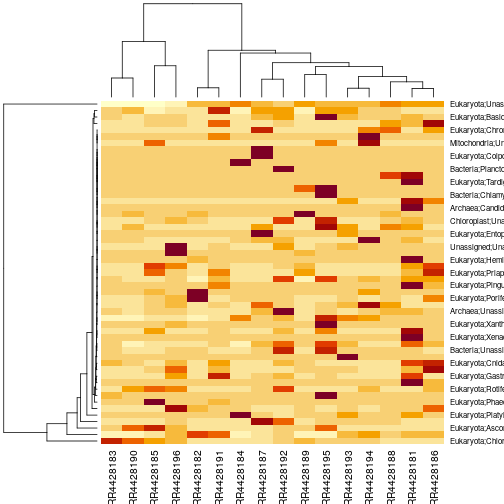
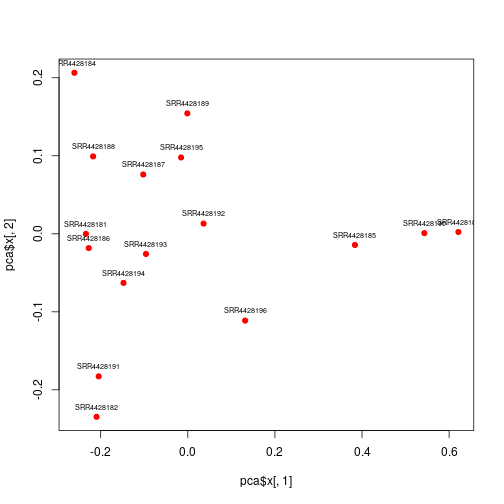

# Sample Comparisons

In this session we have mainly been concerned with the taxa abundance distributions within individual runs and samples. In many cases we will also be interested in comparing samples to find interesting differences between them. This is a big topic which we don't have time to explore in detail now, but I'll just give a quick taster.

We can compare samples at the level of taxa counts, but for some high level analyses, it might make sense to group related taxa together to some level of aggregation. MGNify computes a phylum-level taxonomy table as part of its standard analysis pipeline, so this can be a good starting point for beginning to investigate sample comparisons.

We could write a function to get the phylum-level table for a given study as follows.


```r
library(ebimetagenomics)

getKP = function(studyID) {
 burl = ebimetagenomics:::baseURL
 url = paste(burl,"studies",studyID,"downloads?format=csv",sep="/")
 dl = read.csv(url, stringsAsFactors = FALSE)
 purl = dl$url[grep("phylum",dl$id)][1]
 ttab = read.table(purl, stringsAsFactors = FALSE, header = TRUE)
 rownames(ttab) = paste(ttab[,1],ttab[,2],sep=";")
 ttab = ttab[,-(1:2)]
 ttab
}
```

I will add a similar function to the next release of the `ebimetagenomics` R package. We can then use it to get the table for a study of interest. MGYS00004696 is a study of fungal communities across four coastal marine habitats in North Carolina.


```r
kptab = getKP("MGYS00004696")
str(kptab)
```

```
## 'data.frame':	53 obs. of  16 variables:
##  $ SRR4428181: int  3 1 6 1 0 0 9 0 1 61 ...
##  $ SRR4428182: int  0 0 0 5 0 0 7 0 1 4 ...
##  $ SRR4428183: int  0 0 2 104 0 0 18 0 0 14 ...
##  $ SRR4428184: int  0 0 0 11 0 0 0 1 0 2 ...
##  $ SRR4428185: int  0 0 1 25 0 0 0 0 1 25 ...
##  $ SRR4428186: int  0 0 1 1 0 0 0 0 1 479 ...
##  $ SRR4428187: int  0 0 6 3 0 0 7 0 0 1 ...
##  $ SRR4428188: int  0 1 9 9 0 0 10 0 1 3 ...
##  $ SRR4428189: int  0 0 0 1 0 0 1 0 0 40 ...
##  $ SRR4428190: int  0 0 0 34 0 0 4 0 0 4 ...
##  $ SRR4428191: int  0 0 0 0 0 0 2 0 0 101 ...
##  $ SRR4428192: int  0 0 113 103 0 1 221 0 7 28 ...
##  $ SRR4428193: int  0 0 0 0 0 0 3 0 0 15 ...
##  $ SRR4428194: int  0 0 2 3 0 0 5 0 0 0 ...
##  $ SRR4428195: int  0 0 5 737 2 0 180 0 7 33 ...
##  $ SRR4428196: int  0 0 5 19 0 0 21 0 2 345 ...
```

```r
head(kptab)
```

```
##                                   SRR4428181 SRR4428182 SRR4428183
## Archaea;Candidatus_Bathyarchaeota          3          0          0
## Archaea;Crenarchaeota                      1          0          0
## Archaea;Unassigned                         6          0          2
## Bacteria;Bacteroidetes                     1          5        104
## Bacteria;Chlamydiae                        0          0          0
## Bacteria;Planctomycetes                    0          0          0
##                                   SRR4428184 SRR4428185 SRR4428186
## Archaea;Candidatus_Bathyarchaeota          0          0          0
## Archaea;Crenarchaeota                      0          0          0
## Archaea;Unassigned                         0          1          1
## Bacteria;Bacteroidetes                    11         25          1
## Bacteria;Chlamydiae                        0          0          0
## Bacteria;Planctomycetes                    0          0          0
##                                   SRR4428187 SRR4428188 SRR4428189
## Archaea;Candidatus_Bathyarchaeota          0          0          0
## Archaea;Crenarchaeota                      0          1          0
## Archaea;Unassigned                         6          9          0
## Bacteria;Bacteroidetes                     3          9          1
## Bacteria;Chlamydiae                        0          0          0
## Bacteria;Planctomycetes                    0          0          0
##                                   SRR4428190 SRR4428191 SRR4428192
## Archaea;Candidatus_Bathyarchaeota          0          0          0
## Archaea;Crenarchaeota                      0          0          0
## Archaea;Unassigned                         0          0        113
## Bacteria;Bacteroidetes                    34          0        103
## Bacteria;Chlamydiae                        0          0          0
## Bacteria;Planctomycetes                    0          0          1
##                                   SRR4428193 SRR4428194 SRR4428195
## Archaea;Candidatus_Bathyarchaeota          0          0          0
## Archaea;Crenarchaeota                      0          0          0
## Archaea;Unassigned                         0          2          5
## Bacteria;Bacteroidetes                     0          3        737
## Bacteria;Chlamydiae                        0          0          2
## Bacteria;Planctomycetes                    0          0          0
##                                   SRR4428196
## Archaea;Candidatus_Bathyarchaeota          0
## Archaea;Crenarchaeota                      0
## Archaea;Unassigned                         5
## Bacteria;Bacteroidetes                    19
## Bacteria;Chlamydiae                        0
## Bacteria;Planctomycetes                    0
```

There are many things that one can do with such a table. For some purposes, it might make sense to normalise each column so that it sums to one. This is because different runs often have quite different numbers of successful reads.


```r
colsums = apply(kptab,2,sum)
normtab = sweep(kptab,2,colsums,"/")
head(normtab)
```

```
##                                     SRR4428181   SRR4428182   SRR4428183
## Archaea;Candidatus_Bathyarchaeota 1.584535e-04 0.0000000000 0.000000e+00
## Archaea;Crenarchaeota             5.281783e-05 0.0000000000 0.000000e+00
## Archaea;Unassigned                3.169070e-04 0.0000000000 7.758855e-05
## Bacteria;Bacteroidetes            5.281783e-05 0.0001576541 4.034604e-03
## Bacteria;Chlamydiae               0.000000e+00 0.0000000000 0.000000e+00
## Bacteria;Planctomycetes           0.000000e+00 0.0000000000 0.000000e+00
##                                     SRR4428184   SRR4428185   SRR4428186
## Archaea;Candidatus_Bathyarchaeota 0.0000000000 0.000000e+00 0.000000e+00
## Archaea;Crenarchaeota             0.0000000000 0.000000e+00 0.000000e+00
## Archaea;Unassigned                0.0000000000 3.304038e-05 3.681207e-05
## Bacteria;Bacteroidetes            0.0004122629 8.260094e-04 3.681207e-05
## Bacteria;Chlamydiae               0.0000000000 0.000000e+00 0.000000e+00
## Bacteria;Planctomycetes           0.0000000000 0.000000e+00 0.000000e+00
##                                     SRR4428187   SRR4428188   SRR4428189
## Archaea;Candidatus_Bathyarchaeota 0.0000000000 0.000000e+00 0.000000e+00
## Archaea;Crenarchaeota             0.0000000000 3.725644e-05 0.000000e+00
## Archaea;Unassigned                0.0002943052 3.353079e-04 0.000000e+00
## Bacteria;Bacteroidetes            0.0001471526 3.353079e-04 4.408782e-05
## Bacteria;Chlamydiae               0.0000000000 0.000000e+00 0.000000e+00
## Bacteria;Planctomycetes           0.0000000000 0.000000e+00 0.000000e+00
##                                    SRR4428190 SRR4428191   SRR4428192
## Archaea;Candidatus_Bathyarchaeota 0.000000000          0 0.000000e+00
## Archaea;Crenarchaeota             0.000000000          0 0.000000e+00
## Archaea;Unassigned                0.000000000          0 2.492940e-03
## Bacteria;Bacteroidetes            0.001290665          0 2.272326e-03
## Bacteria;Chlamydiae               0.000000000          0 0.000000e+00
## Bacteria;Planctomycetes           0.000000000          0 2.206142e-05
##                                   SRR4428193   SRR4428194   SRR4428195
## Archaea;Candidatus_Bathyarchaeota          0 0.0000000000 0.000000e+00
## Archaea;Crenarchaeota                      0 0.0000000000 0.000000e+00
## Archaea;Unassigned                         0 0.0001091584 1.476276e-04
## Bacteria;Bacteroidetes                     0 0.0001637376 2.176031e-02
## Bacteria;Chlamydiae                        0 0.0000000000 5.905105e-05
## Bacteria;Planctomycetes                    0 0.0000000000 0.000000e+00
##                                     SRR4428196
## Archaea;Candidatus_Bathyarchaeota 0.0000000000
## Archaea;Crenarchaeota             0.0000000000
## Archaea;Unassigned                0.0001503127
## Bacteria;Bacteroidetes            0.0005711881
## Bacteria;Chlamydiae               0.0000000000
## Bacteria;Planctomycetes           0.0000000000
```

We can "look" at this normalised table using a heatmap.


```r
heatmap(as.matrix(normtab))
```



We can begin to look for similarities and differences between samples using principal components analysis.


```r
pca = prcomp(t(normtab))
plot(pca$x[,1],pca$x[,2],pch=19,col=2)
text(pca$x[,1],pca$x[,2],rownames(pca$x),pos=3,cex=0.6)
```



More formal statistical comparisons and analysis can be facilitated by [installing Bioconductor](https://www.bioconductor.org/install/), together with Bioconductor packages such as `DESeq2` and `phyloseq`. However, this is beyond the scope of this short session.

