# Introduction to taxa abundance data in R

* Using standard tools for processing sequencing data derived from metagenomic samples (such as the [QIIME](http://qiime.org/) pipeline), it is possible to summarise taxonomic diversity in terms of the taxa present in the samples together with counts representing relative species abundance
* Although metagenomics is a relatively new field, ecologists have been studying species abundance and diversity for decades, if not centuries
* Population ecology is a mature discipline, with a huge literature, which makes extensive use of statistical modelling for understanding the effects of sampling on observed data and inferences
* In addition to theory, there are many software tools and libraries that have been produced by ecologists for working with species abundance data
* The main purpose of this session is to make people aware of this connection between metagenomics and population ecology, and to give a *very* brief introduction to some of the useful software tools that are easily and freely available
* Statistical concepts, models and algorithms from population ecology can be used to try to answer some important questions about the community from which the metagenomic sample was taken:
  * What was the true diversity of the population sampled, and what distributional form did the true taxa abundance distribution take?
  * How much more sequencing would be required in order to sample a given required fraction of the true diversity of the sampled population?
  * Is the abundance distribution consistent with neutral theories of evolution?
  * How can I compare species abundance in different metagenomic samples and identify interesting differences that are not simply random sampling effects?
  * Can I test whether a covariate appears to have a significant effect on the abundance distributions observed in my samples?
  * Are the abundance distributions that I observe in my different samples consistent with the notion of a parent "meta-community" from which the samples are derived?

## The R language for statistical computing

* R is a language for statistical computing, modelling, data analysis and visualisation - www.r-project.org
* It is free, open source and cross-platform
* There are good free IDEs, such as [RStudio](https://www.rstudio.com/)
* There are thousands for packages for R, managed in a mirrored repository, known as [CRAN](https://cran.r-project.org), the comprehensive R archive network
* [Bioconductor](https://bioconductor.org/) is another R repository focusing specifically on high-throughput genomic data, containing over one thousand packages

It is possible to analyse raw sequencing data using Bioconductor packages such as [ShortRead](https://bioconductor.org/packages/release/bioc/html/ShortRead.html), but that is a different subject...

### R packages for analysis of species diversity

R is very popular with ecologists, and so there are many R packages in CRAN for modelling and analysis of species diversity and species abundance data. Although most of this software was not designed with [metagenomic](https://en.wikipedia.org/wiki/Metagenomics) applications in mind, much of it is still very useful for exploratory analysis of metagenomic taxa abundance data.

As there are so many R packages on CRAN it can be a challenge to find the right package for the problem at hand. [CRAN Task Views](https://cran.r-project.org/web/views/) provide an overview of a task or domain, giving a guide to available packages and their functionality. The task view for [Environmetrics](https://cran.r-project.org/web/views/Environmetrics.html) is useful for finding out about packages for ecological applications. A small sample of interesting packages are listed below.

* [vegan](https://cran.r-project.org/web/packages/vegan/) - large package for community ecology - fitting species abundance distributions (SADs), estimating number of unobserved species, etc.
* [sads](https://cran.r-project.org/web/packages/sads/) - simulation of and MLE estimation for species abundance distributions (SADs), including *Poisson-log-normal*
* [breakaway](https://cran.r-project.org/web/packages/breakaway/) - package for diversity estimation
* [untb](https://cran.r-project.org/web/packages/untb/) - unified neutral theory of biodiversity (UNTB) - simulation of ecological drift and estimation of biodiversity parameters
* [BAT](https://cran.r-project.org/web/packages/BAT/) - biodiversity assessment tools (BAT)
* [BiodiversityR](https://cran.r-project.org/web/packages/BiodiversityR/) - mainly a GUI interface for `vegan`

There are a *huge* number of useful software tools relating to population ecology that are potentially valuable for the analysis of metagenomics data, and this can feel a little overwhelming. Everyone at this session is interested in different questions, so it is difficult to give completely generic advice regarding what to invest time and effort into learning. That said, **vegan** is a large, well-regarded and well-documented library that contains a significant number of functions which are likely to be very useful almost irrespective of the scientific questions you are interested in. So, if following this session you are interested in exploring some tools from population ecology but are unsure where to start, my recommendation would be to put some time and effort into working through the available documentation for `vegan`.

In this session we will mainly use `sads` and `vegan`. Assuming that R is installed and running, these can be loaded with:


```r
library(sads)
library(vegan)
```

If they are not installed, then can be installed from CRAN with: `install.packages(c("sads","vegan"))`

### Analysis of species abundance data in R

The `sads` package can be loaded, and information about its use obtained in the usual R ways:


```r
library(sads)
help(package="sads")
?"sads-package"
vignette(package="sads")
vignette("sads_intro",package="sads")
?octav
example(octav)
```

We will start with the analysis of the `bci` dataset in the `sads` package. This is a classical ecological dataset, measuring the abundance of different species of tree in a tropical forest plot. We can find out more about it as follows:


```r
?bci
length(bci)
```

```
## [1] 225
```

```r
head(bci)
```

```
##      Acacia melanoceras   Acalypha diversifolia   Acalypha macrostachya 
##                       3                       2                       1 
##          Adelia triloba    Aegiphila panamensis Alchornea costaricensis 
##                      92                      23                     156
```

We can do a very simple plot of the abundance of each species as follows:


```r
barplot(bci,xlab="Species",ylab="Abundance")
```

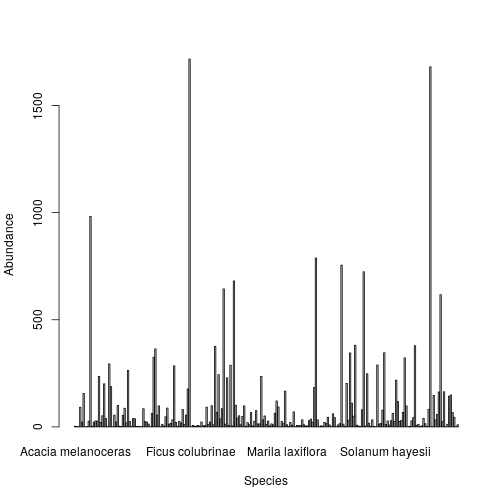

If we prefer, we could first order the species in decreasing order of abundance:


```r
bci2 = bci[order(-bci)]
head(bci2)
```

```
##   Faramea occidentalis  Trichilia tuberculata       Alseis blackiana 
##                   1717                   1681                    983 
##      Oenocarpus mapora       Poulsenia armata Quararibea asterolepis 
##                    788                    755                    724
```

```r
barplot(bci2,xlab="Species",ylab="Abundance")
```

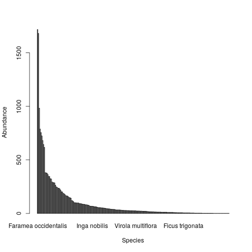

This is not dissimilar to a [rank abundance diagram](https://en.wikipedia.org/wiki/Relative_species_abundance) (Whittaker plot), which can be produced with the aid of the `sads` function `rad()`:


```r
plot(rad(bci))
```

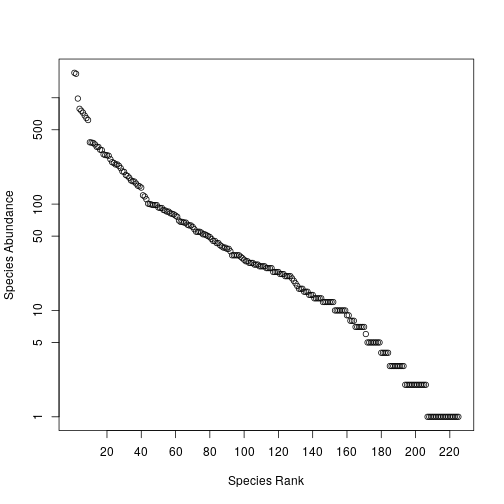

```r
head(rad(bci))
```

```
##                        rank abund
## Faramea occidentalis      1  1717
## Trichilia tuberculata     2  1681
## Alseis blackiana          3   983
## Oenocarpus mapora         4   788
## Poulsenia armata          5   755
## Quararibea asterolepis    6   724
```

However, ecologists often like to think in terms of species abundance distributions (SADs), and for this it can be helpful to think about the number of species having a given abundance. We can re-tabulate our data as a SAD with the help of the following function:


```r
abund2sad <- function(abund) {
  sad = as.data.frame(table(abund))
  names(sad) = c("abund","Freq")
  sad$abund = as.numeric(as.character(sad$abund))
  sad
}
```


We can then convert the `bci` data and plot the SAD as follows:


```r
sad = abund2sad(bci)
head(sad)
```

```
##   abund Freq
## 1     1   19
## 2     2   13
## 3     3    9
## 4     4    5
## 5     5    8
## 6     6    1
```

```r
barplot(sad$Freq,names.arg=sad$abund,xlab="Abundance",ylab="# species",main="SAD")
```

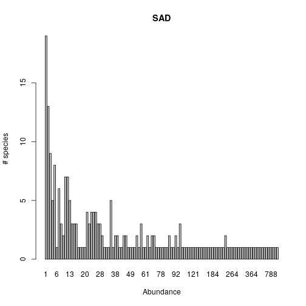

In fact, this kind of data is typically displayed in the form of a histogram with exponentially increasing bins, known as a *Preston plot*. We can plot these in R with the help of the `octav()` function from the `sads` package.


```r
octav(bci)
```

```
## Object of class "octav"
##    octave upper Freq
## 1       0     1   19
## 2       1     2   13
## 3       2     4   14
## 4       3     8   18
## 5       4    16   30
## 6       5    32   34
## 7       6    64   31
## 8       7   128   26
## 9       8   256   18
## 10      9   512   13
## 11     10  1024    7
## 12     11  2048    2
## 13     12  4096    0
```

```r
plot(octav(bci))
```

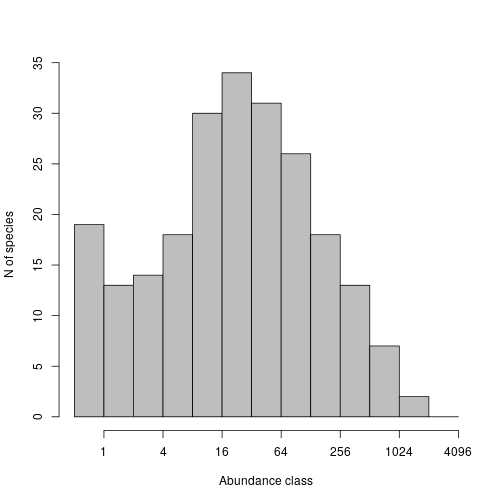

The interpretation here is that there are 19 species having an abundance of 1, there are 13 species having an abundance of 2, 14 species having an abundance of 3 or 4, 18 species with an abundance of 5-8, etc.

### Simulating SAD/TAD data

The `sads` package also includes the `rsad()` function for simulating synthetic species/taxa abundance data. This can be very useful for testing analysis workflows and statistical estimation procedures.

One of the key statistical issues in modelling data of this sort is partial observation. Typically one will not actually measure every individual in an ecological community of interest, but instead the individuals in a small fraction of the population, hopefully a random sample. The `bci` dataset is a case in point. Ecologists are not especially interested in the 50 ha plot they studied, but rather in the whole forest, and they hope that they can infer something useful about the forest by extrapolating what they know about the plot they studied. This raises some non-trivial statistical issues. Exactly the same issues arise in the context of metagenomics.

Let's start by generating a synthetic data set corresponding to a fully observed population containing 1000 species having a log-normal TAD.


```r
set.seed(123)
comm = rsad(S=1000,frac=1,sad="lnorm",coef=list(meanlog=5,sdlog=2))
length(comm)
```

```
## [1] 995
```

```r
sum(comm)
```

```
## [1] 1074576
```

Note that I just set the random seed for reproducibility. Also note that there aren't exactly 1,000 species in the sample (due to the sampling model and species with very low abundance), and that the sample corresponds to the identification of over 1 million individuals. So in the context of metagenomics, this might correspond to over 1 million 16S matches in a sequencing run clustered into roughly 1,000 OTUs. We now know how to plot this kind of data:


```r
op=par(mfrow=c(2,2))
barplot(comm,xlab="Species",ylab="Abundance",main="Taxa abundance")
tad = abund2sad(comm)
barplot(tad[,2],names.arg=tad[,1],xlab="Abundance",
                                ylab="# species",main="TAD")
plot(octav(comm),main="Preston plot")
plot(rad(comm),main="Rank abundance")
```

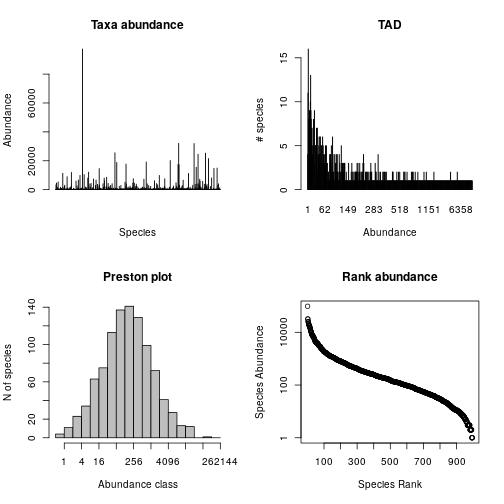

```r
par(op)
```

Note that the Preston plot looks very Gaussian, which is as we would expect, due to simulating from a log-normal TAD.

Now let simulate a synthetic sample corresponding to a small fraction (0.05%) of the same population with 1,000 species. 


```r
commFull=comm
comm=rsad(S=1000,frac=0.0005,sad="lnorm",coef=list(meanlog=5,sdlog=2))
length(comm)
```

```
## [1] 190
```

```r
sum(comm)
```

```
## [1] 407
```

Here we have only observed 190 species, corresponding to 407 individuals. We can plot this using exactly the same code as before.


```r
op=par(mfrow=c(2,2))
barplot(comm,xlab="Species",ylab="Abundance",main="Taxa abundance")
tad = abund2sad(comm)
barplot(tad[,2],names.arg=tad[,1],xlab="Abundance",
                                ylab="# species",main="TAD")
plot(octav(comm),main="Preston plot")
plot(rad(comm),main="Rank abundance")
```

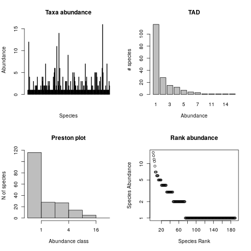

```r
par(op)
```

The key point to notice is that the species abundance distribution for this fractional sample looks very different to the "true" distribution for the fully observed sample, so statistical methods will be required to try and infer something about the true TAD using the observed TAD.

### Statistically fitting species abundance models to data

For our synthetic data problem we have kept both the "full" sample and the fractionally observed sample. As an initial sanity check, we can try fitting a SAD model to our full sample, using the function `fitsad()` in the `sads` package.


```r
mod = fitsad(commFull,"lnorm")
summary(mod)
```

```
## Maximum likelihood estimation
## 
## Call:
## mle2(minuslogl = function (meanlog, sdlog) 
## -sum(dlnorm(x, meanlog, sdlog, log = TRUE)), start = list(meanlog = 5.04777319309102, 
##     sdlog = 1.97087203694877), data = list(x = c(41L, 94L, 3369L, 
## 150L, 206L, 4600L, 419L, 14L, 34L, 59L, 1681L, 312L, 326L, 187L, 
## 43L, 5312L, 436L, 2L, 580L, 68L, 21L, 79L, 13L, 42L, 45L, 7L, 
## 805L, 216L, 19L, 1723L, 365L, 71L, 881L, 861L, 818L, 563L, 423L, 
## 128L, 76L, 58L, 40L, 95L, 12L, 11340L, 1685L, 12L, 71L, 52L, 
## 685L, 131L, 269L, 132L, 113L, 2284L, 91L, 3106L, 6L, 497L, 190L, 
## 214L, 298L, 52L, 72L, 14L, 16L, 260L, 341L, 167L, 886L, 8941L, 
## 48L, 1094L, 40L, 40L, 1151L, 93L, 10L, 199L, 123L, 156L, 316L, 
## 75L, 489L, 81L, 278L, 1295L, 330L, 78L, 1452L, 1145L, 442L, 237L, 
## 29L, 2274L, 57L, 11907L, 3225L, 87L, 18L, 33L, 241L, 95L, 73L, 
## 24L, 124L, 27L, 3L, 53L, 980L, 45L, 492L, 6L, 133L, 421L, 275L, 
## 173L, 39L, 24L, 23L, 204L, 23L, 49L, 102L, 5938L, 38L, 251L, 
## 179L, 22L, 129L, 2694L, 352L, 152L, 57L, 4L, 1371L, 12L, 688L, 
## 6673L, 6L, 568L, 86L, 8L, 10L, 5L, 55L, 4L, 544L, 9879L, 8L, 
## 700L, 706L, 308L, 16L, 109L, 64L, 406L, 88L, 1052L, 62L, 1137L, 
## 24L, 9L, 97363L, 66L, 292L, 518L, 61L, 439L, 293L, 83L, 172L, 
## 141L, 10432L, 33L, 20L, 168L, 271L, 327L, 62L, 21L, 1826L, 55L, 
## 18L, 100L, 89L, 1449L, 167L, 648L, 48L, 200L, 62L, 175L, 24L, 
## 7L, 7992L, 478L, 9L, 47L, 11L, 12119L, 2111L, 90L, 461L, 69L, 
## 60L, 32L, 53L, 3967L, 124L, 186L, 234L, 1777L, 50L, 13L, 4305L, 
## 64L, 43L, 12L, 15L, 53L, 524L, 1381L, 604L, 64L, 167L, 41L, 34L, 
## 868L, 24L, 7395L, 136L, 229L, 33L, 67L, 12L, 120L, 342L, 309L, 
## 31L, 31L, 56L, 2910L, 18L, 98L, 6639L, 110L, 11L, 39L, 383L, 
## 70L, 41L, 87L, 164L, 3673L, 115L, 1228L, 508L, 104L, 8L, 51L, 
## 67L, 151L, 2150L, 14586L, 3327L, 126L, 3L, 70L, 184L, 815L, 998L, 
## 576L, 9L, 808L, 53L, 189L, 186L, 346L, 174L, 4L, 662L, 349L, 
## 108L, 181L, 199L, 217L, 4088L, 101L, 212L, 1590L, 1259L, 1458L, 
## 46L, 8008L, 162L, 6358L, 10L, 171L, 1863L, 29L, 31L, 28L, 21L, 
## 65L, 295L, 2L, 213L, 1814L, 8602L, 2006L, 643L, 3L, 43L, 85L, 
## 603L, 124L, 13L, 4347L, 937L, 208L, 1686L, 12L, 528L, 56L, 631L, 
## 133L, 472L, 2088L, 149L, 1127L, 11L, 35L, 3017L, 308L, 5L, 14L, 
## 96L, 877L, 102L, 529L, 1001L, 4121L, 155L, 136L, 5L, 193L, 45L, 
## 24L, 102L, 1164L, 3L, 67L, 178L, 32L, 289L, 353L, 137L, 1L, 25515L, 
## 90L, 557L, 262L, 1060L, 726L, 104L, 308L, 30L, 838L, 61L, 18839L, 
## 2L, 61L, 740L, 392L, 49L, 20L, 224L, 151L, 6L, 163L, 213L, 217L, 
## 21L, 411L, 2375L, 377L, 11L, 56L, 307L, 43L, 2L, 837L, 31L, 48L, 
## 2958L, 37L, 762L, 11L, 90L, 118L, 7L, 32L, 147L, 578L, 8L, 59L, 
## 692L, 46L, 231L, 416L, 265L, 522L, 132L, 60L, 1L, 118L, 370L, 
## 455L, 47L, 5154L, 268L, 196L, 1889L, 40L, 63L, 17715L, 164L, 
## 3950L, 8L, 107L, 308L, 289L, 18L, 160L, 16L, 634L, 1295L, 3L, 
## 1761L, 11L, 357L, 563L, 108L, 34L, 187L, 367L, 934L, 1L, 6L, 
## 2500L, 1193L, 351L, 615L, 962L, 1L, 1394L, 64L, 239L, 81L, 889L, 
## 75L, 450L, 67L, 19L, 1605L, 629L, 4616L, 169L, 1365L, 7600L, 
## 88L, 17L, 107L, 98L, 195L, 4560L, 82L, 303L, 98L, 144L, 274L, 
## 2134L, 183L, 598L, 742L, 924L, 53L, 3798L, 68L, 114L, 2447L, 
## 1911L, 16L, 21L, 7L, 227L, 239L, 269L, 439L, 36L, 23L, 1173L, 
## 700L, 9L, 97L, 20L, 3L, 194L, 119L, 125L, 202L, 896L, 248L, 49L, 
## 40L, 123L, 283L, 16L, 104L, 1014L, 129L, 42L, 86L, 1358L, 475L, 
## 1802L, 199L, 349L, 65L, 451L, 56L, 14L, 207L, 7257L, 722L, 1569L, 
## 288L, 43L, 88L, 100L, 69L, 634L, 11L, 801L, 863L, 12L, 483L, 
## 19179L, 48L, 812L, 31L, 1396L, 261L, 3996L, 3L, 136L, 50L, 91L, 
## 31L, 28L, 445L, 21L, 2910L, 19L, 174L, 426L, 465L, 79L, 185L, 
## 998L, 9L, 38L, 287L, 67L, 2282L, 568L, 179L, 5L, 178L, 90L, 131L, 
## 14L, 389L, 13L, 86L, 327L, 28L, 505L, 11L, 372L, 777L, 100L, 
## 442L, 10L, 126L, 3L, 1615L, 6222L, 1233L, 141L, 127L, 7L, 738L, 
## 94L, 33L, 16L, 82L, 28L, 68L, 11L, 4263L, 135L, 1223L, 51L, 32L, 
## 7L, 3347L, 8L, 263L, 799L, 208L, 24L, 1028L, 213L, 16L, 7L, 9822L, 
## 43L, 2L, 399L, 270L, 11L, 3L, 101L, 1482L, 526L, 38L, 36L, 262L, 
## 206L, 507L, 60L, 847L, 27L, 82L, 678L, 1110L, 4L, 194L, 525L, 
## 8L, 364L, 27L, 1207L, 445L, 637L, 186L, 833L, 2346L, 7561L, 138L, 
## 2L, 182L, 252L, 115L, 470L, 1208L, 57L, 70L, 340L, 41L, 170L, 
## 3L, 10L, 10L, 25L, 39L, 300L, 1068L, 34L, 24L, 19L, 60L, 95L, 
## 385L, 79L, 3L, 126L, 1573L, 1679L, 25L, 6L, 20190L, 118L, 124L, 
## 352L, 3L, 27L, 7L, 47L, 177L, 12L, 460L, 292L, 23L, 250L, 664L, 
## 1227L, 92L, 122L, 134L, 2554L, 1418L, 796L, 73L, 294L, 301L, 
## 22L, 3L, 516L, 4L, 132L, 266L, 448L, 216L, 42L, 1085L, 4818L, 
## 811L, 2L, 2421L, 133L, 403L, 538L, 109L, 145L, 1108L, 644L, 1129L, 
## 17455L, 546L, 217L, 6L, 32064L, 58L, 17230L, 312L, 3130L, 130L, 
## 464L, 219L, 115L, 99L, 1068L, 86L, 111L, 431L, 513L, 505L, 5L, 
## 336L, 1055L, 1888L, 90L, 86L, 2905L, 66L, 328L, 3L, 248L, 6541L, 
## 134L, 90L, 384L, 77L, 760L, 880L, 128L, 5L, 8L, 45L, 726L, 2L, 
## 4L, 48L, 311L, 24L, 892L, 293L, 115L, 796L, 339L, 57L, 273L, 
## 519L, 324L, 38L, 833L, 1520L, 247L, 201L, 117L, 11203L, 265L, 
## 104L, 2L, 10L, 135L, 231L, 225L, 755L, 124L, 1688L, 17L, 18L, 
## 5L, 684L, 82L, 699L, 93L, 34L, 69L, 7L, 22L, 6L, 1255L, 47L, 
## 690L, 3043L, 103L, 284L, 3L, 39L, 188L, 265L, 32L, 31937L, 50L, 
## 159L, 530L, 143L, 42L, 1219L, 3727L, 151L, 475L, 139L, 1157L, 
## 14L, 15478L, 46L, 9L, 83L, 182L, 3905L, 941L, 203L, 10L, 31L, 
## 128L, 24512L, 2L, 1462L, 53L, 4121L, 22L, 181L, 13L, 921L, 2929L, 
## 7264L, 740L, 5835L, 1841L, 110L, 350L, 13L, 107L, 1725L, 427L, 
## 370L, 15L, 45L, 25L, 342L, 27L, 456L, 17L, 5745L, 365L, 37L, 
## 257L, 64L, 337L, 254L, 11L, 29L, 276L, 3807L, 1333L, 45L, 749L, 
## 127L, 253L, 263L, 25267L, 14L, 203L, 2L, 459L, 1300L, 2658L, 
## 5L, 314L, 3629L, 56L, 107L, 140L, 289L, 516L, 2039L, 130L, 196L, 
## 21537L, 347L, 216L, 10L, 161L, 79L, 142L, 49L, 32L, 34L, 89L, 
## 2281L, 1256L, 65L, 9L, 29L, 55L, 176L, 34L, 8127L, 95L, 17L, 
## 106L, 26L, 205L, 232L, 294L, 8L, 253L, 234L, 11L, 1004L, 683L, 
## 14714L, 216L, 183L, 184L, 170L, 3L, 4L, 117L, 39L, 166L, 10L, 
## 12L, 23L, 1087L, 13L, 29L, 189L, 80L, 189L, 14981L, 11L, 81L, 
## 49L, 3062L, 28L, 122L, 715L, 21L, 4056L, 580L, 21L, 376L, 106L, 
## 268L, 135L, 1279L, 13L, 40L, 98L)))
## 
## Coefficients:
##         Estimate Std. Error z value     Pr(z)    
## meanlog 5.047773   0.062449  80.830 < 2.2e-16 ***
## sdlog   1.969881   0.044158  44.609 < 2.2e-16 ***
## ---
## Signif. codes:  0 '***' 0.001 '**' 0.01 '*' 0.05 '.' 0.1 ' ' 1
## 
## -2 log L: 14217.92
```

```r
par(mfrow=c(2,2))
plot(mod)
```

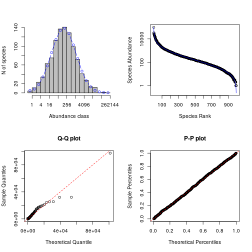

```r
par(op)
```

We confirm that in this case our fit to a log-normal SAD is excellent, and our estimated coefficients are very close to the "true" values of 5 and 2. Now let's try again with our fractional sample.


```r
mod = fitsad(comm,"lnorm")
```

```
## Warning in dlnorm(x, meanlog, sdlog, log = TRUE): NaNs produced
```

```r
summary(mod)
```

```
## Maximum likelihood estimation
## 
## Call:
## mle2(minuslogl = function (meanlog, sdlog) 
## -sum(dlnorm(x, meanlog, sdlog, log = TRUE)), start = list(meanlog = 0.469922863063333, 
##     sdlog = 0.676119917956515), data = list(x = c(1L, 1L, 12L, 
## 1L, 4L, 1L, 1L, 1L, 1L, 1L, 1L, 1L, 1L, 3L, 1L, 1L, 1L, 2L, 1L, 
## 2L, 2L, 2L, 4L, 1L, 1L, 1L, 1L, 1L, 1L, 1L, 2L, 1L, 1L, 4L, 3L, 
## 4L, 1L, 2L, 1L, 2L, 2L, 7L, 1L, 2L, 2L, 1L, 1L, 3L, 1L, 2L, 3L, 
## 1L, 1L, 1L, 1L, 1L, 1L, 1L, 1L, 4L, 2L, 5L, 6L, 6L, 1L, 1L, 2L, 
## 11L, 1L, 1L, 3L, 2L, 14L, 1L, 6L, 1L, 2L, 1L, 1L, 1L, 1L, 4L, 
## 1L, 1L, 1L, 1L, 1L, 3L, 3L, 1L, 3L, 1L, 1L, 9L, 1L, 2L, 1L, 1L, 
## 1L, 3L, 1L, 1L, 1L, 1L, 5L, 1L, 1L, 5L, 4L, 3L, 2L, 2L, 1L, 1L, 
## 1L, 2L, 1L, 1L, 4L, 1L, 1L, 1L, 1L, 3L, 1L, 1L, 3L, 1L, 1L, 2L, 
## 2L, 1L, 1L, 7L, 3L, 1L, 4L, 2L, 1L, 1L, 1L, 1L, 1L, 1L, 1L, 1L, 
## 1L, 4L, 2L, 1L, 2L, 1L, 1L, 1L, 1L, 5L, 1L, 5L, 1L, 5L, 4L, 1L, 
## 2L, 2L, 1L, 1L, 3L, 1L, 4L, 1L, 1L, 1L, 6L, 16L, 5L, 1L, 1L, 
## 1L, 1L, 1L, 2L, 1L, 1L, 7L, 1L, 1L, 1L, 1L, 3L, 2L)))
## 
## Coefficients:
##         Estimate Std. Error z value     Pr(z)    
## meanlog 0.469923   0.048922  9.6056 < 2.2e-16 ***
## sdlog   0.674339   0.034593 19.4936 < 2.2e-16 ***
## ---
## Signif. codes:  0 '***' 0.001 '**' 0.01 '*' 0.05 '.' 0.1 ' ' 1
## 
## -2 log L: 568.0385
```

```r
par(mfrow=c(2,2))
plot(mod)
```

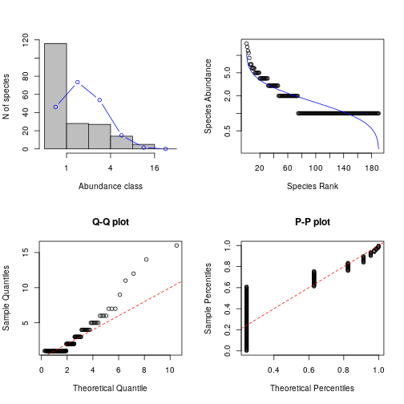

```r
par(op)
```

Here we see that the fit is rather poor, and that the estimated parameters are also far from the true values used to generate the data. However, we know that our sample has been generated from a (Poisson) sampling mechanism from an underlying log-normal population. This is consistent with a Poisson-log-normal model, so we can re-fit using that.


```r
mod = fitsad(comm,"poilog")
summary(mod)
```

```
## Maximum likelihood estimation
## 
## Call:
## mle2(minuslogl = function (mu, sig) 
## -sum(dtrunc("poilog", x = x, coef = list(mu = mu, sig = sig), 
##     trunc = trunc, log = TRUE)), start = list(mu = -1.74256445123933, 
##     sig = 1.5731709624325), data = list(x = c(1L, 1L, 12L, 1L, 
## 4L, 1L, 1L, 1L, 1L, 1L, 1L, 1L, 1L, 3L, 1L, 1L, 1L, 2L, 1L, 2L, 
## 2L, 2L, 4L, 1L, 1L, 1L, 1L, 1L, 1L, 1L, 2L, 1L, 1L, 4L, 3L, 4L, 
## 1L, 2L, 1L, 2L, 2L, 7L, 1L, 2L, 2L, 1L, 1L, 3L, 1L, 2L, 3L, 1L, 
## 1L, 1L, 1L, 1L, 1L, 1L, 1L, 4L, 2L, 5L, 6L, 6L, 1L, 1L, 2L, 11L, 
## 1L, 1L, 3L, 2L, 14L, 1L, 6L, 1L, 2L, 1L, 1L, 1L, 1L, 4L, 1L, 
## 1L, 1L, 1L, 1L, 3L, 3L, 1L, 3L, 1L, 1L, 9L, 1L, 2L, 1L, 1L, 1L, 
## 3L, 1L, 1L, 1L, 1L, 5L, 1L, 1L, 5L, 4L, 3L, 2L, 2L, 1L, 1L, 1L, 
## 2L, 1L, 1L, 4L, 1L, 1L, 1L, 1L, 3L, 1L, 1L, 3L, 1L, 1L, 2L, 2L, 
## 1L, 1L, 7L, 3L, 1L, 4L, 2L, 1L, 1L, 1L, 1L, 1L, 1L, 1L, 1L, 1L, 
## 4L, 2L, 1L, 2L, 1L, 1L, 1L, 1L, 5L, 1L, 5L, 1L, 5L, 4L, 1L, 2L, 
## 2L, 1L, 1L, 3L, 1L, 4L, 1L, 1L, 1L, 6L, 16L, 5L, 1L, 1L, 1L, 
## 1L, 1L, 2L, 1L, 1L, 7L, 1L, 1L, 1L, 1L, 3L, 2L)))
## 
## Coefficients:
##     Estimate Std. Error z value     Pr(z)    
## mu  -1.74257    0.73332 -2.3763   0.01749 *  
## sig  1.57322    0.28394  5.5408 3.011e-08 ***
## ---
## Signif. codes:  0 '***' 0.001 '**' 0.01 '*' 0.05 '.' 0.1 ' ' 1
## 
## -2 log L: 535.8973
```

```r
par(mfrow=c(2,2))
plot(mod)
```

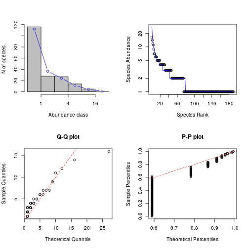

```r
par(op)
```

Here we see that the fit is much better, but the parameter estimates still look poor. However, the distribution theory underpinning the Poisson-log-normal suggests that the sample should have theoretical mean and standard deviation of 5+log(0.0005)=-2.6 and 2, which aren't so far away from the estimates.

See the vignette for the package: `vignette("sads_intro",package="sads")` for a more detailed discussion of model fitting and selection using this package.

### Estimation of diversity

Given the observed sample, and its observed species richness, it is natural to want to estimate the true biodiversity of the population that has been sampled. As previously discussed, this is a non-trivial statistical problem, but there are some well-known estimators implemented in the aforementioned `vegan` package.

We can load up `vegan` and get a list of vignettes with:

```r
library(vegan)
vignette(package="vegan")
```
You will see that there are several useful vignettes giving a tutorial introduction to several different aspects of the package functionality. For the purposes of this session, the `diversity-vegan` vignette is of particular interest.

```r
vignette("diversity-vegan")
```
When you have time (after this session), it would be worth spending some time working through this document carefully.

We can compute some estimates of species diversity from our sample as follows:

```r
estimateR(commFull)
```

```
##       S.obs     S.chao1    se.chao1       S.ACE      se.ACE 
## 995.0000000 995.5000000   0.9270013 996.1003993   8.9599511
```

```r
estimateR(comm)
```

```
##     S.obs   S.chao1  se.chao1     S.ACE    se.ACE 
## 190.00000 420.00000  61.89537 393.84194  11.43052
```

We get the Chao estimator and the adjusted Chao estimator (ACE), together with estimates of standard error. For our full sample, the estimators correctly deduce that the vast majority of species are present in our sample. For our fractional sample, the estimators detect that there are a significant number of unobserved species. However, they substantially underestimate the true species richness of the parent population. The Chao estimator is well-known to often underestimate true species diversity, but it serves as a useful lower bound. 

#### Breakaway

Note finally that there are other available methods for species richness estimation, and some of these are implemented in other R packages on CRAN. For example, the package `breakaway` implements some methods recently proposed in the literature. If this package is installed (if not, `install.packages("breakaway")`), we can use it as follows.


```r
library(breakaway)
breakaway(abund2sad(commFull))
```

```
## No breakaway models converged.################## breakaway ##################
## 	The best estimate of total diversity is 996 
##  	 with std error 1 
## 	The model employed was the WLRM
```

```r
breakaway(abund2sad(comm))
```

```
## ################## breakaway ##################
## 	The best estimate of total diversity is 264 
##  	 with std error 154 
## 	The model employed was model_1_1 
## 	The function selected was
## 	  f_{x+1}/f_{x} ~ (beta0+beta1*(x-xbar))/(1+alpha1*(x-xbar)) 
##        Coef estimates Coef std errors
## beta0       0.6627340      0.06707941
## beta1       0.2463346      0.02563838
## alpha1      0.3222428      0.08677450
## xbar			 3.5
```

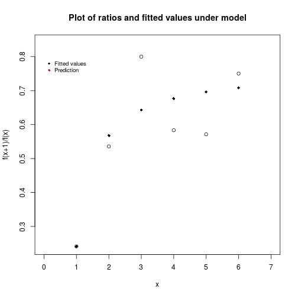

Note that this package requires abundance data in the SAD form, as given by the output of the function `abund2sad()`. Further details are given in the package documentation. In this case the estimate is worse than that of the Chao estimator, but this won't always be so. 

When working with real (as opposed to synthetically generated) data, it is sometimes the case that the singleton count (the number of species observed exactly once) may be spurious. In the case of metagenomics data, for example, the spurious taxa could be the result of sequencing error. In this case, the `breakaway` package includes a function for estimating total diversity which does not use the singleton count.

```r
breakaway_nof1(abund2sad(comm)[-1,])
```

```
## No breakaway models converged.################## breakaway ##################
## 	The best estimate of total diversity is 152 
##  	 with std error 33 
## 	The model employed was the WLRM
```
In this case, for our synthetic data with a valid singleton count, this method is obviously not helpful. Diversity estimation is a non-trivial problem!


#### (C) 2016-19 Darren J Wilkinson


